# Tạo máy ảo Ubunto bằng VMware Workstation Pro

## 1. Vào file > New Virtual Mechine

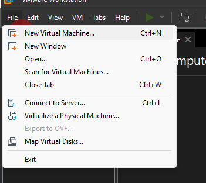

## 2. Next

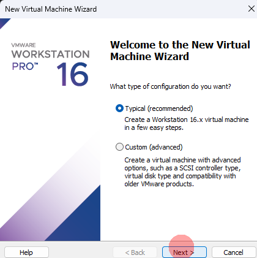

## 3. Chọn file iso

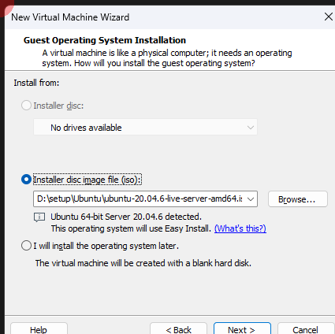

## 4. Điền tk/mk

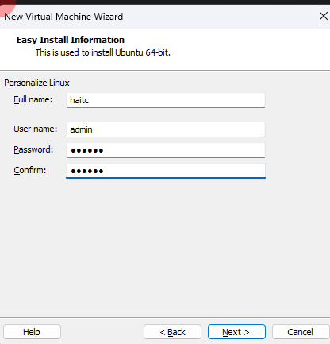

## 5. Đặt tên máy ảo và nơi lưu trữ

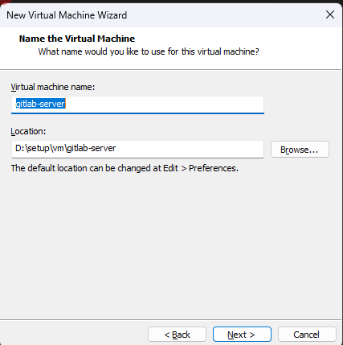

## 6. Đặt giới hạn dung lượng


## 7. Cấu hình phần cứng

- Customize Hardware

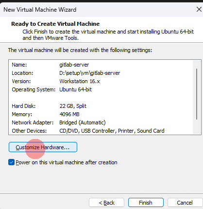

- Giới hạn RAM

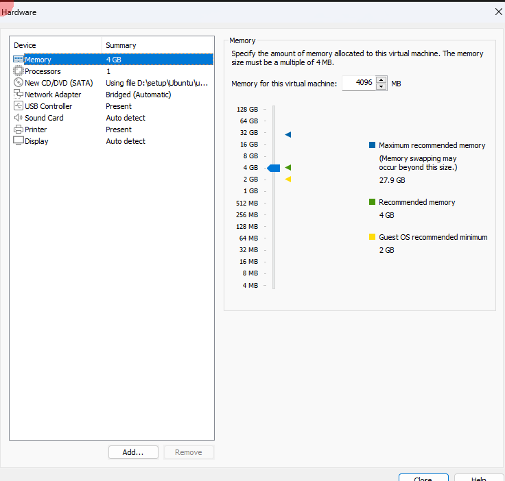

- Cấu hình Processor

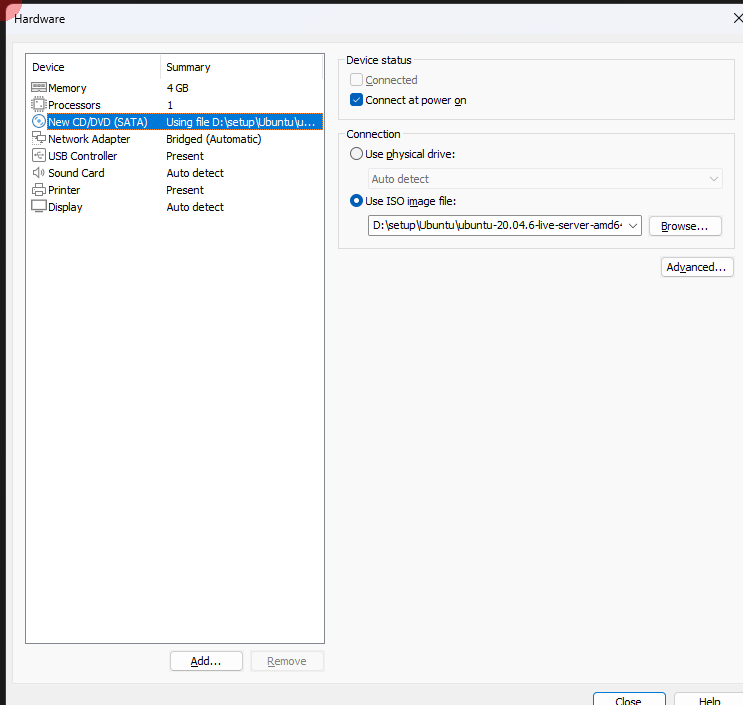

- Network đổi về Brige (mặc định là NAT)

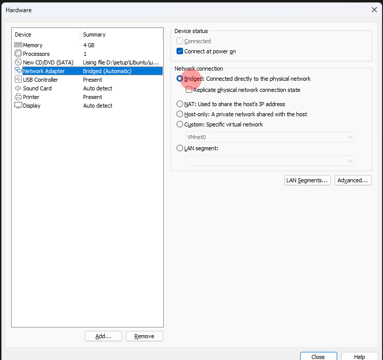

- Chú ý sẽ có 2 kiểu netwwork 2 kiểu này sẽ thay đổi cấu hình gateway4:
  - Brige: Là ip cùng mạng LAN, gateway4: 192.168.1.1
  - NAT: Nội bộ máy local, gateway4 là ip vào Edit>Virtual Network Editer tìm dòng NAT NAT Setting>Gateway Ip

## 8. Close > Finish

9. Bật VM vừa tạo

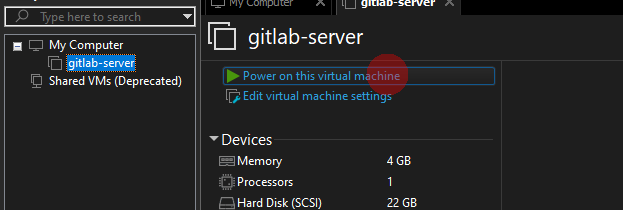
10. Cấu hình VM

- Chọn ngôn ngữ English > Enter

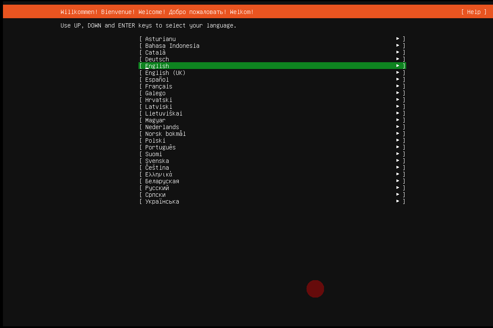

- Không cần update > Enter

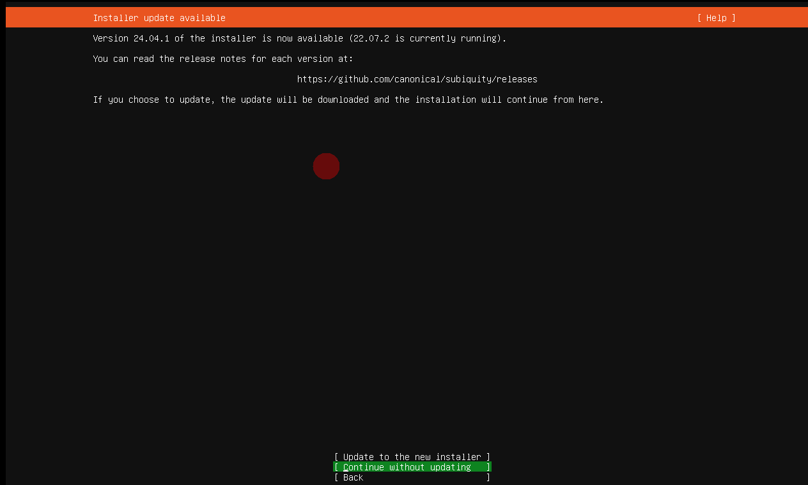

- Keyboard

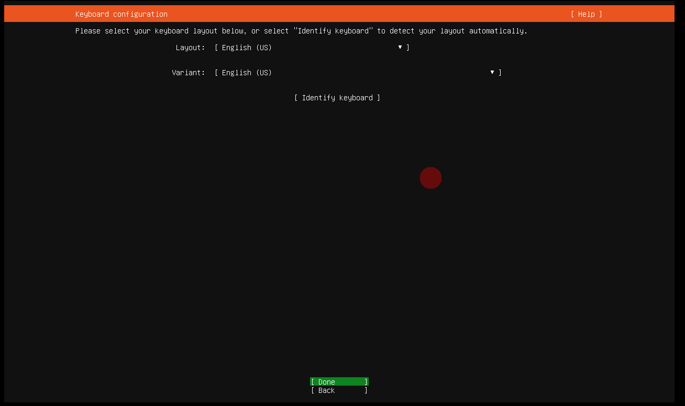

- Network: enS3 là tên card mạng, ip ở dưới là ip động sẽ thay đổi khi restart VM nên sau đó cần cấu hình lại

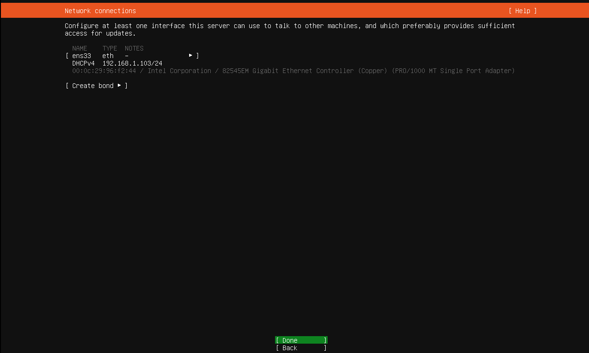

- Proxy để mặc định

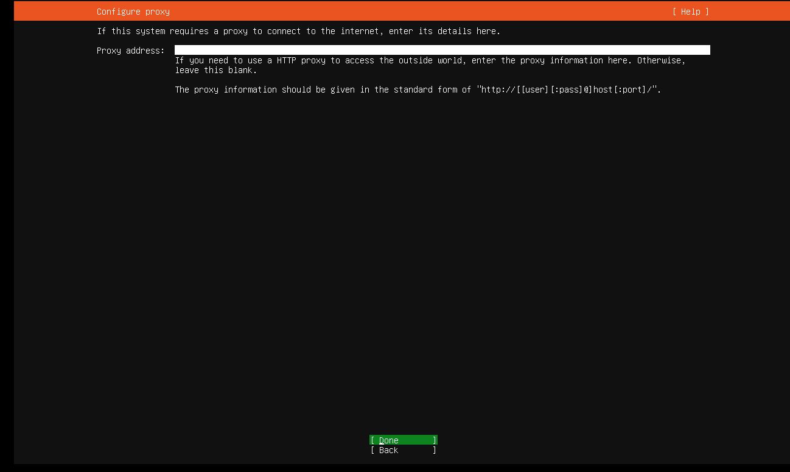

- Miror để mặc định

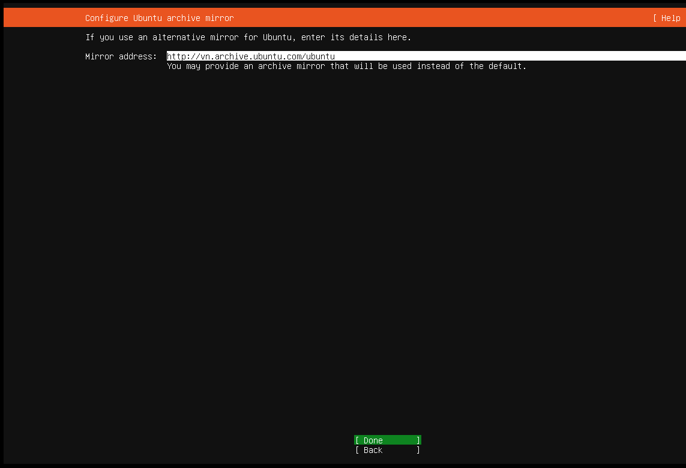

- Storage để mặc định

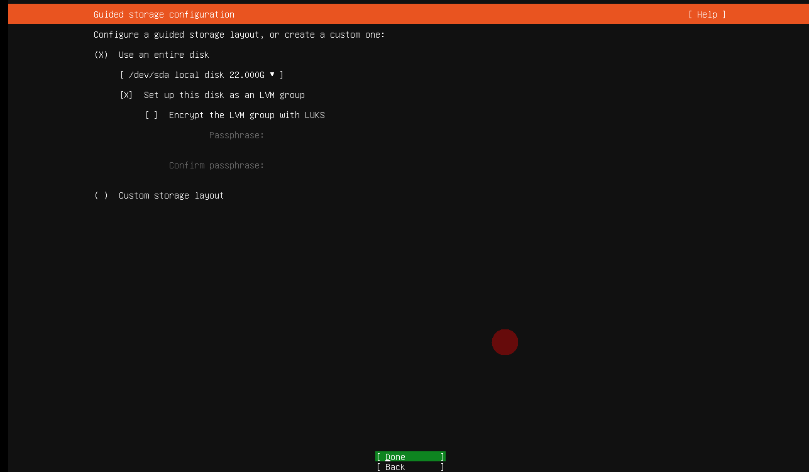

- Disk để dung lượng dòng Ubuntu-LV bằng dòng trên

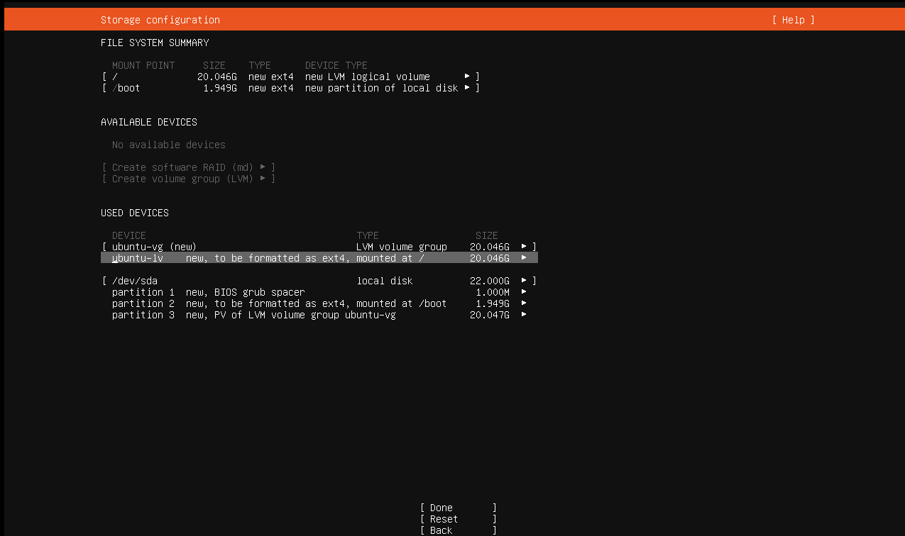

- Điền thông tin

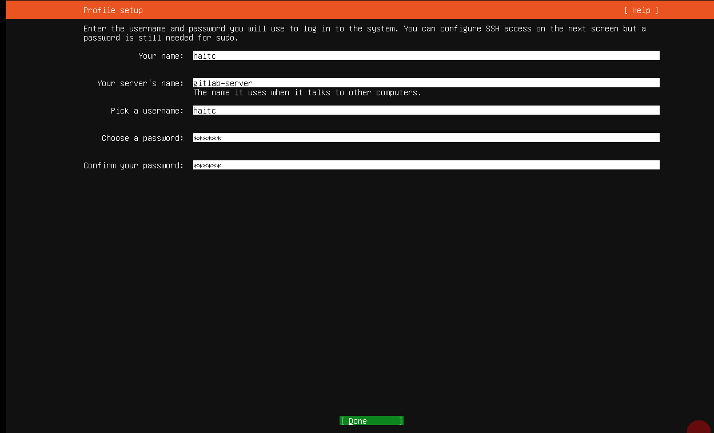

- Cài đặt OpenSSH nhớ tích vào không là phải cài tay như sau:

```sh
sudo apt update
sudo apt install openssh-server
sudo systemctl enable ssh
sudo systemctl start ssh
sudo systemctl status ssh
```

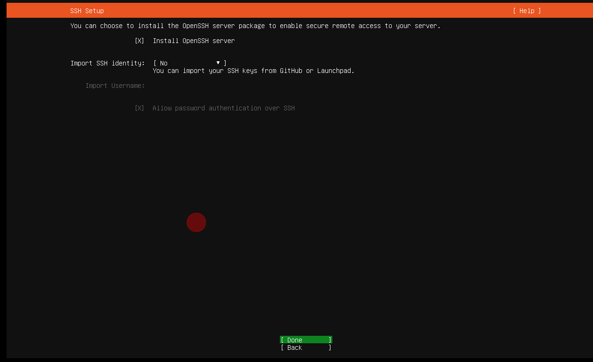

- Cần cài thêm gì thì tick vào

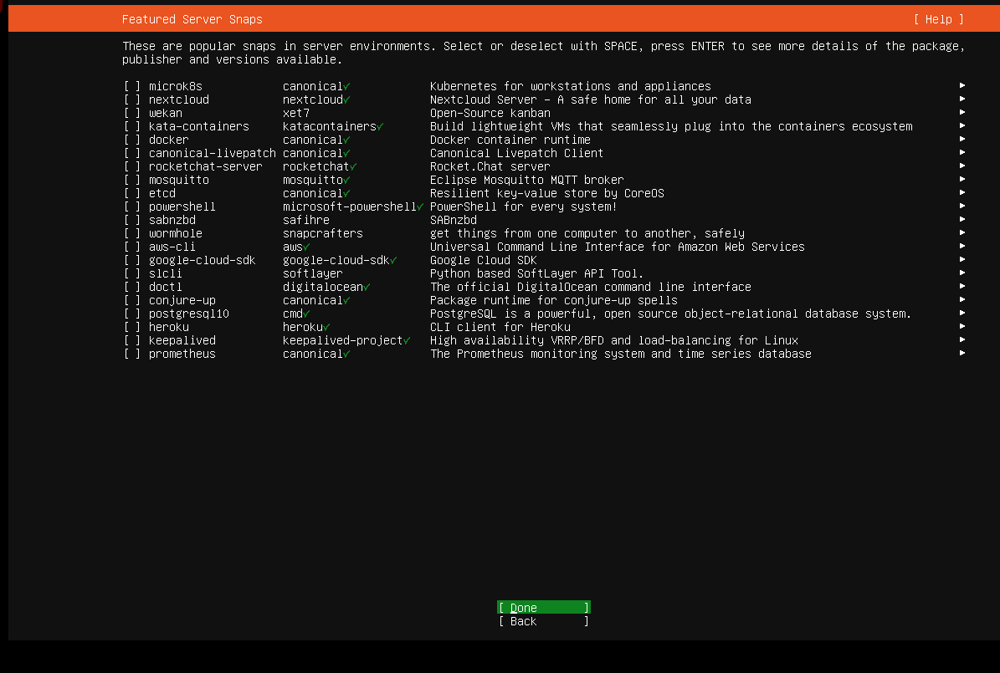

- Chờ cho VM chạy xong

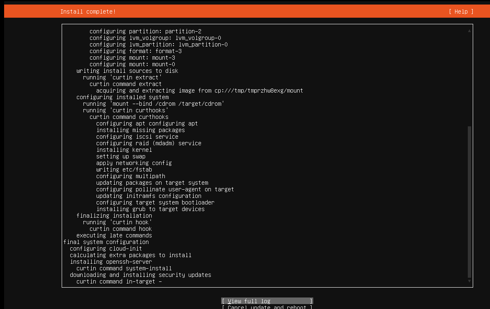

## 11. Cấu hình ip

- Chỉnh sửa file config netplan

``` sh
sudo nano /etc/netplan/00-installer-config.yaml
```

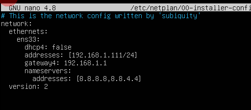

- Ctrl+x y để thoát và lưu

``` sh
# Apply cònig
netplan apply
# kiểm tra xem ở phần es330 ăn ip chưa
ip a
# restart server
reboot
```

## 12. Cài đặt múi giờ

```sh
timedatectl set-timezone Asia/Ho_Chi_Minh 
```

- Kiểm tra

```sh
date
```

## 13. Đặt mật khẩu cho user root

```sh
sudo passwd root
```

- Cho phép ssh bằng root

```sh
sudo vi /etc/ssh/sshd_config
# Tìm sửa ermitRootLogin yes
sudo systemctl restart ssh
reboot
```

# Kiểm Tra và Cài Đặt systemd-resolved

Khởi Động Dịch Vụ:

``` sh
sudo systemctl start systemd-resolved=
```

Kích Hoạt Dịch Vụ Để Tự Động Khởi Động:

``` sh
sudo systemctl enable systemd-resolved
```

 Kiểm Tra Lại
Kiểm Tra Trạng Thái Dịch Vụ:

``` sh
systemctl status systemd-resolved
```

Xem Cấu Hình DNS:

Sau khi dịch vụ đang hoạt động, kiểm tra lại cấu hình DNS:

``` sh
systemd-resolve --status
```

Cập Nhật Cấu Hình Mạng:

``` sh
sudo netplan apply
```

kiểm tra

``` sh
nslookup google.com
ping google.com
```

- Cho phép ssh bằng root: Mở file /etc/ssh/sshd_cònig sửa PermitRootLogin thành yes

``` sh
sudo vi /etc/ssh/sshd_cònig
```
