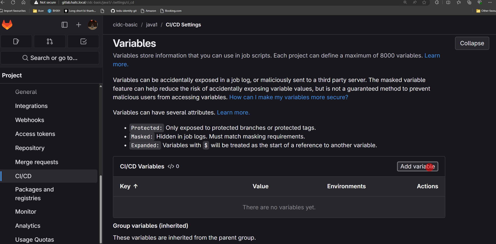
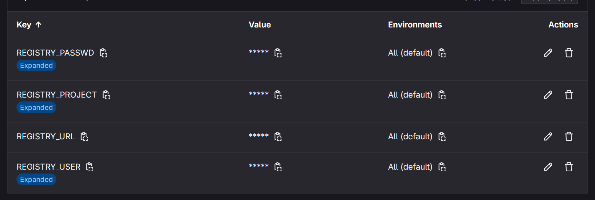

- Cho phép user gitlab-runner chạy lệnh docker: Theem usser gitlab-runner vafo group docker

``` sh
sudo usermod -aG docker gitlab-runner
```

- Tạo biến trong CI?CD: Vào project trên gitlab => Settings => Ci/CD => Vảiable




- .gitlab-ci.yml
``` yml
# Khai báo biến global
variables:
  DOCKER_IMAGE: "$REGISTRY_URL/$REGISTRY_PROJECT/$CI_PROJECT_NAME:${CI_COMMIT_TAG}_${CI_COMMIT_SHORT_SHA}"
  DOCKER_CONTAINER: demojavaapp

stages:
  - build
  - deploy
  - checklog

build:
  stage: build
  variables:
    GIT_STRATEGY: clone
  before_script:
    - echo "$REGISTRY_PASSWD" | docker login $REGISTRY_URL -u $REGISTRY_USER --password-stdin
  script:
    - cd src/demo/
    - docker build -t $DOCKER_IMAGE .
    - docker push $DOCKER_IMAGE
  tags:
    - gitlab-server
  only:
    - tags

deploy:
  stage: deploy
  variables:
    GIT_STRATEGY: none
  before_script:
    - echo "$REGISTRY_PASSWD" | docker login $REGISTRY_URL -u $REGISTRY_USER --password-stdin
  script:
    - docker pull $DOCKER_IMAGE
    - docker rm -f $DOCKER_CONTAINER || true # thêm `|| true` để tránh lỗi nếu container không tồn tại
    - docker run --name $DOCKER_CONTAINER -d -p 8083:8081 $DOCKER_IMAGE
  tags:
    - gitlab-server
  only:
    - tags

checklog:
  stage: checklog
  variables:
    GIT_STRATEGY: none
  script:
    - docker logs $DOCKER_CONTAINER
  tags:
    - gitlab-server
  only:
    - tags

```
