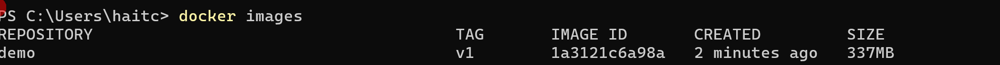
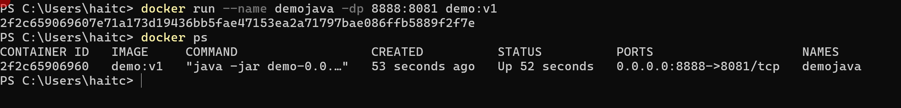

# 1. Các khái niệm cơ bản

## 1.1 Commands

- FROM: Khai báo image
- WORKDIR: Chỉ định thư mục làm việc, nếu folder chưa có sẽ tạo mới
- COPY . . : . đầu tiên là vị trí hiện tại của file Dockerfile trên máy hiện tại, . thứ 2 là vị trí thư mục WORKDIR trong container.
- USER: Xác định người dùng (user) và nhóm (group) sẽ được sử dụng khi chạy container hoặc khi thực hiện các lệnh RUN, CMD, ENTRYPOINT sau đó.

  - Có thể truyền theo tên user/group (ví dụ: USER appuser:appgroup) hoặc theo UID/GID (ví dụ: USER 1000:1000).
  - Nếu chỉ truyền USER <user>, group mặc định sẽ là group chính của user đó.
  - Mặc định khi build image và chạy container, user là root (UID=0).

- ENV: Định nghĩa các biến môi trường.
- EXPOSE: Chỉ định ứng dụng trong container chạy ở port nào.
- RUN: Chạy các câu lệnh Linux.
- CMD: Dùng để xác định lệnh và giá trị mặc định
- ENTRYPOINT: Giữ lệnh cố định được chạy ở cuối.

- So sanh RUN, CMD và ENTRYPOINT
  | Đặc điểm | RUN | CMD | ENTRYPOINT |
  |-----------------------|----------------------------------------------------|---------------------------------------------------------------------|---------------------------------------------------------------------|
  | **Thời điểm chạy** | Khi build image (docker build) | Khi container start (docker run) | Khi container start (docker run) |
  | **Mục đích chính** | Thiết lập môi trường, cài package, copy file... | Xác định lệnh mặc định để chạy khi container khởi động | Xác định tiến trình chính, khó bị override hơn CMD |
  | **Kết quả** | Tạo layer mới trong image | Lệnh mặc định (có thể bị thay thế khi run) | Lệnh bắt buộc (trừ khi dùng `--entrypoint` để override) |
  | **Số lần dùng** | Có thể nhiều lần | Chỉ một lệnh cuối cùng có hiệu lực | Chỉ một lệnh cuối cùng có hiệu lực |
  | **Override được?** | Không | Có → bằng cách truyền lệnh mới trong `docker run` | Khó hơn: tham số `docker run` được truyền thành **tham số cho ENTRYPOINT** |
  | **Dạng khai báo** | `RUN <command>` | Shell form: `CMD <command>` <br> Exec form: `CMD ["executable","arg"]` | Exec form (khuyến nghị): `ENTRYPOINT ["executable","arg"]` <br> Shell form: `ENTRYPOINT <command>` |
  | **Ví dụ** | `RUN apt-get install -y curl` | `CMD ["nginx", "-g", "daemon off;"]` | `ENTRYPOINT ["python", "app.py"]` |

## 1.2 Quy tắc

- Dùng user tương ứng không dùng root
- Chọn image phù hợp
  - Nhỏ nhẹ: Dùng alpine thay ubuntu
  - Uy tín: Chọn base image từ các nguồn official, verified, sponsored
  - Sử dụng công cụ kiểm tra image
- Sử dụng multi-stage để giảm dung lượng container: Build, Deploy...

# 2. Dockerfile dự án

## 2.1 Java

### 2.1.1 Basic

- tạo file Dcokerfile trong thư mục gốc chứa source code

```Dockerfile
## Build Stage ##
FROM maven:3.9.9-eclipse-temurin-21-alpine as build
WORKDIR /app
COPY . .
RUN mvn install -DskipTests=true
## Run Stage ##
FROM amazoncorretto:21-alpine3.18-full
WORKDIR /run
COPY --from=build /app/target/demo-0.0.1-SNAPSHOT.jar /run/demo-0.0.1-SNAPSHOT.jar
EXPOSE 8081
ENTRYPOINT [ "java", "-jar", "demo-0.0.1-SNAPSHOT.jar" ]
```

- Giải thích:
  - Ở Build cần jdk và maven để build dự án java, dungfimage của alpine cho nhẹ
  - Samg bước run thì không cần maven chỉ cần jdk là đủ, nên sử dụng imae của amazon.
  - Vì code cấu hình chạy port 8081 nên cần EXPOSE đúng port 8081
- Build docker image từ file Dockerfile

````sh
docker build -t demo:v1 .
```



- Run container

````sh
docker run --name demojava -dp 8081:8081 demo:v1
```



### 2.1.2 Sử dụng Alpine thuần thay vì amazoncorretto

- Copy Dockerfile ra file Dockerfile-v2

```Dockerfile
## Build Stage ##
FROM maven:3.9.9-eclipse-temurin-21-alpine as build
WORKDIR /app
COPY . .
RUN mvn install -DskipTests=true
## Run Stage ##
FROM alpine:20240807
RUN apk add openjdk21
WORKDIR /run
COPY --from=build /app/target/demo-0.0.1-SNAPSHOT.jar /run/demo-0.0.1-SNAPSHOT.jar
EXPOSE 8081
ENTRYPOINT [ "java", "-jar", "demo-0.0.1-SNAPSHOT.jar" ]
```

- Build image

````sh
docker build -t demo:v2 -f Dockerfile-v2 .
```

- Run

````sh
docker run --name demojava2 -dp 8082:8081 demo:v2
```

### 2.1.3 Sử dụng user demo (tương ứng với tên project) thay vì root

```Dockerfile
## Build Stage ##
FROM maven:3.9.9-eclipse-temurin-21-alpine as build
WORKDIR /app
COPY . .
RUN mvn install -DskipTests=true
## Run Stage ##
FROM alpine:20240807

RUN adduser -D demo
RUN apk add openjdk21

WORKDIR /run
COPY --from=build /app/target/demo-0.0.1-SNAPSHOT.jar /run/demo-0.0.1-SNAPSHOT.jar

RUN chown -R demo:demo /run
USER demo

EXPOSE 8081
ENTRYPOINT [ "java", "-jar", "demo-0.0.1-SNAPSHOT.jar" ]
```

- Build image

````sh
docker build -t demo:v3 -f Dockerfile-v3 .
```

- Run

````sh
docker run --name demojava3 -dp 8083:8081 demo:v3
```

- Kiểm tra user run project

````sh
docker exec -it demojava3 sh
whoami
```

## 2.2 React

### 2.2.1 Basic

```Dockerfile
## build stage ##
FROM node:20.17.0-alpine AS build
WORKDIR /app
COPY . .
RUN npm install && npm run build

## Run stageCLS
FROM nginx:stable-alpine3.20-perl
COPY --from=build /app/build /usr/share/nginx/html
EXPOSE 80
CMD ["nginx", "-g", "daemon off;"]
```

````sh
docker run --name ecommercewebapp -dp 3000:80 ecommercewebapp:v1
```

### 2.2.2 Advance

- Tạo file nginx.conf trong thư mục dự án

```nginx.conf
##### nginx.conf ####
user  nginx;
worker_processes  1;
error_log  /var/log/nginx/error.log warn;
pid        /var/run/nginx.pid;
events {
  worker_connections  1024;
}
http {
  include       /etc/nginx/mime.types;
  default_type  application/octet-stream;
  log_format  main  '$remote_addr - $remote_user [$time_local] "$request" '
                    '$status $body_bytes_sent "$http_referer" '
                    '"$http_user_agent" "$http_x_forwarded_for"';
  access_log  /var/log/nginx/access.log  main;
  sendfile        on;
  keepalive_timeout  65;
  server {
    listen       80;
    server_name  webclient;
    location / {
      root   /run;
      index  index.html;
      try_files $uri $uri/ /index.html;
    }
    error_page   500 502 503 504  /50x.html;
    location = /50x.html {
      root   /usr/share/nginx/html;
    }
  }
}
```

```Dockerfile
## build stage ##
FROM node:20.17.0-alpine AS build
WORKDIR /app
COPY . .
RUN npm install && npm run build

## Run stageCLS
FROM nginx:stable-alpine3.20-perl
WORKDIR /run
COPY --from=build /app/build /run
COPY nginx.conf /etc/nginx/nginx.conf
```

````sh
docker run --name ecommercewebapp2 -dp 3001:80 ecommercewebapp:v2
```

# [Mẫu Dockerfile](https://elroydevops.tech/mau-dockerfile-cac-du-an/#Dockerfile_React)
