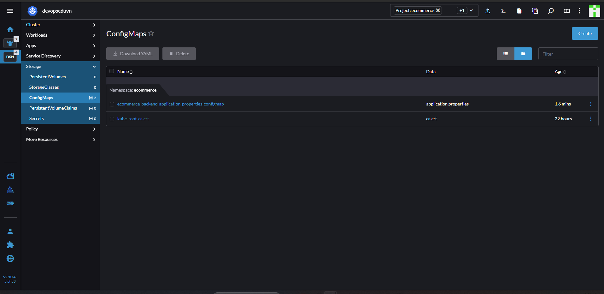

# K8s ConfigMap

- Là tài nguyên lưu trữ cấu hình dưới dạng ky/value hoặc file
- Dùng để Mapping cấu hình giữa k8s và container.

## 1. Áp dụng cho việc cấu hình dự án BE ở bài trước

**Chỉnh sửa `Dockerfile`**

- Ở dòng `ENTRYPOINT java -jar /run/spring-boot-ecommerce-0.0.1-SNAPSHOT.jar` chúng ta chưa chỉ định rõ file cấu hình khi chạy dự án. Cần sửa thành `ENTRYPOINT java -jar /run/spring-boot-ecommerce-0.0.1-SNAPSHOT.jar --spring-config-localation=/run/src/main/resources/application.properties`

>Note: `/run/src/main/resources/application.properties` là thư mục trong ontainer

- Build image v2

```sh
docker build -t haitc21/ecommerce-backend:v2 .
docker push haitc21/ecommerce-backend:v2
```

- Lên Rancher tạo tài nguyên ConfigMap

```yml
apiVersion: v1
kind: ConfigMap
metadata:
  name: ecommerce-backend-application-properties-configmap
  namespace: ecommerce
data:
  application.properties: |
    spring.datasource.url=jdbc:mysql://192.168.159.105:3306/full-stack-ecommerce #chú ý thay đổi địa chỉ IP của bạn 
    spring.datasource.username=ecommerceapp
    spring.datasource.password=StrongPa55WorD
    spring.datasource.driverClassName=com.mysql.cj.jdbc.Driver
    spring.datasource.sql-script-encoding=UTF-8

    spring.jpa.properties.hibernate.globally_quoted_i/dentifiers=true
    spring.jpa.properties.hibernate.dialect=org.hibernate.dialect.MySQL8Dialect
    spring.jpa.hibernate.ddl-auto=none
    spring.jpa.show-sql=true
    spring.jpa.properties.hibernate.format_sql=true

    spring.data.rest.base-path=/api
    spring.data.rest.detection-strategy=ANNOTATED

    allowed.origins=http://ecommerce.devopsedu.vn

    okta.oauth2.client-id=0oab0lzwjoN1Rjsar5d7
    okta.oauth2.issuer=https://dev-82108115.okta.com/oauth2/default
```

- Lưu ý:
  - name:`<tên app>-<tên file>-configmap`
  - `data.<tên file>`
- **ConfigMap** ở trong **Storage**



- Để container sử dụng được ConfigMap thì cần:
  - Tạo volume để lưu ConfigMap
  - Mount volume vào trong container
- Edit YAML **ecommerce-backend-deployment**
  - spec.template.spec thêm **volume** `ecommerce-backend-application-properties-config-volume` (ngang hàng với containers).

```yml
volumes:
        - name: ecommerce-backend-application-properties-config-volume
          configMap:
            name: ecommerce-backend-application-properties-configmap
```

- spec.template.spec.containers trong image:
  - tăng version image lên v2
  - Thêm **volumeMounts**

```yml
volumeMounts:
            - name: ecommerce-backend-application-properties-config-volume
              mountPath: /run/src/main/resources/application.properties
              subPath: application.properties
```

= Có thể kiểm tra bằng cách **Execute Shell** trong Deployment:

```sh
cat /run/src/main/resources/application.properties

```
>Note: Khi **sửa ConfigMap** thì cần **Redeploy Deployment**.