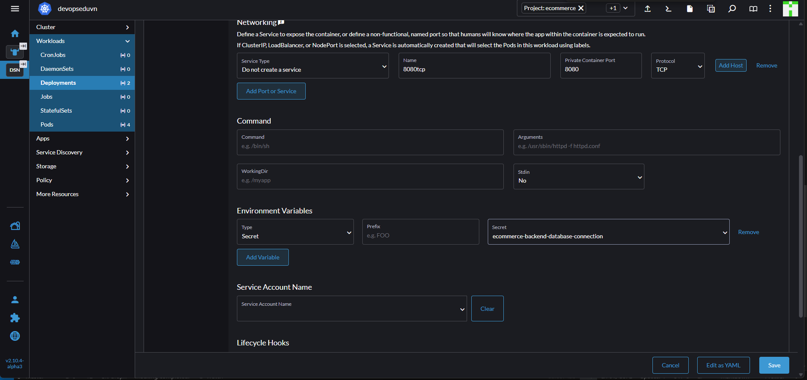
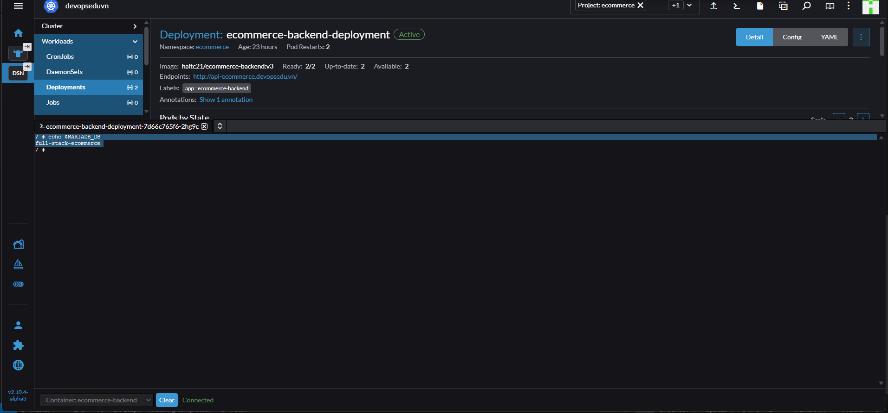

# k8s Secret

- Để lưu trữ các giá trị nhạy cảm cần được bảo mật
- Giá trị sẽ sẽ được:
  - Mã hóa cơ bản base64: **Mã hóa này để đảm bảo truyền tải dữ liệu chứ không phải để bảo mật**.
  - Hạn chế truy cập qua k8s API
  - Không được ghi trong log.
**Types**
| Secret Type                          | Mô tả                                           | Ví dụ ngắn |
|-------------------------------------|--------------------------------------------------|-------------|
| **Opaque**                          | Dữ liệu tùy ý do người dùng tự định nghĩa       | Lưu thông tin cấu hình hoặc token API tùy chỉnh |
| **kubernetes.io/service-account-token** | Token của ServiceAccount để truy cập API Server | Token dùng bởi Pod để xác thực với Kubernetes API |
| **kubernetes.io/dockercfg**         | File `~/.dockercfg` được tuần tự hóa            | Thông tin đăng nhập Docker cũ (định dạng dockercfg) |
| **kubernetes.io/dockerconfigjson**  | File `~/.docker/config.json` được tuần tự hóa   | Thông tin đăng nhập Docker Registry hiện tại |
| **kubernetes.io/basic-auth**        | Thông tin xác thực cơ bản (username/password)   | Lưu thông tin đăng nhập dịch vụ REST API |
| **kubernetes.io/ssh-auth**          | Thông tin xác thực SSH                         | Lưu private key SSH để kết nối máy chủ từ xa |
| **kubernetes.io/tls**               | Dữ liệu chứng chỉ và khóa riêng TLS             | Lưu cặp `tls.crt` và `tls.key` cho HTTPS |

## Sử dụng Secret  cho ecommerce-backend để cấu hình DB

-Sử dụng `type: Opaque`

- Dữ liệu ở đây có 2 kiểu
  - Data: Phải tự chuyển dữ liệu sang base64 trước.
  - **stringData**: Điền dữ liệu string sau đó k8s tự chuyển sang base64.

```yml
apiVersion: v1
kind: Secret
metadata:
  name: ecommerce-backend-database-connection
  namespace: ecommerce
type: Opaque
stringData:
  MARIADB_HOST: "192.168.159.105"
  MARIADB_DB: "full-stack-ecommerce"
  MARIADB_PORT: '3306'
  MARIADB_USERNAME: "ecommerceapp"
  MARIADB_PASSWORD: "StrongPa55WorD"
```

- Kiểm tra trên Rancher => Storage => Secrets
- Deployments => ecommerce-backend-deployment => kéo xuống phần **Enviroment Variables** => Add Variable
  - Type: Secret
  - Selector: ecommerce-backend-database-connection

  
  
- Save
- Có thể xem thay đổi trong file yml,phần `template.spec.containers` trong container sex theem

```yml
secretRef:
                name: ecommerce-backend-database-connection
                optional: false
```

- **Bản chất sẽ giống với việc set các biến môi trường trong container** nên có thể vào Pod => Execute Shell

```sh
echo $MARIADB_DB
```



- Sửa **ConfigMap** `ecommerce-backend-application-properties-configmap` => Edit Config => sỬA VALUE CỦA `APPLICATION.PROPERTIES` THAY VÌ DÙNG TRƯC TIẾP GIÁ TRỊ THÌ SẼ DÙNG BIẾN MÔI TRƯỜNG

```APPLICATION.PROPERTIES
spring.datasource.url=jdbc:mysql://${MARIADB_HOST}:${MARIADB_PORT}/${MARIADB_DB}
spring.datasource.username=${MARIADB_USERNAME}
spring.datasource.password=${MARIADB_PASSWORD}
spring.datasource.driverClassName=com.mysql.cj.jdbc.Driver
spring.datasource.sql-script-encoding=UTF-8

spring.jpa.properties.hibernate.globally_quoted_i/dentifiers=true
spring.jpa.properties.hibernate.dialect=org.hibernate.dialect.MySQL8Dialect
spring.jpa.hibernate.ddl-auto=none
spring.jpa.show-sql=true
spring.jpa.properties.hibernate.format_sql=true

spring.data.rest.base-path=/api
spring.data.rest.detection-strategy=ANNOTATED

allowed.origins=http://ecommerce.devopsedu.vn

okta.oauth2.client-id=0oab0lzwjoN1Rjsar5d7
okta.oauth2.issuer=https://dev-82108115.okta.com/oauth2/default
```

- rEDEPLOY DEPLOYMENT `ECOMMERCE-BACKEND-DEPLOYMENT`
