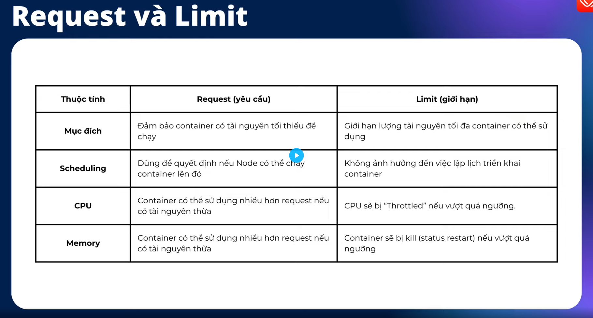
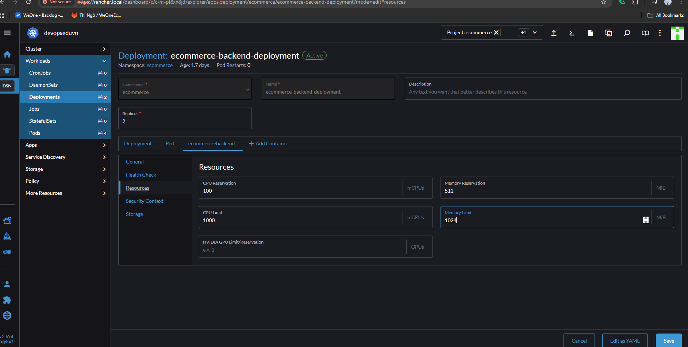

# Request & Limit

- **Request**: Tài nguyên tối hiểu.
- **Limi**: Giới hạn ài nguyên tối đa
  - Khi container **vượt ngưỡng CPU** thì k8s sẽ **throttling** tức là giowishanj tốc độ CPU.
  - Khi container **vượt ngưỡng Memor**y thì k8s sẽ **kill container**.

| Loại tài nguyên | Đơn vị                 | Ví dụ request      | Ví dụ limit       |
| --------------- | ---------------------- | ------------------ | ----------------- |
| CPU             | core / millicore (`m`) | `250m` (0.25 core) | `500m` (0.5 core) |
| Memory          | byte / Mi / Gi         | `512Mi`            | `1Gi`             |

| Đơn vị               | Cách tính               | Số byte chính xác | Hệ đếm                  | Dùng ở đâu                           |
| -------------------- | ----------------------- | ----------------- | ----------------------- | ------------------------------------ |
| **1 MB (Megabyte)**  | 1 MB = 1,000,000 bytes  | 10⁶ bytes         | **Thập phân (Decimal)** | Các ổ cứng, SSD, network speed, …    |
| **1 MiB (Mebibyte)** | 1 MiB = 1,048,576 bytes | 2²⁰ bytes         | **Nhị phân (Binary)**   | RAM, hệ điều hành, Kubernetes, Linux |

## Đặt Request & Limit cho ecommerce-backend-deploymet

- Lên Rancher => Deployments => Edit Config => Resoueces

