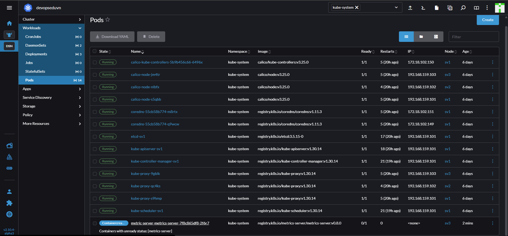

# Horizontal Pod Autoscaling - HPA

## 1. HPA

- Phương pháp này dựa trên 2 tài nguyên là CPU và Memory
- Ví dụ cấu hình khi CPU vượt quá 80% **limit** thì sẽ tự sacle ra Pod mới. Cũng như có thể để min 2, max 10 Pod.
- thực tế cần **cân nhắc kỹ khi sử dụng HPA** vì sẽ có khả năng gây ra **Over Résource**.. Nên trong giai đoạn đầu vẫn nên sacle thủ công, sau khi có đủ đủ thông tin, tính toán kỹ thuật mới sử dụng HPA.
- Để có thể sử dụng HPA thì bặt buộc cần có công cụ để thu thập số liệu về tài nguyên sử dụng. Theo tài liệu chính thức của k8s thì khuyên dùng **Metrics Server,**

## 2. Metric Server

- Cài đặt Metric Server sử dụng Helm trên **sv1**

```sh
helm repo add  metric-server https://kubernetes-sigs.github.io/metrics-server/
helm pull metric-server/metrics-server
tar -xvf metrics-server-*
helm install metric-server metrics-server -n kube-system
```

- Kiểm tra trên Rancher => namespace `kube-system`
\


- Hiện tại Pod đang fall cần chỉnh sửa yml của Deployment:
  - Sửa hết 10250 => 4443
  - Trong `template.spec.containers.args` thêm 1 dòng '--kubelet-insecure-tls=true'
- Kiểm tra thông tin

```sh
kubectl top nodes
kubectl top po -n ecommerce
```

## 3. Theem HPA cho ecommerce-backend

- Rancher => Service Discovery => HorizontalPodScalers
- Import

```yml
apiVersion: autoscaling/v1
kind: HorizontalPodAutoscaler
metadata:
  name: ecommerce-backend-autoscaling
  namespace: ecommerce
spec:
  scaleTargetRef:
    apiVersion: apps/v1
    kind: deployment
    name: ecommerce-backend-deployment
  minReplicas: 2
  maxReplicas: 4
  targetCPUUtilizationPercentage: 50
```

- Giải thích:
  - minReplicas: Số Pod tối thiểu.
  - maxReplicas: Số Pod tối đa.
  - `targetCPUUtilizationPercentage: 50`: Sacle khi vượ quá 50% **Limit** CPU.
- Để test autosacle thì Execute vào Pod `ecommerce-backend` và sử dụng `stress`
- Mặc định sau **15s autoscale up** và **300s autoscale down**.

```sh
apk update
apk add stress-ng
# Giả lập sử dụng 1 cpu
stress-ng --cpu 1
```
