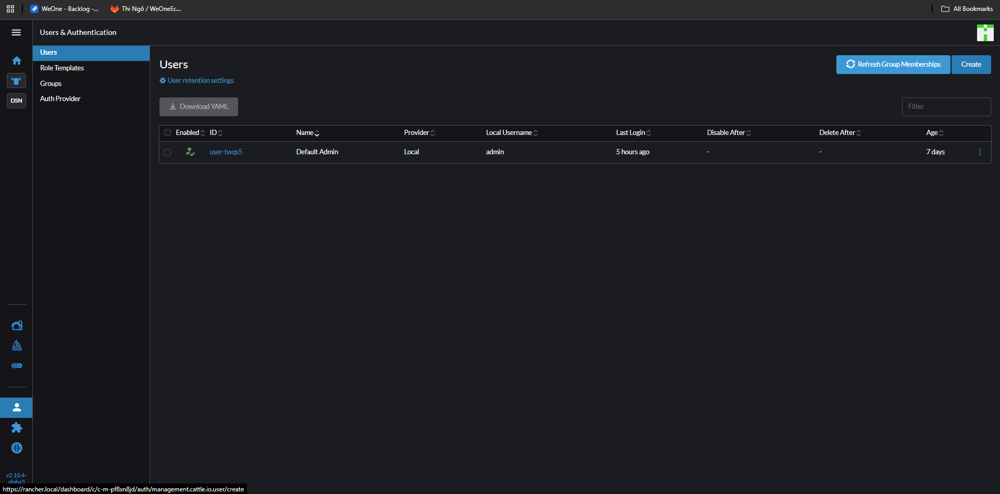

# rbac aUTHORIZATION

- rANCHER => Users & Authentication => uSERS => cREATE

- Tạo user **haitc** với **Global Permissions** là **User Base**
- Đăng nhập user **haitc** thì sẽ không thấy bất cứ clusster nào.
- Về tài khoản **admin** vào phần **Role Templates** có 3 tab là **Global**, **Cluster**, **Project**.

- Muốn thêm user **haitc** vào cluster **devopseduvn** thì chọn clusster => **Cluster and Project Members** tab **Cluster**.

- Đầu tiên cần gán quyền để View được cluster trước

~

- Ở đây **Custom** chính là các Role trong **Role Tamplates**.
- Sang user **haitc** lúc này có thể xem các tài nguyên trong cụm **devopseduvn**.
- Cũng có thể phân quyền đến project **Cluster and Project Members**
- Có thể tạo role Custom để chuyên sau hơn ví dụ tạo role **View ConfigMap and Worfloads** kế thừa từ 2 role template 

