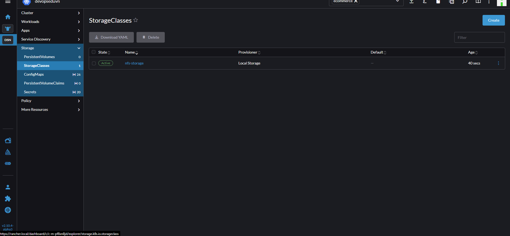

# Storage Class

- Tài nguyên quản lý các loại lưu trữ trong k8s
- Kiểu như StorageClass cho SSD, HDD.
- đỌC [k8S sTORAGEcLASS](https://kubernetes.io/docs/concepts/storage/storage-classes/) ĐỂ BIẾT THÊM CHI TIẾT CÁC LOẠI sTORAGE cLASS.
- bÀI NÀY SẼ DÙNG LOẠI sTORAGE cLASS PHỔ BIẾN TRÊN ON-PREM LÀ **nfs**
- Ví dụ như cài **NFS Server** lên máy chủ Db (sv5) và cluster chỉ cần cài **NFS Client** là có thể sử dụng để lưu dữ liệu.
- NFS lưu trữ tập trung nên không đảm bảo tính HA do vậy trong thực tế nên sử dụng [**GlusterFS**](
Events Planet Gluster Documentation
Quick Start Guide
More detailed Installation Guide
Administrators Guide
GlusterFS Developer Guide
Upgrade Guide
More documentation…
 Community
How to get involved?
Consultants
Development repositories for Gluster
Release Schedule
Roadmap
Gluster Dashboard
 Install
Search
Previous

Storage for your cloud
Gluster is a free and open source software scalable network filesystem.

Install Gluster

Scalable data filesystem
Gluster is a free and open source software scalable network filesystem.

Install Gluster

Next

Get to know the community
Gluster is powered by an open source community of users and developers.

Read more

Participate
Participate with the community!

Read more

Suggest a feature
Want to suggest a feature?

Read more
BLOG
06 Dec 2020
Looking back at 2020 – with g...
2020 has not been a year we would have been able to predict. With a worldwide pandemic and lives thrown out of gear, as we head into 2021, we are thankful that our community and project continued to receive new developers, users and make small gains. For that and a...

Read more
27 Apr 2020
Update from the team
It has been a while since we provided an update to the Gluster community. Across the world various nations, states and localities have put together sets of guidelines around shelter-in-place and quarantine. We request our community members to stay safe, to care for their loved ones, to continue to be...

Read more
03 Feb 2020
Building a longer term focus for Gl...
The initial rounds of conversation around the planning of content for release 8 has helped the project identify one key thing – the need to stagger out features and enhancements over multiple releases. Thus, while release 8 is unlikely to be feature heavy as previous releases, it will be the...

Read more
View all
About Gluster

Gluster is a free and open source scalable network filesystem
Gluster is a scalable network filesystem. Using common off-the-shelf hardware, you can create large, distributed storage solutions for media streaming, data analysis, and other data- and bandwidth-intensive tasks. Gluster is free.

Join Gluster Browse guides
Back to top
MENU

Install
News
Documentation
Support
COMMUNITY

Get to know the community
DOCUMENTATION

Quick Start Guide
More detailed Installation Guide
Administrators Guide
GlusterFS Development Guide
Upgrade Guide
Copyright © 2019, Red Hat, Inc. All rights reserved.
Terms Of Service Privacy Statement Trademarks Code of Conduct), [**NFS Ganesha server**](https://github.com/kubernetes-sigs/nfs-ganesha-server-and-external-provisioner)

- Có 1 tùy chọn cần chú ý là **Vloume binding mode** để quyết định xem volume sẽ đượ gắn ngay hay bao giờ sử dụng mới gắn.
- tạo Storage Class trên Rancher

```yml
apiVersion: storage.k8s.io/v1
kind: StorageClass
metadata:
  name: nfs-storage
provisioner: kubernetes.io/no-provisioner
volumeBindingMode: WaitForFirstConsumer
```



>Note: **StorageClass là tài nguyên toàn cục** không cần chỉ định Namespace
