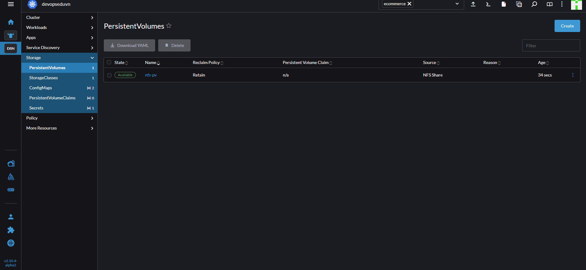
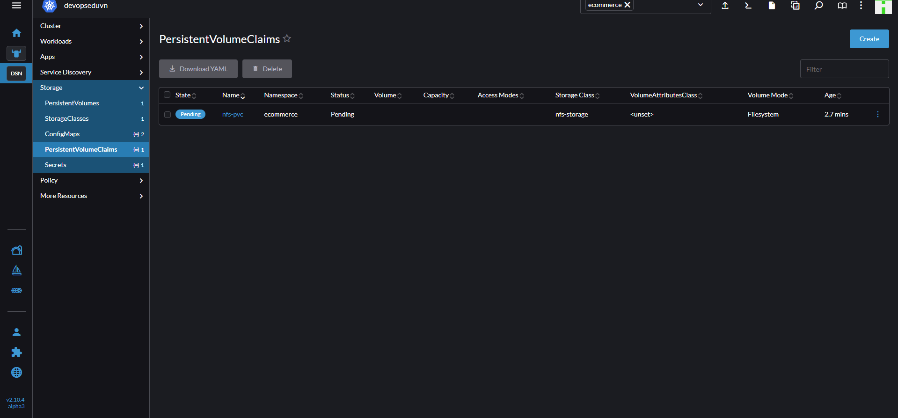
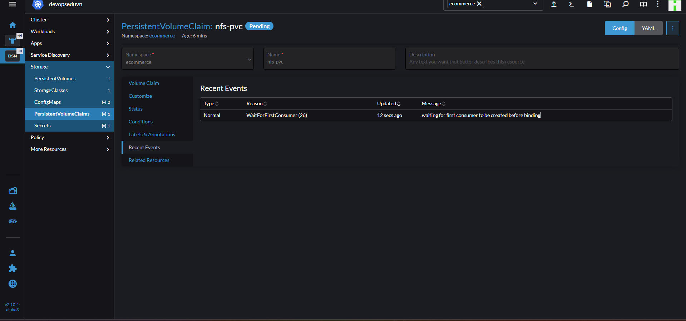
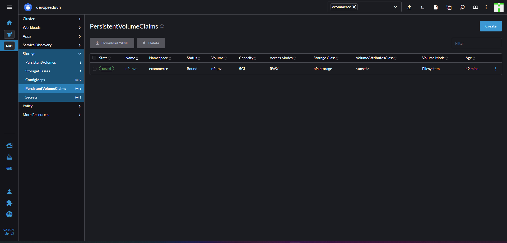

# 1. PersistentVolumes (PV) - PersistentVolumeClaims (PVC)

## 1. Lý thuyết

- PV: Đối tượng trong k8s cung cấp kha năng lưu trữ bền vững
- PVC: Yêu cầu từ người dùng sử dụng 1 vùng lưu trữ dựa trên PV.
- Không nên sử dụng **hostPath** trong thực tế vì tùy chọn này sử dụng trực tiếp disk của node, gây các vấn đề về đồng bộ dữ liệu, mất mát dữ liệu...
- Access Modes:
  - ReadWriteOnce
  - ReadOnlyMany
  - ReadWriteOncePod

| Volume Plugin   | ReadWriteOnce             | ReadOnlyMany             | ReadWriteMany                     | ReadWriteOncePod       |
|-----------------|---------------------------|---------------------------|-----------------------------------|------------------------|
| AzureFile       | ✓                         | ✓                         | ✓                                 | -                      |
| CephFS          | ✓                         | ✓                         | ✓                                 | -                      |
| CSI             | depends on the driver     | depends on the driver     | depends on the driver             | depends on the driver  |
| FC              | ✓                         | ✓                         | -                                 | -                      |
| FlexVolume      | ✓                         | ✓                         | depends on the driver             | -                      |
| HostPath        | ✓                         | -                         | -                                 | -                      |
| iSCSI           | ✓                         | ✓                         | -                                 | -                      |
| NFS             | ✓                         | ✓                         | ✓                                 | -                      |
| RBD             | ✓                         | ✓                         | -                                 | -                      |
| VsphereVolume   | ✓                         | -                         | - (works when Pods are collocated)| -                      |
| PortworxVolume  | ✓                         | -                         | ✓                                 | -                      |

- Reclaim Policy: Khi  PVC bị xóa hoặc unbound thì dữ liệu trong PV sẽ được xử lý như thế nào.

| Reclaim Policy | Mô tả                                 | Hành động thực hiện                                                                                                                                                                                       |
| -------------- | ------------------------------------- | --------------------------------------------------------------------------------------------------------------------------------------------------------------------------------------------------------- |
| **Retain**     | Giữ lại dữ liệu sau khi PVC bị xóa.   | PV vẫn tồn tại ở trạng thái *Released*, dữ liệu vẫn còn nguyên trên storage. Quản trị viên phải xóa thủ công dữ liệu hoặc PV.                                                                             |
| **Recycle**    | Tự động “dọn dẹp” dữ liệu cơ bản.     | Kubernetes chạy lệnh `rm -rf /thevolume/*` để xóa tất cả nội dung trong volume, sau đó PV sẵn sàng được bind lại với PVC khác. *(Tuy nhiên, tính năng này đã bị **deprecated** trong các phiên bản mới.)* |
| **Delete**     | Xóa toàn bộ dữ liệu và volume vật lý. | PV và tài nguyên lưu trữ backend (ví dụ: EBS volume, GCE PD, v.v.) sẽ bị xóa hoàn toàn.                                                                                                                   |

>⚠️ Lưu ý: Từ Kubernetes 1.34, chỉ còn nfs và hostPath volume types hỗ trợ chính sách Recycle. Các loại volume khác nên sử dụng Delete hoặc Retain.

- PersistentVolume Phase (Trạng thái của PV)

| Phase         | Ý nghĩa ngắn gọn                                  |
| ------------- | ------------------------------------------------- |
| **Available** | PV trống, sẵn sàng sử dụng                        |
| **Bound**     | PV đang được sử dụng bởi một PVC                  |
| **Released**  | PVC bị xóa, PV đang chờ xử lý theo Reclaim Policy |
| **Failed**    | PV gặp lỗi trong quá trình xử lý reclaim          |

## 2. Thực hành

- Cài NFS Server trên **sv5**

```sh
sudo apt update -y && sudo apt install nfs-server -y
# Tạo thư mục lưu trữ
mkdir /data
chown -R nobody:nogroup /data
chmod -R 777 /data
# Thêm `/data *(rw,sync,no_subtree_check)` vào trong /etc/rxport
sudo vi /etc/export
sudo exportfs -rav
sudo systemctl restart nfs-server
```

- Cài đặt `nfs-common` trên cả 3 server trong cụm (sv1,sv2,sv3)

```sh
sudo apt update -y && sudo apt install nfs-common -y
```

- Tạo PV, Import Rancher

```yml
apiVersion: v1
kind: PersistentVolume
metadata:
  name: nfs-pv
spec:
  capacity:
    storage: 5Gi
  accessModes:
    - ReadWriteMany
  nfs:
    path: /data
    server: 192.168.159.105 #chú ý thay đổi địa chỉ IP tương ứng của bạn
  persistentVolumeReclaimPolicy: Retain
  storageClassName: nfs-storage #storage class ở bài trước-
```



- tạo PVC

```yml
apiVersion: v1
kind: PersistentVolumeClaim
metadata:
  name: nfs-pvc
  namespace: ecommerce
spec:
  accessModes:
    - ReadWriteMany
  resources:
    requests:
      storage: 5Gi
  storageClassName: -storagenfs
```



>Note: Trạng thái của PVC là **Pending** vì **StorageClass** `-storage` cấu hình `volumeBindingMode: WaitForFirstConsumer` và chưa có Pod nào sử dụng PVC.

- Vào trong chi tiết PVC vừa tạo phần **Recent Event**



- tạo Pod test thử PVC

```yml
apiVersion: v1
kind: Pod
metadata:
  name: nfs-nginx
  namespace: ecommerce
spec:
  containers:
    - image: nginx
      name: nginx
      volumeMounts:
        - mountPath: /usr/share/nginx/html
          name: nfs-storage
  volumes:
    - name: nfs-storage
      persistentVolumeClaim:
        claimName: nfs-pvc
```

- PVC đã **Bound**
- Thử tạo 1 file trong pod vừa tạo ở thư mục `/usr/share/nginx/html` đã được mount vào PV. Execute Sheel vào Pod  `nfs-nginx`

```sh
touch /usr/share/nginx/html/create_file_from_k8s.txt
ls /usr/share/nginx/html/
```



- Kiểm tra trên **sv5** xem đã mount đúng chưa

```sh
ls /data
```

## 3. Tổng kết

Các bước thực hiện

- Tạo StorageClass
- Cài đặt nfs-server
- Cài đặt nfs-common trên các node k8s.
- Tạo PV
- Tạo PVC
- Mount Pod vào PVC
