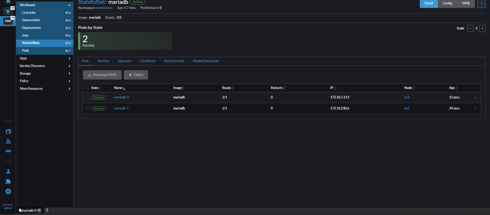

# StatefulSets

- Là tài nguyên trong k8s để triển khai các ứng dụng Stateful như DB,Cache, message broker...
- **Deployment** khi tạo Pod thì Pod Name sẽ được sinh ra ngãu nhiên khiến việc quản lý State của Pod gặp khó khăn.
- **StatefullSets*8 sẽ tạo Pod với Pod Name có thứ tự ví dụ: web-0, web-1.... Khi web-0 bị restart thì sau đó tên vẫn là web-0 chứ không bị sinh ngẫu nhiên như với **Deployment**.

So sánh **StatefullSets** và **Deployment**

| Tiêu chí | **Deployment** | **StatefulSet** |
|-----------|----------------|-----------------|
| **Mục đích sử dụng** | Dùng cho các ứng dụng **stateless** (không lưu trạng thái). | Dùng cho các ứng dụng **stateful** (có trạng thái, dữ liệu riêng cho từng Pod). |
| **Định danh Pod** | Các Pod **không có danh tính cố định** — khi bị xóa và tạo lại sẽ có tên mới. | Mỗi Pod **có danh tính duy nhất, cố định** (ví dụ: `web-0`, `web-1`, `web-2`). |
| **Quản lý lưu trữ (Storage)** | Thường **không dùng PersistentVolumeClaim (PVC) riêng biệt** cho từng Pod. | Mỗi Pod có **PVC riêng biệt**, giúp giữ dữ liệu ngay cả khi Pod bị xóa. |
| **Thứ tự khởi tạo và xóa Pod** | Pods được **tạo và xóa song song**, không đảm bảo thứ tự. | Pods được **tạo, cập nhật và xóa theo thứ tự tuần tự (0 → n)**. |
| **Sử dụng phổ biến cho** | Web server, API server, frontend stateless, worker job. | Database (MySQL, MongoDB), Kafka, Zookeeper, Redis cluster. |
| **Tên Pod (DNS)** | Không có định danh cố định, tên Pod thay đổi khi recreate. | Có **DNS ổn định**: `<pod-name>.<service-name>`. |
| **Cập nhật phiên bản (Rolling Update)** | Có thể cập nhật **song song nhiều Pod** (tốc độ cao). | Cập nhật **tuần tự từng Pod**, đảm bảo tính nhất quán dữ liệu. |
| **Tự động mở rộng (Scaling)** | Tăng giảm số Pod rất linh hoạt, vì Pod độc lập. | Vẫn có thể scale nhưng cần đảm bảo dữ liệu của từng Pod được xử lý đúng. |
| **Sử dụng Service** | Thường dùng với **Deployment + ClusterIP/LoadBalancer**. | Dùng kèm **Headless Service** (`ClusterIP: None`) để truy cập từng Pod riêng biệt. |
| **Dữ liệu khi Pod bị xóa** | Dữ liệu **mất** nếu không gắn PersistentVolume. | Dữ liệu **giữ nguyên** vì mỗi Pod gắn PVC riêng. |

---

✅ **Tóm tắt nhanh**  

- Dùng **Deployment** khi ứng dụng **stateless** (ví dụ: web frontend, API).  
- Dùng **StatefulSet** khi ứng dụng **stateful** (ví dụ: database, message broker, cache cluster).

## Triển khai MariaDB trên k8s

- Trên nfs-server (sv5) sửa `/etc/export` thêm `no_root_squash`

```sh
 sudo vi /etc/exports
 # Sửa dòng cuối thành: /data *(rw,sync,no_subtree_check,no_root_squash)
sudo exportfs -rav
sudo systemctl restart nfs-server
```

- Treen Rancher tạo **StatefulSet** `mariadb`

```yml
apiVersion: apps/v1
kind: StatefulSet
metadata:
  name: mariadb
  namespace: ecommerce
spec:
  serviceName: mariadb-service
  replicas: 1
  selector:
    matchLabels:
      app: mariadb
  template:
    metadata:
      labels:
        app: mariadb
    spec:
      securityContext:
        fsGroup: 65534
      containers:
      - name: mariadb
        image: mariadb:latest
        env:
        - name: MYSQL_ROOT_PASSWORD
          value: "devopseduvn"
        ports:
        - containerPort: 3306
          name: mysql
        volumeMounts:
        - name: mariadb-storage
          mountPath: /var/lib/mysql
      volumes:
      - name: mariadb-storage
        persistentVolumeClaim:
          claimName: nfs-pvc
```

>65534 thường tương ứng với nhóm nfsnobody hoặc nobody trong Linux.

- Đã tạo thành công 1 pod **mariadb-0**
![](./images/1.png

- Chỉ cần tăng replica của **SeatefullSet** `mariadb` lên là ta đã có 1 cụm mariadb đảm bảo tính HA



- Cấu hình Service NodePort MariaDB

```yml
apiVersion: v1
kind: Service
metadata:
  name: mariadb-service
  namespace: ecommerce
spec:
  selector:
    app: mariadb
  type: NodePort
  ports:
    - port: 3306
      targetPort: 3306
      nodePort: 31306
```

- Bây giờ có thể kết nối đến MariaDb ở địa chỉ IP của 2 node sv2 hoặc sv3, port 31306

```sh
mysql -h 192.168.159.103 -P 31306 -u root -p
```