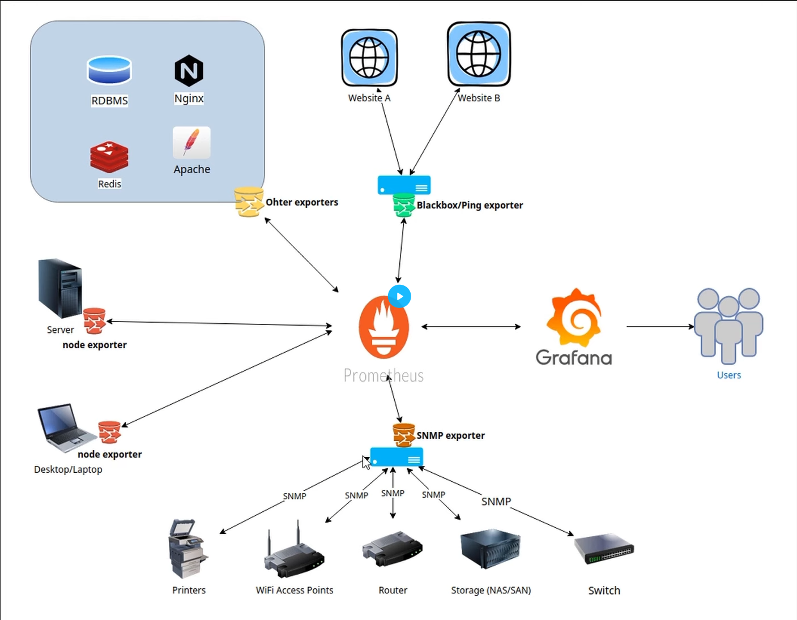
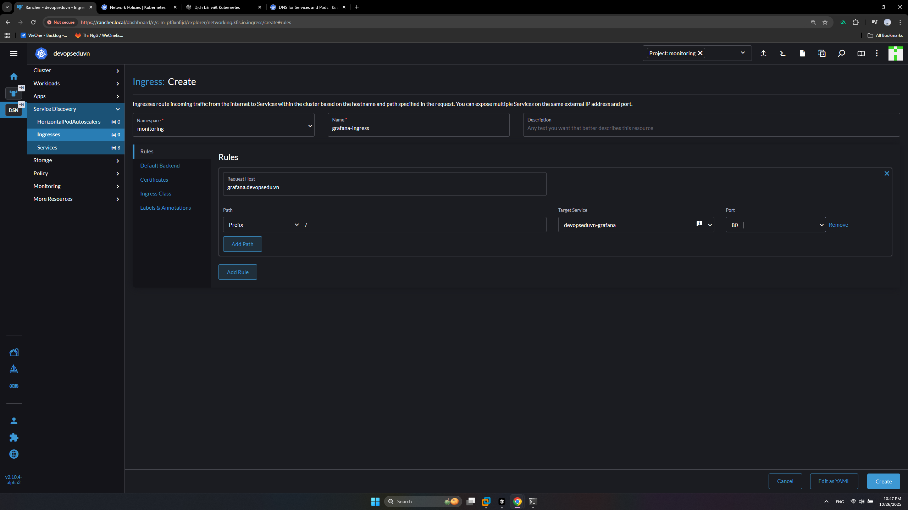
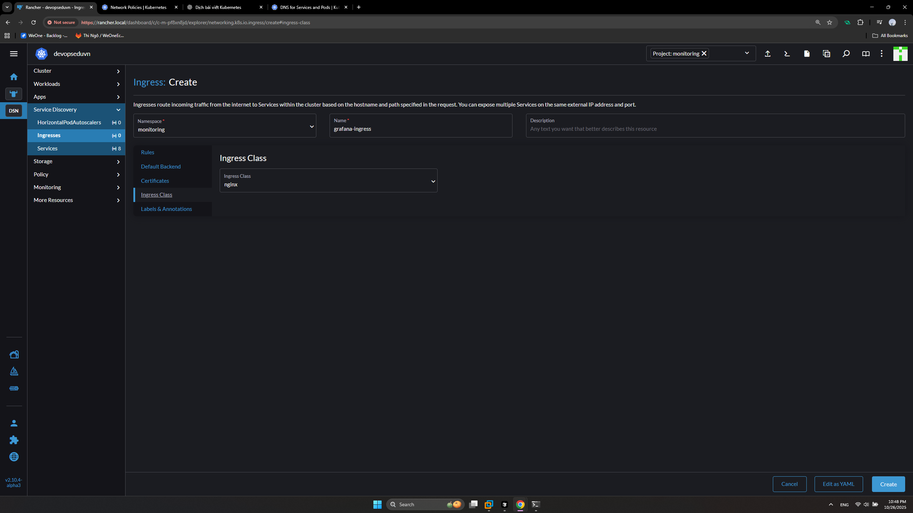
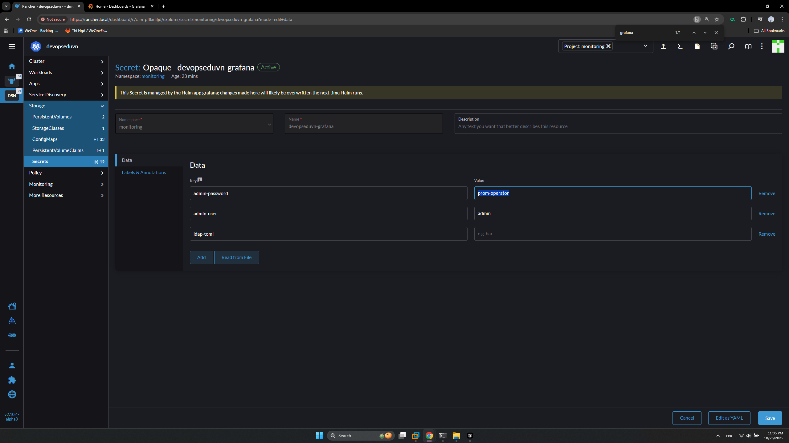
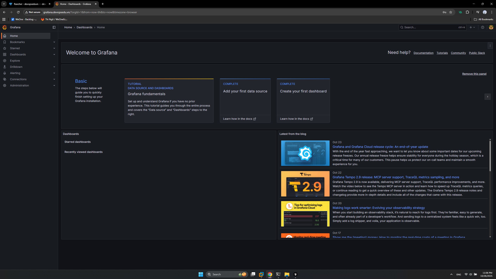
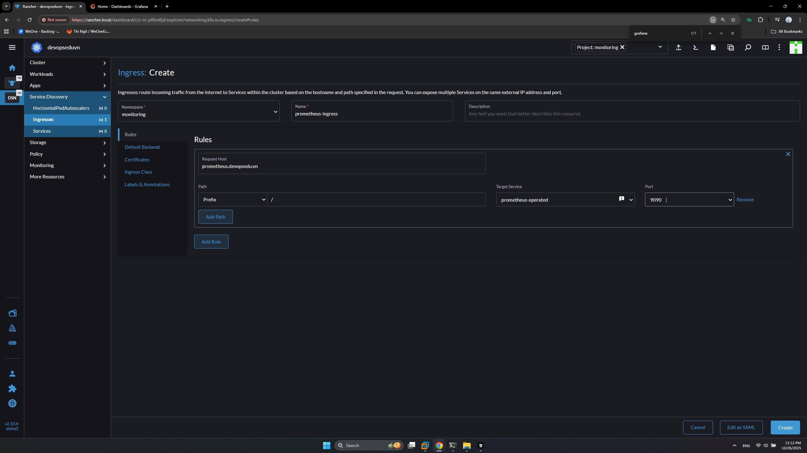
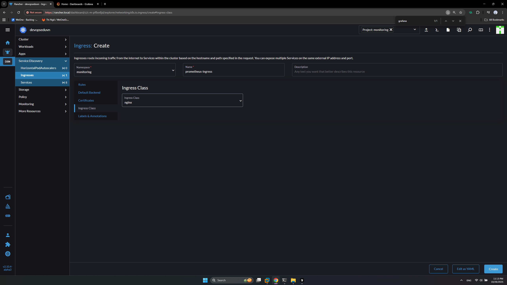
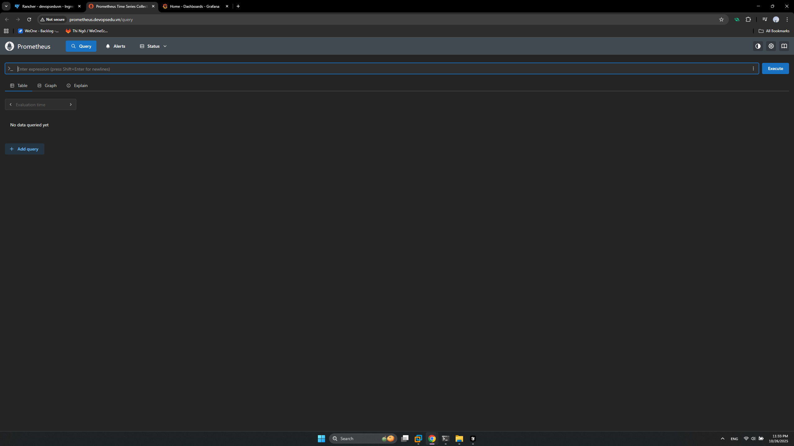

# Cài đặt Prometheus và Grafana (P&G Stack)



- Ở nơi cần giám sát thì cài đặt các **Exporter**.
- **Prometheus** tiến hành thu thập dữ liệu từ các **Exporter**. Dữ liệu đó gọi là **Metric**.
- **Grafana** hiển thị dữ liệu **Metric** lên cho người dùng.

>Note: Có thể hiểu đơn giản Exporter = DB (Là các con bot thu thập dữ liệu),  Prometheus = BE, Grafana = FE.

## Cài đặt P&G Stack

- Tạo thư mục chứa dữ liệu Prometheus trên NFS server (Thực hiện trên **sv5**)

```sh
sudo mkdir /data/monitoring
sudo chown -R nobody:nogroup /data/
sudo chmod -R 777 /data
```

- Tạo project và namespace `monitoring` trên Rancher.

- Tạo PV `monitoring-pv`

```yaml
apiVersion: v1
kind: PersistentVolume
metadata:
  name: monitoring-pv
spec:
  capacity:
    storage: 8Gi
  accessModes:
    - ReadWriteOnce
  nfs:
    path: /data/monitoring
    server: 192.168.159.105 #Chú ý thay đổi địa chỉ IP tương ứng của bạn
  persistentVolumeReclaimPolicy: Retain
  storageClassName: nfs-storage
```

- Khởi tạo Kube Prometheus stack Chart (thực hiện trên server sv1 hoặc kubectl shell Rancher)

```sh
helm repo add prometheus-community https://prometheus-community.github.io/helm-charts
helm repo update
# Sử dụng --set là 1 cách khác để ghi đè cấu hình, tương đương với tạo file values.yaml
helm upgrade --install devopseduvn prometheus-community/kube-prometheus-stack \
  --namespace monitoring \
  --set prometheus.prometheusSpec.storageSpec.volumeClaimTemplate.spec.accessModes[0]=ReadWriteOnce \
  --set prometheus.prometheusSpec.storageSpec.volumeClaimTemplate.spec.resources.requests.storage=2Gi \
  --set prometheus.prometheusSpec.storageSpec.volumeClaimTemplate.spec.storageClassName=nfs-storage
```

>Note: Có thể chỉnh sửa bằng file values.yaml để enable ingress luôn.

- Tạo ingress `grafana-ingress` trên Rancher





- Add hosst trên window: `192.168.159.105 grafana.devopsedu.vn`
- Lấy mật khẩu trong Rancher => Storage => Secrets => 'devopseduvn-grafana' => `admin`/`prom-operator`



- Lgon vào trang http://grafana.devopsedu.vn



- Tạo `prometheus-ingress`





- Add host: `192.168.159.105 prometheus.devopsedu.vn`

- Truy cập http://prometheus.devopsedu.vn

