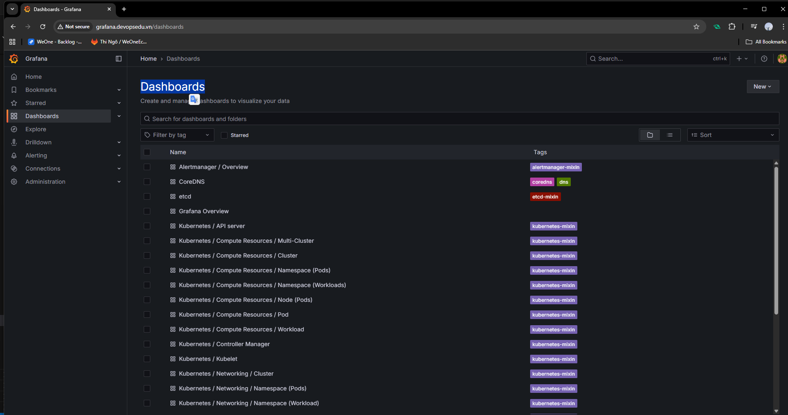
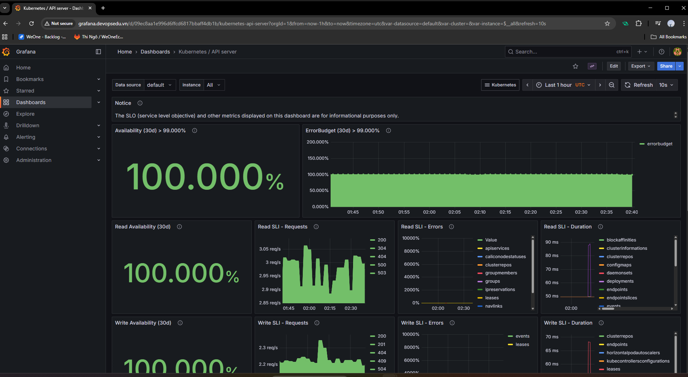
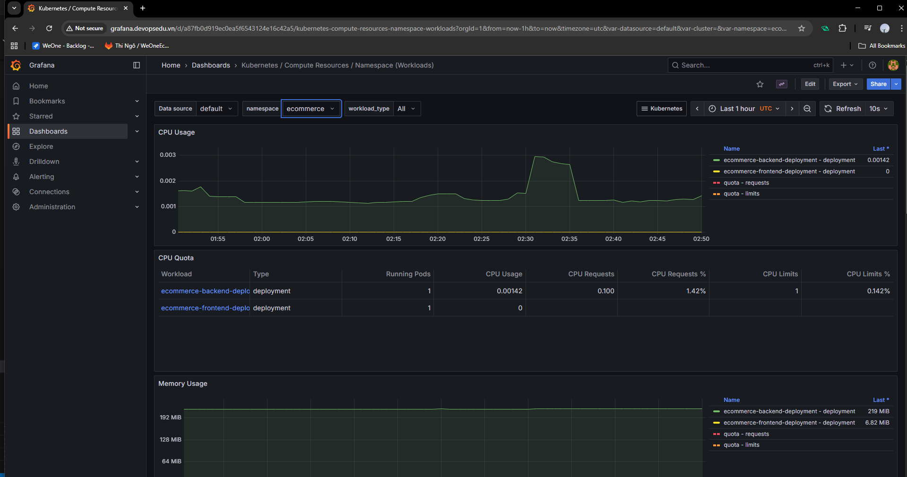
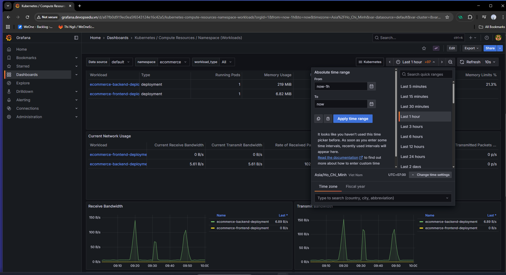
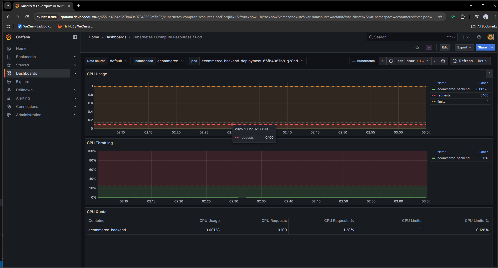
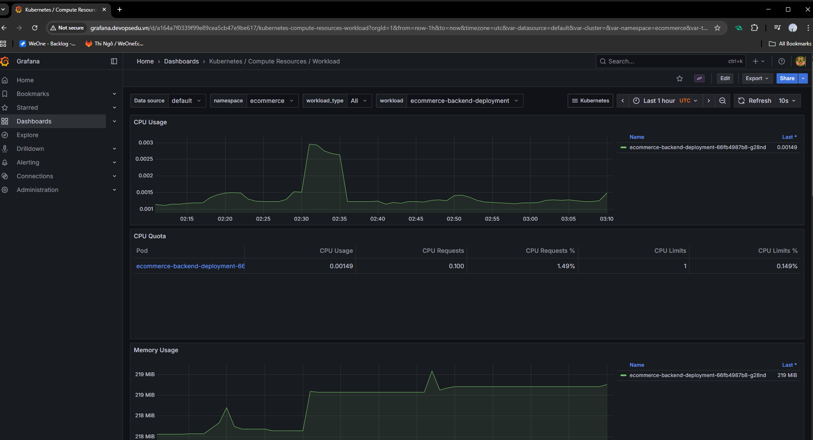
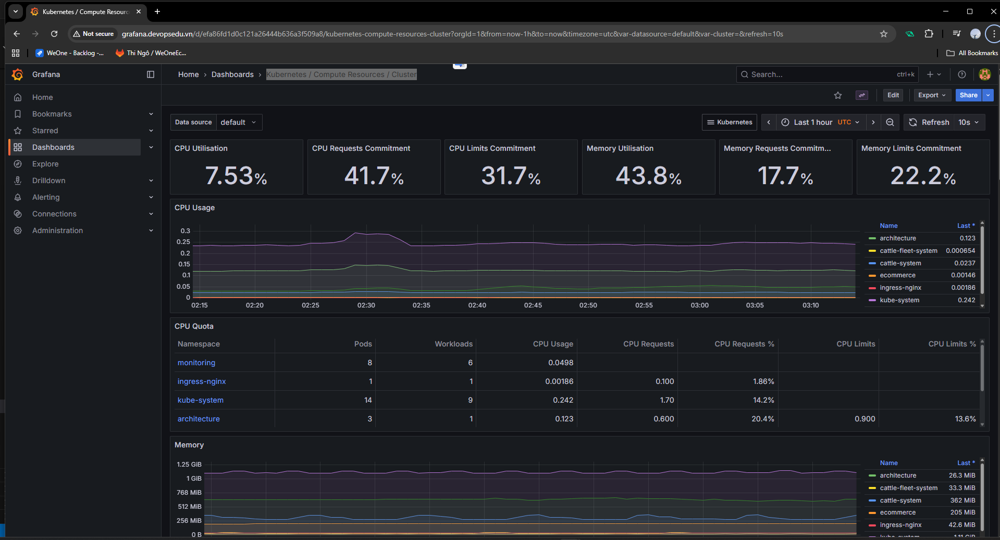

# Dashboards giám sát hệ thống k8s

- Khi cài đặt P&G Stack thì đã có sẵn một số Dashboards giám sát

- Khi thấy hệ thống bị chậm có thể xem dashboard `Kubernetes / API server`

- Ví dụ dự án `ecommerce` bị chậm thì cần tìm xét cá yếu tố
  -Tài nguyên: CPU, Memory.
  - Mạng: bandwidth
  - Kết nối DB, query DB....
  - Cache
- Trong dashboard dựng sẵn sẽ xét đượ 2 yếu tố là tài nguyên và mạng.
- Với tài nguyên dùng dashboard  `Kubernetes / Compute Resources / Namespace (Workloads)`chọn namespace `ecommerce`

- Đổi múi giờ sang `Asian/Ho Chi Minh`

- Kiểm tra Pod đang cao tải `Kubernetes / Compute Resources / Pod`

- `Kubernetes / Compute Resources / Workload`  cũng có thể xem lượng tài nguyên của các pod.

- `Kubernetes / Compute Resources / Cluster` dashboard tổng quan overview tài nguyên toàn cluser.

- Phần Networking tượng tự.