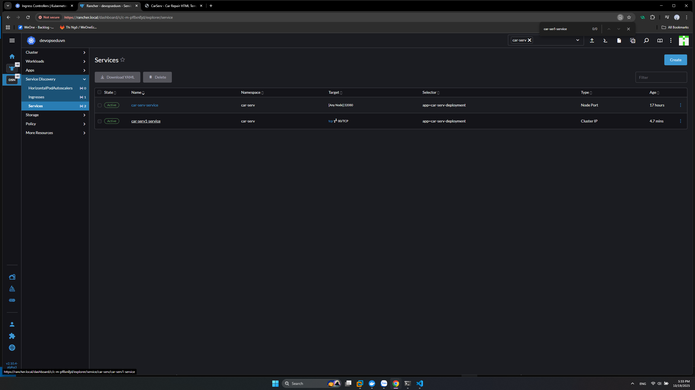
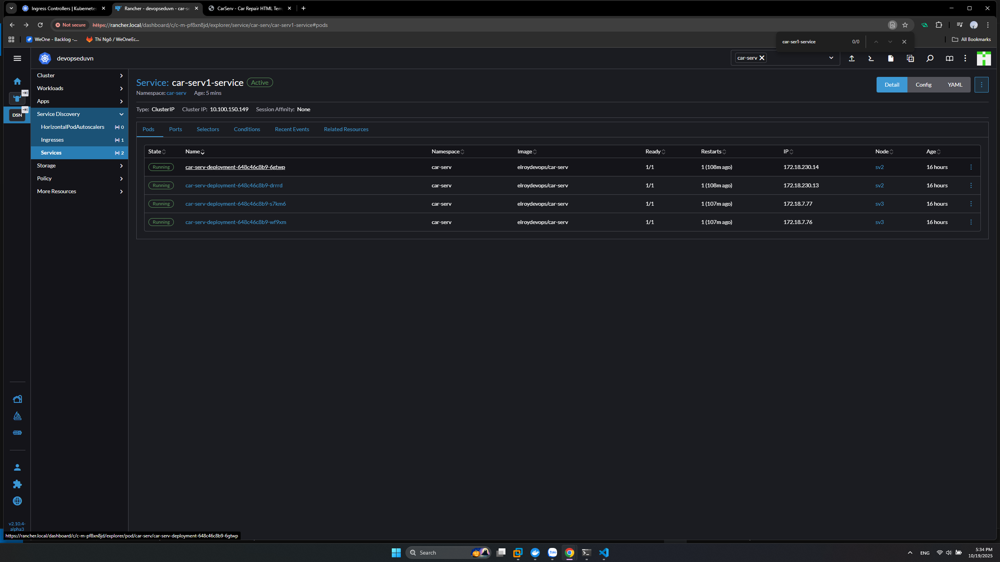

# k8s Service

- Là 1 đối tượng trong k8s dùng để định nghĩa cách tiếp cần đến các Pod
- Điều phối traffic đến các Pod
- Service Type:
  - **Cluster IP**: Tạo địa chỉ IP nội bộ trong cụm. Các service bên ngoài muốn kết nối đến phải đi qua **Ingress** hoặc **Gateway**.
  - **Node Port**: Mở port Trên Node kết nối trực tiếp từ bên ngoài đến Pod.
  - **LoadBalancer**: Dùng cho Cloud Provider để điều phối traffic đến Pod.
  - **ExternalName**: Điều phối đến domain.

## 1. Node Port

- Kết nối trực tiếp đến Pod.
- Chỉ sử dụng được các port trong khoảng **30000 - 32767**
- Trên Rancher => Service Discovery => Services => Create => NodePort
- Namespace: car-serve
- Name: car-serv-service
- Trong phần **Service Ports**:
  - Port Name: tcp
  - Listen Port: 80
  - target Port: 80
  - Node Port: 32080 (Tùy ý trong giải **30000 - 32767**)
- Trong phần **Selector** (Chỉ định đến Deployment trong bài trước):
  - Key: app
  - Value: car-serv-deployment
  Sau khi tạo thành công có thể truy cập vào container ở bất cứ node nào trong cụm ở cổng 32080. ở đây có 2 node là sv2 ip 192.168.159.102 và sv3 ip 192.168.159.103

## 2. Cluster IP

- Cách tạo tương tự với Node Port ở phần 1 chỉ khác kiểu
- Khi tạo xong chỉ có thể truy cập nội bộ cluster
- Tạo service Cluster IP có tên **car-serv1-service** Cần thêm **Ingress** ở bài sau.

