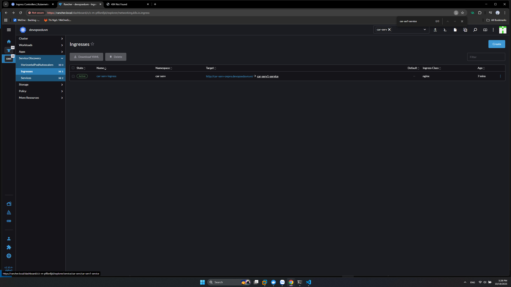

# Ingress

## 1. Giới thiệu

- Là tài nguyên quản lý cách thức kết nối từ bên ngoài vào tỏng cụm k8s.
- Định hướng các truy cập HTTP/HTTPS vào các service nội bộ.


- **Ingress Controller** hay dùng trên on-prem
  - nginx ingress controller
  - HA prozy ingress controller
  - Kong ingress controller

## 2..  Ingress NGINX Controller

### 2.1. Helm

Helm là công cụ quản lý package danh cho k8s (tương tự như apt trong Ubuntu)
Cài đặt helm trên **sv1**:

```sh
wget https://get.helm.sh/helm-v3.16.2-linux-amd64.tar.gz
tar xvf helm-v3.16.2-linux-amd64.tar.gz
sudo mv linux-amd64/helm /usr/bin/
helm version
```

>Note: Có thể tìm tải các phiên bản của helm [tại đây](https://github.com/helm/helm/releases) và dùng wget tài về cài bình thường như các package.
>
### 1.2. Ingress NGINX Controller

Cài đặt [Ingress NGINX Controller](https://github.com/kubernetes/ingress-nginx) bằng helm

```sh
# Cú pháp `helm repo add <tên-repo> <đường dẫn đến repo>`
helm repo add ingress-nginx https://kubernetes.github.io/ingress-nginx
# `1helm repo update` giống như apt update.
helm repo update
# kiểm tra
helm search repo nginx
# Tài về dùng `helm pull <tên repo>`
helm pull ingress-nginx/ingress-nginx
# Giair nén, Chú ý tên file tùy thuộc vào phiên bản ở trên git tải về
tar -xzf ingress-nginx-4.13.3.tgz
vi ingress-nginx/values.yaml
```

- Sửa type: LoadBalancing => type: NodePort - Vì LoadBalancing ở trên cloud ở on-prem dùng NodePort.
- Sửa nodePort http: "" => http: "30080"
- Sửa nodePort https: "" => https: "30443"

>Tip: Tìm kiềm trong vim là `/<từ khóa>`, và ở bài trước khi NodePort sẽ ở port **30000 - 32767**.

```sh
# tạo namespace 
kubectl create ns ingress-nginx
# Cú pháp install: helm -n <namespace> install <release name> -f <đường dẫn đến value.yml> <helm chart>
helm -n ingress-nginx install ingress-nginx -f ingress-nginx/values.yaml ingress-nginx
# kiểm tra các tài nguyên được tạo
kubectl get all -n ingress-nginx
```

- Lwu lại phần **An example Ingress that makes use of the controller:**

```yml
# An example Ingress that makes use of the controller:
apiVersion: networking.k8s.io/v1
kind: Ingress
metadata:
  name: example
  namespace: foo
spec:
  ingressClassName: nginx
  rules:
    - host: www.example.com
      http:
        paths:
          - pathType: Prefix
            backend:
              service:
                name: exampleService
                port:
                  number: 80
            path: /
  # This section is only required if TLS is to be enabled for the Ingress
  tls:
    - hosts:
      - www.example.com
      secretName: example-tls
 TLS is enabled for the Ingress, a Secret containing the rtificate and key must also be provided:
apiVersion: v1
kind: Secret
metadata:
  name: example-tls
  namespace: foo
data:
  tls.crt: <base64 encoded cert>
  tls.key: <base64 encoded key>
type: kubernetes.io/tls
```

Để bên ngoài có thể kết nối đến ingress thì cần 1 **Load Balancer** như ở hình 1.

### 2.3. Nginx Loadbalancer

- Thêm server **sv5** 192.168.159.105

```sh
# Cài đặt nginx
 sudo apt update -y
 sudo apt install nginx -y
 # Đổi listten: 80 => listen: 999 và listen [::]:80 => listen [::]:999 (port bất kỳ thôi tránh 80 là được)
 vi /etc/nginx/sites-available/default
 # Thêm file conf
 vi /etc/nginx/conf.d/devopsedu.vn.conf
```

- devopsedu.vn.conf

```conf
upstream my_servers {
    server 192.168.159.101:30080;
    server 192.168.159.102:30080;
    server 192.168.159.103:30080;
}

server {
    listen 80;

    location / {
        proxy_pass http://my_servers;
        proxy_redirect off;
        proxy_set_header Host $host;
        proxy_set_header X-Real-IP $remote_addr;
        proxy_set_header X-Forwarded-For $proxy_add_x_forwarded_for;
        proxy_set_header X-Forwarded-Proto $scheme;
    }
}
```

- Ở trên server là địa chỉ ip của sv1,sv2,sv3 còn port là 30080 là cấu hình ingress-nginx ở phần 2.listen 80 thì để host không cần đến port và đã đổi port trang default của nginx ở trước khác 80

```sh
# kiểm tra
sudo nginx -t
# Restart nginx
sudo systemctl restart nginx
```

### 2.4. Theem Ingress vào cụm

- Lên  =? cụm devopseduvn => Service Discovery => Ingress
- Imporrt chính file yml example ví dụ ở phần 2 vòa:
  - name: ar-serv-ingress
  - namespace: car-serv
  - Chú ý nếu không có **ingressClassName** là sẽ 404
  - host: car-serv-onpre.devopseduvn.vn
  - service.name: car-serv1-service

```yml
apiVersion: networking.k8s.io/v1
kind: Ingress
metadata:
  name: car-serv-ingress
  namespace: car-serv
spec:
  ingressClassName: nginx
  rules:
    - host: car-serv-onpre.devopseduvn.vn
      http:
        paths:
          - pathType: Prefix
            backend:
              service:
                name: car-serv1-service
                port:
                  number: 80
            path: /
```



- Tạo xong ấn vào **car-serv1-service** ra danh sachs Pod laf ok
~[](./images/2.png)
- Add host vào mays `192.168.159.105 car-serv-onpre.devopseduvn.vn`
- [car-serv-onpre.devopseduvn.vn](http://car-serv-onpre.devopseduvn.vn/)

```sh
kubectl get ingress -n car-serv
```

## 3. Tổng kết

Có thể triển khai toàn bộ tài nguyên của car-serv bao gồm `deployment`, `service Cluster IP` và `ingress` bằng file yml sau:

```yml
apiVersion: apps/v1
kind: Deployment
metadata:
  labels:
    app: car-serv
  name: car-serv-deployment
  namespace: car-serv
spec:
  replicas: 2
  revisionHistoryLimit: 11
  selector:
    matchLabels:
      app: car-serv
  strategy:
    rollingUpdate:
      maxSurge: 25%
      maxUnavailable: 25%
    type: RollingUpdate
  template:
    metadata:
      labels:
        app: car-serv
      namespace: car-serv
    spec:
      containers:
        - image: elroydevops/car-serv
          imagePullPolicy: Always
          name: car-serv
          ports:
            - containerPort: 80
              name: tcp
              protocol: TCP
---
apiVersion: v1
kind: Service
metadata:
  name: car-serv-service
  namespace: car-serv
spec:
  internalTrafficPolicy: Cluster
  ipFamilies:
    - IPv4
  ipFamilyPolicy: SingleStack
  ports:
    - name: tcp
      port: 80
      protocol: TCP
      targetPort: 80
  selector:
    app: car-serv
  sessionAffinity: None
  type: ClusterIP
---
apiVersion: networking.k8s.io/v1
kind: Ingress
metadata:
  name: car-serv-ingress
  namespace: car-serv
spec:
  ingressClassName: nginx
  rules:
    - host: car-serv-onpre.devopsedu.vn
      http:
        paths:
          - backend:
              service:
                name: car-serv-service
                port:
                  number: 80
            path: /
            pathType: Prefix
```

- Trong yml có thể ngăn cách các phần bằng `---`.
- Nên đặt **label**, **selector** là **tên dự án** như ở trên là `carr-serv`.
