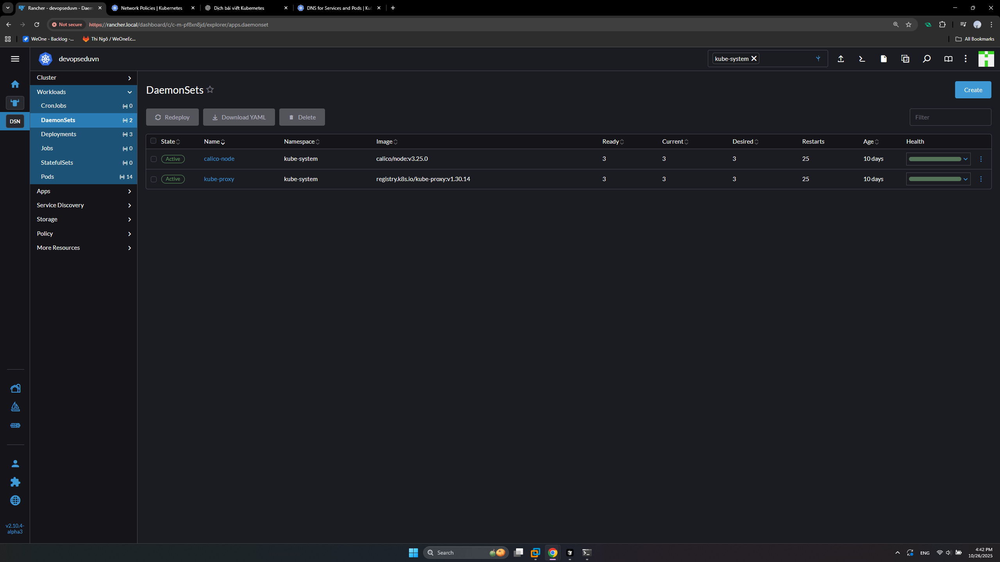
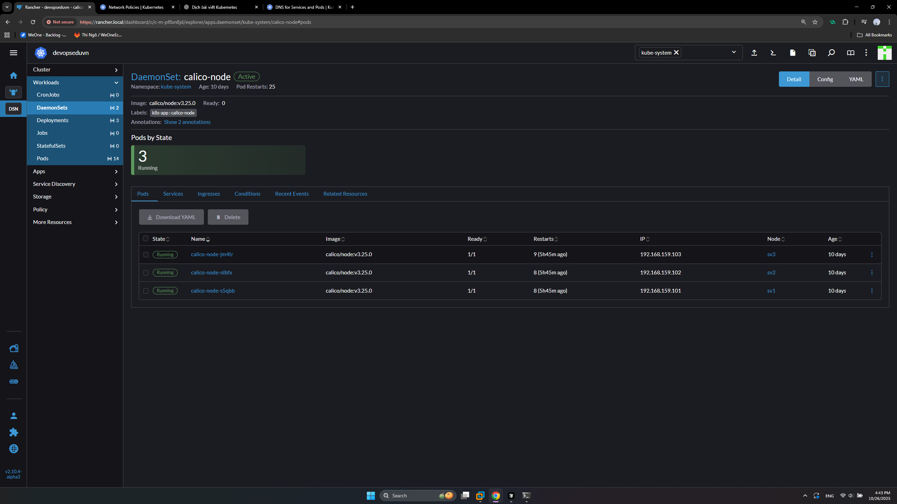

# DaemonSet

- Là tài nguyên sẽ tạo Pod trên tất cả các Node, khi có Node mới Join vào Cluster thì sẽ tự động triển khai Pod trên Node mới.
- Thích hợp để triển khai các tài nguyên giám sát hệ thống, netwwork... Vì **DaemonSet** đảm bảo triển khai Pod trên tất cả các Node trong Clusster. Tương ứng trong cụm hiện tại sử dụng **Calico** là 1 **network Plugin** cho phép triển khai các **Network Policies** trong Cluster.

```sh
devops@sv1:~$ kubectl get ds -A
NAMESPACE     NAME          DESIRED   CURRENT   READY   UP-TO-DATE   AVAILABLE   NODE SELECTOR            AGE
kube-system   calico-node   3         3         3       3            3           kubernetes.io/os=linux   10d
kube-system   kube-proxy    3         3         3       3            3           kubernetes.io/os=linux   10d
```

- tương ứng trên Rancher trong namespace **kube-system**





- **Taint and Tolerance** có thể ngăn chặn được 1 Pod nào đó được triển khai lên Node
