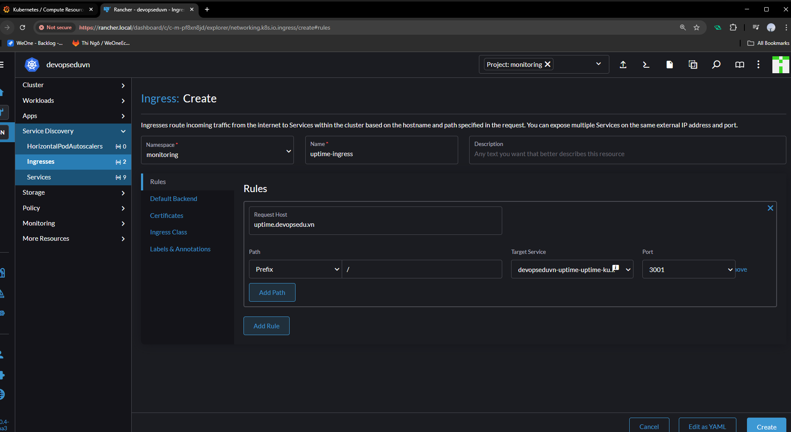

# Kiểm tra khả năng uptime của website

- Có 2 Eporter thông dụng
  - Blackbox Exporter, Alert Manager
  - **uptime-kuma** (được sử dụng trong bài viết).

  ## 1. Cài đặt uptime-kuma bằng helm

- Cấu hình PV và PVC Uptime Kuma

```yaml
apiVersion: v1
kind: PersistentVolume
metadata:
  name: uptime-kuma-pv
spec:
  capacity:
    storage: 5Gi
  accessModes:
    - ReadWriteOnce
  nfs:
    path: /data/monitoring
    server: 192.168.159.105 #chú ý đổi địa chỉ IP tương ứng của bạn
  persistentVolumeReclaimPolicy: Retain
  storageClassName: nfs-storage
---
apiVersion: v1
kind: PersistentVolumeClaim
metadata:
  name: uptime-kuma-pvc
  namespace: monitoring
spec:
  accessModes:
    - ReadWriteOnce
  resources:
    requests:
      storage: 5Gi
  storageClassName: nfs-storage

```

- Khởi tạo Uptime Kuma (thực hiện trên server sv1 hoặc kubectl shell Rancher)

```sh
mkdir uptime && cd uptime
vi values.yaml
```

- Cấu hình file values.yaml

```yaml
volume:
  enabled: true
  accessMode: ReadWriteOnce
  existingClaim: "uptime-kuma-pvc"
```

- Khởi tạo Uptime Kuma

```sh
helm repo add uptime-kuma https://helm.irsigler.cloud
helm repo update
helm install devopseduvn-uptime uptime-kuma/uptime-kuma -n monitoring -f values.yaml
```

>Note: Nếu bị lỗi do quyền chú ý xem thư mục /data/monitoring trên server NFS server đã được cấu hình các câu lệnh sau chưa

```sh
sudo mkdir -o /data/monitoring
sudo chown -R nobody:nogroup /data
sudo chmod -R 777 /data
```
- Kiểm tra Deployments trên Rancher


- tạo ingress `uptime-ingress`




- Add host: `192.168.159.105 uptime.devopsedu.vn`
- Truy cập http:// uptime.devopsedu.vn


- Add new member `ecommerce`


- Có thể cấu hình thêm **notification Teletegram** để thông báo khi website Down

- trạng thái `dowwn` là do http:ecommerce.devopsedu.vn là Add hosts chứ không phải domain. Để uptime-kuma hiểu được thì cần Add hosts trong Deployments `devopseduvn-uptime-uptime-kuma`: Edit Config => Pod => Networking => Host Alias


