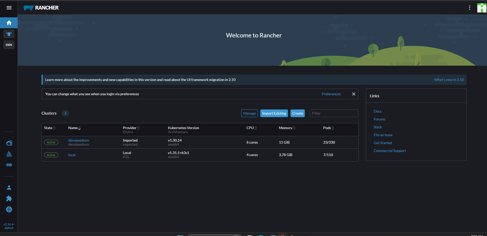
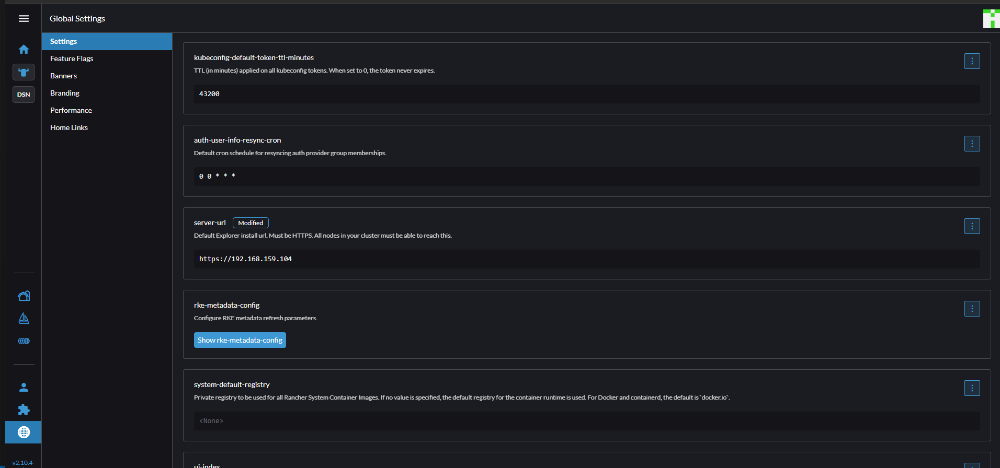
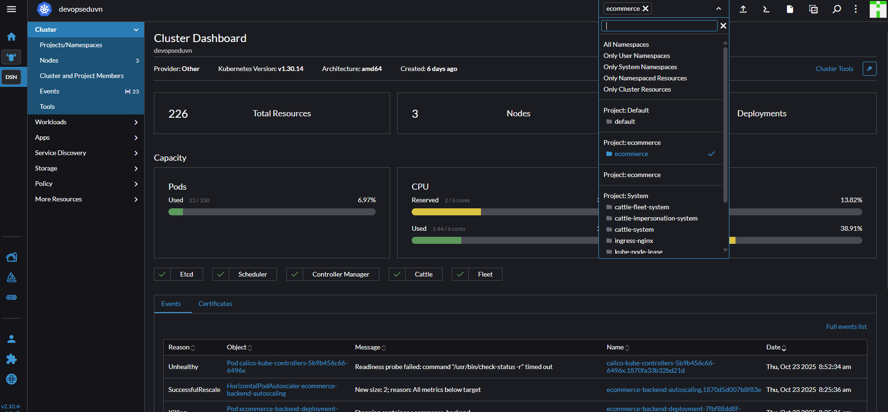
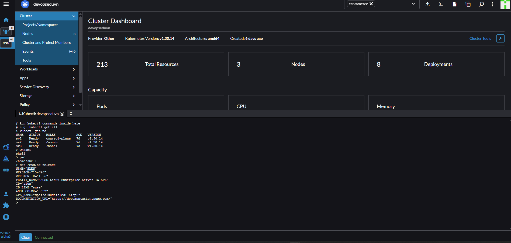

# # Rancher cơ bản

- Trang chủ

- Phần **Links** có thể custome và nên link đến các tài liệu về cụm đang cài đặt.

- Global Settings: Rancher cho phép custom giao diện như **Banners**, **Branding** rất mạnh mẽ chỉ cần thao tác trên giao diện
  - Cần lưu ý phần **Server url** này vì trong seri đang dùng Add Host **rancher.local** chứ không phải domain thật nên nếu ở đây là rancher.local sẽ gây lỗi.

- Rancher có chức năng  **Continuous Delivery** nhưng không nên dùng mà hãy sử dụn các công cụ CICD chuyên biệt như Jenkins, GitLab CI...

- Về trang chủ chọn cluster **devopseduvn**

- Ở góc trên bên phải là các chức năng
- Luôn chọn đúng **namespace**

- **Import YML** để tạo tài nguyền từ file yml.
- **kubectl Shell** để chạy lệnh kubectl.

>Note: Rancher không chạy Shell trực tiếp trên cụm mà tạo ra 1 container kết nối đến cụm qua Kubernetes API.

- **KubeConfig** là file lưu trữ cấu hình để kết nối đến cụm. Với cụm **devopseduvn** hiện tại thì sẽ kết nối đến với quyền admin.

- Add host cho Pod: Workloads => Pods => Edit Config => Chọn tab Pod =>  networking => **Host Aliases&&
