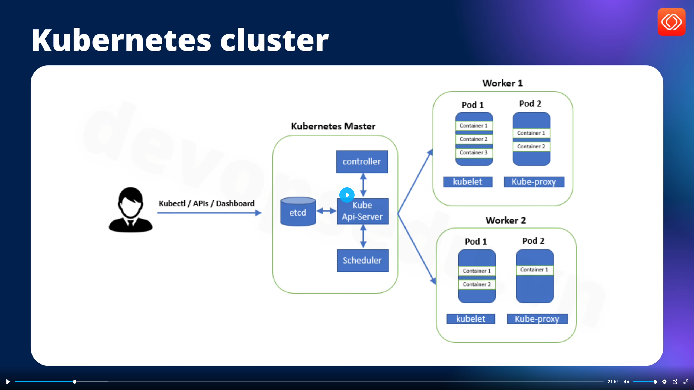
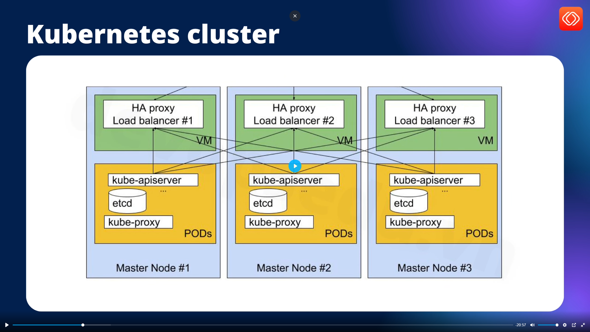

# Cài đặt kubernetes trên on-premise

## 1. Mô hình triển khai

### 1.1. . Mô hình production gồm 1 master và 2 worker

- Trong kiểu này thì master (control plane) sẽ không cài các node,pod


### 1.2. Mô hình dev, stagging cả 3 đều là master + worker



## 2. Chuẩn bị công cụ

 Ở đây có 3 server

- 192.168.159.101 sv1 : master
- 192.168.159.102 sv2 : worker 1
- 192.168.159.103 sv3 : worker 2

### 2.1 Cài đặt bằng cách sử dụng lệnh kube-admin

**Bước 1:** Cấu hình hệ thống (chạy trên cả 3 server)

- Cập nhật hệ thống

``` sh
sudo apt update -y && sudo apt upgrade -y
```

- Thêm user devops và thêm vào group sudo

``` sh
adduser devops
usermod -aG sudo devops
su devops
```

- k8x yêu cầu tắt swap

``` sh
sudo swapoff -a
sudo sed -i '/swap.img/s/^/#/' /etc/fstab
```

**Bước 2:** Cài đặt containerd tương tự như docker (chạy cả 3 server)

- Cấu hình module kerne

``` sh
sudo vi /etc/modules-load.d/containerd.conf
```

Nội dung containerd.conf

``` containerd.conf
overlay
br_netfilter
```

- Tải module kernel

``` sh
sudo modprobe overlay
sudo modprobe br_netfilter
```

- Cấu hình hệ thống mạng

``` sh
echo "net.bridge.bridge-nf-call-ip6tables = 1" | sudo tee -a /etc/sysctl.d/kubernetes.conf
echo "net.bridge.bridge-nf-call-iptables = 1" | sudo tee -a /etc/sysctl.d/kubernetes.conf
echo "net.ipv4.ip_forward = 1" | sudo tee -a /etc/sysctl.d/kubernetes.conf
```

- Áp dụng cấu hình sysctl

``` sh
sudo sysctl --system
```

- Cài đặt các gói cần thiết và thêm kho Docker

``` sh
sudo apt install -y curl gnupg2 software-properties-common apt-transport-https ca-certificates
sudo curl -fsSL <https://download.docker.com/linux/ubuntu/gpg> | sudo gpg --dearmour -o /etc/apt/trusted.gpg.d/docker.gpg
sudo add-apt-repository "deb [arch=amd64] <https://download.docker.com/linux/ubuntu> $(lsb_release -cs) stable"
```

- Cấu hình containerd

``` sh
containerd config default | sudo tee /etc/containerd/config.toml >/dev/null 2>&1
sudo sed -i 's/SystemdCgroup = false/SystemdCgroup = true/g' /etc/containerd/config.toml
```

- Khởi động containerd

``` sh
sudo systemctl restart containerd
sudo systemctl enable containerd
```

- Kiểm tra

``` sh
containerd --version
```

**Bước 3:** Cài đặt kubelet, kubeadm, kubectl (chạy cả 3 server)
Để có thể hoạt động được thì cần kubelet, kubeadm, kubectl

- Thêm kho lưu trữ Kubernetes

``` sh
echo "deb [signed-by=/etc/apt/keyrings/kubernetes-apt-keyring.gpg] https://pkgs.k8s.io/core:/stable:/v1.30/deb/ /" | sudo tee /etc/apt/sources.list.d/kubernetes.list
curl -fsSL https://pkgs.k8s.io/core:/stable:/v1.30/deb/Release.key | sudo gpg --dearmor -o /etc/apt/keyrings/kubernetes-apt-keyring.gpg
```

- Cài đặt các gói Kubernetes

``` sh
sudo apt update -y
sudo apt install -y kubelet kubeadm kubectl
sudo apt-mark hold kubelet kubeadm kubectl
```

>Note: **apt-mark hold** để tránh khi apt update sẽ tự động thay đổi phiên bản.
 **Nên snapshot lại bước này trước khi triển khai**

## 3. Triển khai k8s 1 master 2 wworker
>
>Note: Chú ý chuyển sang user devops

- Khởi tạo cụm trên master (sv1)

- Khởi tạo cụm

``` sh
sudo kubeadm init
```

- Sau khi khởi tạo xong sẽ có dòng **Then you can join any number of worker nodes by running the following on each as root:** copy câu lệnh dưới đó Ví dụ:

``` sh
sudo kubeadm join 192.168.159.101:6443 --token q57c5z.yg489snkqj8tty52 --discovery-token-ca-cert-hash sha256:add3e0407160742b155bd27c738eb96558a2268bd3c72a1b1482c7eca8789ce4
```

- Tạo thư mục và copy file config (sv1)

``` sh
mkdir -p $HOME/.kube
sudo cp -i /etc/kubernetes/admin.conf $HOME/.kube/config
```

- Chuyển quyền sở hữu cho user và group hiện tại (sv1)

``` sh
sudo chown $(id -u):$(id -g) $HOME/.kube/config
```

- Apply cấu hình network (sv1)

``` sh
kubectl apply -f https://raw.githubusercontent.com/projectcalico/calico/v3.25.0/manifests/calico.yaml
```

- Chạy trên các server workder (sv2, sv3) với quyền sudo để join vòa cụm:

``` sh
sudo kubeadm join 192.168.159.101:6443 --token q57c5z.yg489snkqj8tty52 --discovery-token-ca-cert-hash sha256:add3e0407160742b155bd27c738eb96558a2268bd3c72a1b1482c7eca8789ce4
```

- Kiểm tra danh sahcs nodes trong cụm sv1: (sv1)

``` sh
kubectl get nodes
```

- Có thể thấy bây giờ sv1 có role là control-plane còn sv2 và sv3 role là <none> tức là worker.

>Node: Nên snapshot lại bước này vì cả tutorial thực hành trên mô hình này

## 4. Triển khai cả 3 server đều là master + worker

- Reset cụm vừa tạo (chạy trên cả 3 server)

``` sh
sudo kubeadm reset -f
sudo rm -rf /var/lib/etcd
sudo rm -rff /etc/kubernetes/manifests/*
```

- khởi tạo cụm (sv1)

``` hs
sudo kubeadm init --control-plane-endpoint "192.168.159.101:6443" --upload-certs
```

- Copy lệnh dưới dòng **You can now join any number of the control-plane node running the following command on each as root** để chạy trên 2 server còn lại

``` sh
sudo kubeadm join 192.168.159.101:6443 --token 6foxbn.qs6asb8w0hqucqbx \
        --discovery-token-ca-cert-hash sha256:7595f6d4c42e3151c8850a90e7f7234e6237c29b35d421981ce214f71e5ab9cb \
        --control-plane --certificate-key 2ae77398fb662e4c15a4f6fd8699e02e3ebc72727ff0ac938cccfd1e880bf62b
```

- Tạo thư mục config và thêm netwwork tương tự phần 3:

``` sh
mkdir -p $HOME/.kube 
sudo cp -i /etc/kubernetes/admin.conf $HOME/.kube/config 
sudo chown $(id -u):$(id -g) $HOME/.kube/config
kubectl apply -f https://raw.githubusercontent.com/projectcalico/calico/v3.25.0/manifests/calico.yaml
```

- Chạy lệnh vừa copy được ở trên và tạo thư mục config trên sv2 và sv3 với quyền sudo

``` sh
sudo kubeadm join 192.168.159.101:6443 --token 6foxbn.qs6asb8w0hqucqbx \
        --discovery-token-ca-cert-hash sha256:7595f6d4c42e3151c8850a90e7f7234e6237c29b35d421981ce214f71e5ab9cb \
        --control-plane --certificate-key 2ae77398fb662e4c15a4f6fd8699e02e3ebc72727ff0ac938cccfd1e880bf62b

mkdir -p $HOME/.kube 
sudo cp -i /etc/kubernetes/admin.conf $HOME/.kube/config 
sudo chown $(id -u):$(id -g) $HOME/.kube/config
```

- Kiểm tra danh sahcs nodes trong cụm sv1: (sv1)

``` sh
kubectl get nodes
```

- Có thể thấy bây giờ cả 3 server đều là control-plane nên cần chỉ định các worker cho cụm (sv1)

````sh
kubectl taint nodes sv1 node-role.kubernetes.io/control-plane:NoSchedule-
kubectl taint nodes sv2 node-role.kubernetes.io/control-plane:NoSchedule-
kubectl taint nodes sv3 node-role.kubernetes.io/control-plane:NoSchedule-
```

>Note: Nên snapshot lại cụm này

- Kiểm tra thông tin node

````sh
kubectl describe node sv1 | grep Taint
```

- Node có taint = "Chỉ chạy Pod đặc biệt thôi (Pod có toleration khớp)".
- Node không có taint = "Có thể nhận Pod từ scheduler bình thường".
- Khởi tạo node là control-pane thì sẽ có taint.
