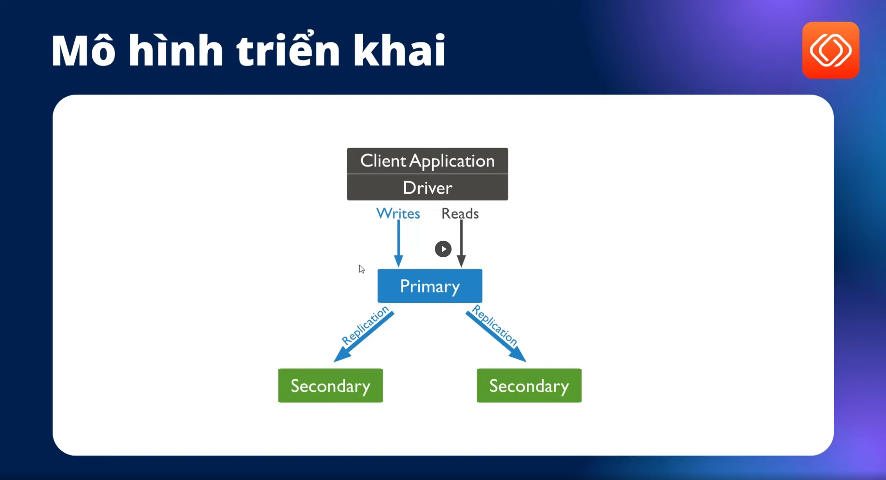
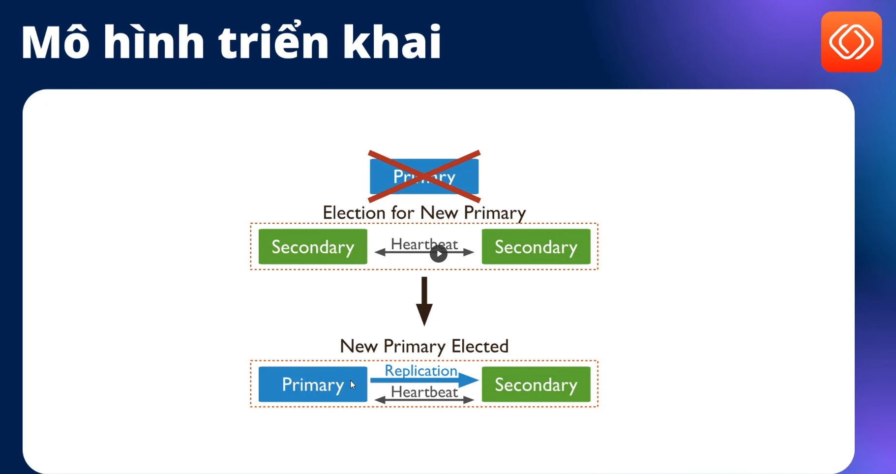

# MongooDB HA

- Mô hình triển khai MongoDB Replica với:
  - 1 primary (master) có quyền read write. triển khai trên sv1.
  - 2 secondary (slave) chỉ có quyền read. Triển khai trên sv2 và sv3.



- Khi master gặp lỗi thì hệ thống sẽ tự đề cử master mới.



- Vì hệ thống có 3 server nên để kết nối từ code đến Monggo dễ hơn thì cần Virtual IP (**VIP**) để điều phối để code cỉ cấu hình 1 connection.

## Cần cài MongoDB trước trên cả 3 server

Cài đặt các công cụ cần thiết

```sh
sudo apt update -y
sudo apt install -y net-tools telnet traceroute
sudo apt install software-properties-common gn upg apt-transport-https ca-certificates -y
 ```

- Cài đặt MongoDB mới nhất theo [Tài lieuj chính thức](https://www.mongodb.com/docs/manual/tutorial/install-mongodb-enterprise-on-ubuntu/)

```sh
sudo apt-get install gnupg curl
curl -fsSL https://pgp.mongodb.com/server-8.0.asc | \
   sudo gpg -o /usr/share/keyrings/mongodb-server-8.0.gpg \
   --dearmor
echo "deb [ arch=amd64,arm64 signed-by=/usr/share/keyrings/mongodb-server-8.0.gpg ] https://repo.mongodb.com/apt/ubuntu jammy/mongodb-enterprise/8.2 multiverse" | sudo tee /etc/apt/sources.list.d/mongodb-enterprise-8.2.list
sudo apt-get update
sudo apt-get install mongodb-enterprise
```

- Kiểm tra

```sh
root@sv1:~# mongod --version
db version v8.2.1
Build Info: {
    "version": "8.2.1",
    "gitVersion": "3312bdcf28aa65f5930005e21c2cb130f648b8c3",
    "openSSLVersion": "OpenSSL 3.0.2 15 Mar 2022",
    "modules": [
        "enterprise"
    ],
    "allocator": "tcmalloc-google",
    "environment": {
        "distmod": "ubuntu2204",
        "distarch": "x86_64",
        "target_arch": "x86_64"
    }
}
```

>Note: `mongod` là tên serice được định nghĩa trong `/lib/systemd/system/mongod.service`

- mặc định thì `mongod` sẽ inactive nên cần enable lên

```sh
systemctl start mongod
systemctl status mongod
netstat -tlpun
```

>Note: mặc định mongod đang chạy localhost `127.0.0.1:27017` nên chưa kết nối được từ bên ngoài.

>Note: Cần mở firewall tương ứng port (nếu có).

- Mở file cấu hình để chỉnh sửa thiết lập mongodb thành cluster

```sh
vi /etc/mongod.conf
```

- Tìm và sửa 2 phần này trong file
  - bindIp: 0.0.0.0
  - replication:
      replSetName: "mongodb-devopseduvn"

- Khởi động lại mongodb để áp dụng cấu hình mới

```sh
systemctl restart mongod
# Khởi động cùng hệ thống
systemctl enable mongod
netstat -tlpun
```

## Khởi tạo MongoDB cluster trên sv1

```sh
mongosh
```

- Khởi tạo cụm

```mongosh
rs.initiate( {
      _id : "mongodb-devopseduvn",
      members: [
         { _id: 0, host: "sv1:27017" },
         { _id: 1, host: "sv2:27017" },
         { _id: 2, host: "sv3:27017" }
      ]
   })
```

- Kiểm tra trạng thái cluster

```mongosh
rs.status()
rs.isMaster()
```

- Thêm thử dữ liệu test tính HA

```mongosh
use devopseduvndb
db.courses.insertOne({ "name": ["DevOps for freshers", "pipeline DevSecOps", "HA tools"] })
```

## Kiểm tra xem dữ liệu đã được đồng bộ sang sv2 và sv3 chưa

```sh
mongosh
```

```mongosh
show dbs
use devopseduvndb
show collections
db.courses.find()
```

- Đúng logic thì ở **secondary** sẽ không write được

```mongosh
Enterprise mongodb-devopseduvn [direct: secondary] devopseduvndb> db.courses.insertOne({ "name": ["K8s"] })
MongoServerError[NotWritablePrimary]: not primary
```

>Note: Có thể giả lập sv1 bị lỗi bằng cách Power Off sv1 đi sau đó chạy rs.status() trên sv2 xem cluster có bầu master mới không?

## Cấu hình Virtual IP sử dụng keepalived

- Cài `keepalived` trên cả 3 sv (Cần cài trên 3 sv để đảm bảo vẫn hoạt động khi có sv down)

```sh
sudo apt install -y keepalived
```

- Cấu hình keepalived sv1

```sh
#Thêm file cấu hình
vi /etc/keepalived/keepalived.conf
```

- Nội dung sau (xem bài giảng để hiểu chi tiết)

```conf
vrrp_instance VI_1 {
    state MASTER
    interface ens33
    virtual_router_id 51
    priority 100
    advert_int 1
    authentication {
        auth_type PASS
        auth_pass password
    }
    virtual_ipaddress {
        192.168.159.104
    }
}
```

- Giải thích:
  - vrrp: Là giao thức mà `keepalived` sử dụng.
  - state: là trạng thái ban đầu chỉ có 2 giá trị `master`,`backup`..
  - interface: có thể check bằng `ip a`.
  - virtual_router_id: giá trị định danh duy nhất trong mạng `vrrp`, 3 cùng 1 ip
  - priority: độ ưu tiên, max là 255.
  - authentication: Cấu hình authen theo PASS. IP ảo sẽ ở trên sv đang hoạt động và có priority lớn nhất.
  - advert_int: thời gian gửi gói tin (s).
  - virtual_ipaddress: `192.168.159.104` ip ảo.

- Cấu hình keepalived trên sv2

 ```sh
# Thêm file cấu hình
vi /etc/keepalived/keepalived.conf
```

- Nội dung sau (xem bài giảng để hiểu chi tiết)

```conf
vrrp_instance VI_1 {
    state BACKUP
    interface ens33
    virtual_router_id 51
    priority 90
    advert_int 1
    authentication {
        auth_type PASS
        auth_pass password
    }
    virtual_ipaddress {
        192.168.159.104
    }
}
 ```

- Cấu hình keepalived trên sv3

```sh
# Thêm file cấu hình
vi /etc/keepalived/keepalived.conf
```

- Nội dung sau (xem bài giảng để hiểu chi tiết)

```conf
vrrp_instance VI_1 {
    state BACKUP
    interface ens33
    virtual_router_id 51
    priority 80
    advert_int 1
    authentication {
        auth_type PASS
        auth_pass password
    }
    virtual_ipaddress {
       192.168.159.104
    }
}
```

- Cấu hình VIP (virtual IP) trên 3 sv

```sh
# Khởi động lại keepalived
systemctl restart keepalived
# Kiểm tra IP ảo đã có chưa
ip a
```

- Hiện tại trên sv1 khi chạy `ip a` sẽ có dòng ``192.168.159.104/32`
- Có 1 vấn đề là `priority` trên `keepalived` và `mongoo cluster` đang khác nhau do đó ip ảo sẽ không nằm ở master.
- Chỉnh sửa lại `priority` cho mongo. Trên sv1

```sh
mongosh
```

```mongosh
# Tạo biến conf
cfg = rs.conf()
# Set priority giống như với keepalived
cfg.members[0].priority = 100
cfg.members[1].priority = 90
cfg.members[2].priority = 80
#  Luwu cấu hình
rs.reconfig(cfg)
# Kiểm tra lại
 rs.conf()
```

- thử tắt các sv và test kết nối

```sh
mongosh "mongodb://192.168.159.104:27017"
```
