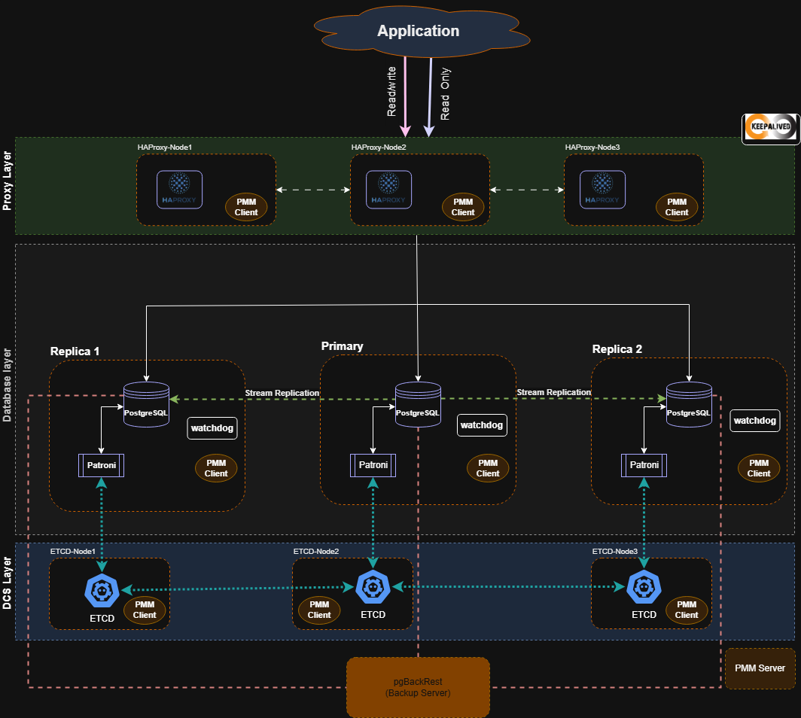

# PostgreSQL Replica

## 1. Architecture

Kiến trúc triển khai PostgreSQL đảm bảo tính HA bao gồm 1 primary và 2 replica

**Database layer**

- PostgreSQL nodes: Lưu data.
- [Patroni](https://docs.percona.com/postgresql/17/solutions/patroni-info.html#next-steps): Quản lý cụm
- watchdog - một cơ chế sẽ thiết lập lại toàn bộ hệ thống khi chúng không nhận được tín hiệu duy trì hoạt động trong một khoảng thời gian nhất định. Điều này bổ sung thêm một lớp bảo vệ dự phòng trong trường hợp Patroni bị lỗi.

**DCS layer¶**

- [etcd](https://docs.percona.com/postgresql/17/solutions/etcd-info.html): Distributed Configuration Store.

**Load balancing layer**

- [HAProxy](https://docs.percona.com/postgresql/17/solutions/haproxy-info.html): Load Balancer cho phép ứng dụng kết nối đến PostgreSQL Cluster với chỉ 1 IP duy nhất.
- keepalived: Đã sử dụng trong bài [MongoDB](../2-MongoDB/1-MongoDB.md) để triển khai VIP.
- (Tùy chọn) pgbouncer - một trình gom kết nối cho PostgreSQL. Mục đích của pgbouncer là giảm thiểu tác động đến hiệu suất khi mở các kết nối mới đến PostgreSQL.

^^Services layer**

- [pgBackRest](https://docs.percona.com/postgresql/17/solutions/pgbackrest-info.html#key-features-of-pgbackrest) - giải pháp sao lưu và khôi phục cho PostgreSQL. Giải pháp này cũng nên dự phòng để loại bỏ một điểm lỗi duy nhất.
- (Tùy chọn) Percona Monitoring and Management (PMM) - giải pháp giám sát tình trạng cụm của bạn

## 2.Cài đặt cụm PostgreSQL 17

- Làm theo [tài liệu chính thức của Percona](https://docs.percona.com/postgresql/17/solutions/ha-init-setup.html#next-steps)
