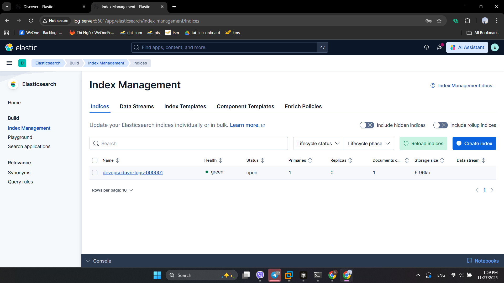
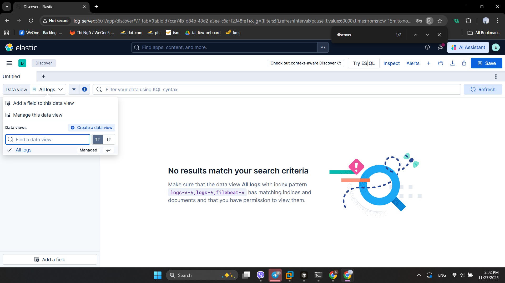
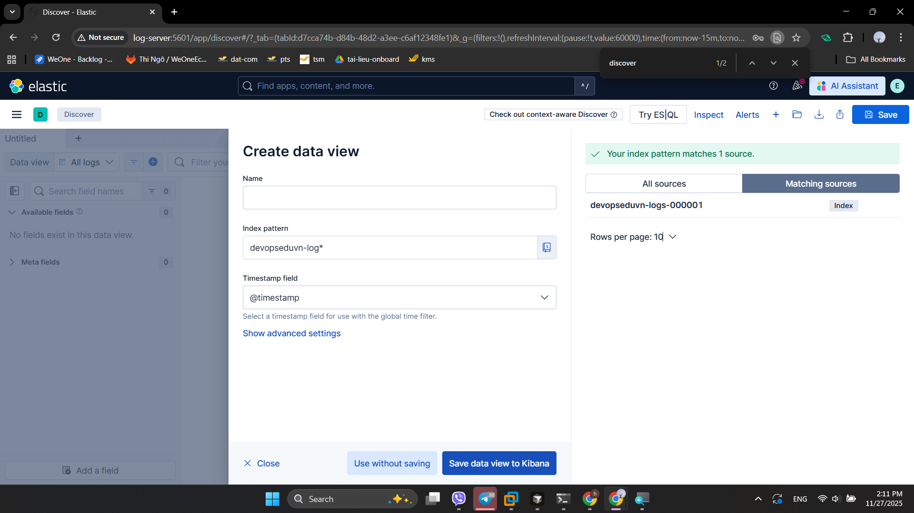
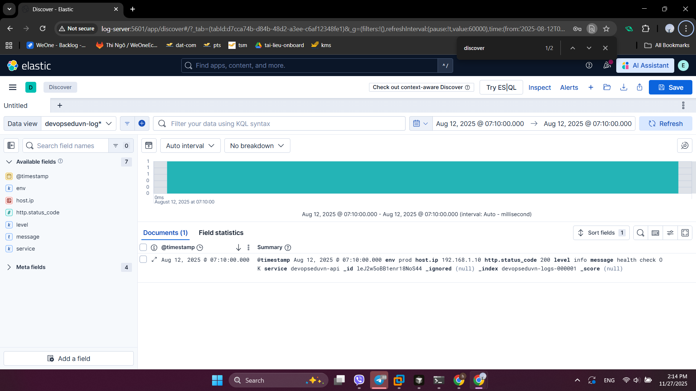

# Setup

## 1. Setup server

- Seri này cần 2 server:
  - log-server: 192.168.159.11
  - dev-server: 192.168.159.12

>Note: Hướng dẫn setup [tại đây](../../1-DevOps_For_Fresher/1-Linux/1-Tạo_máy_ảo_VMware.md)

## 2. Triển khai dự án

### 2.1. Backend

- Backend triển khai chạy qua Darmon (Run bằng lệnh java)
- Chú ý chỉnh lại cấu hình IP trong code đúng vs IP của dev-server
- Copy code lên dev-server

```ps1
cd .\4-Logging\2-Setup\
scp .\SpringBoot-Reactjs-Ecommerce.zip 192.168.159.12:/home/haitc
```

- Trên dev-server

```sh
mkdir /project
mv /home/haitc/SpringBoot-Reactjs-Ecommerce.zip  /project
cd /project
# Giải nén
sudo apt install unzip -y
unzip SpringBoot-Reactjs-Ecommerce.zip
# Cài đặt DB, java 21, maven
sudo apt install mariadb-server openjdk-21-jdk maven -y
```

- Cấu hình DB

```sh
mysql -u root
```

```sql
CREATE DATABASE ecommerce_db;
CREATE USER 'ecommerce'@'%' IDENTIFIED BY 'StrongPa55WorD';
GRANT ALL PRIVILEGES ON ecommerce_db.* TO 'ecommerce'@'%';
FLUSH PRIVILEGES;
exit
```

- Build và Run backend

```sh
cd /project/SpringBoot-Reactjs-Ecommerce/Ecommerce-Backend/
mvn clean install -DskipTests
# Taọ thư mục lưu log
mkdir /var/log/java
java -jar target/ecom-proj-0.0.1-SNAPSHOT.jar > /var/log/ecom-backend.log
# Xem log
tail -f /var/log/ecom-backend.log
```

- Truy cập <http://192.168.159.12:8080/swagger-ui/index.html>

### 2.2. Triển khai FE

- Trên dev-server

```sh
sudo apt install docker.io -y
cd Ecommerce-Frontend
docker build -t ecommerce-fe:v1 .
docker run --name=ecommerce-fe -dp 5173:80 ecommerce-fe:v1
# Xem log
docker logs -f ecommerce-fe
```

- Truy cập <http://192.168.159.12:5173/>

  ## 3. Setup log-server

  ### 3.1. Elastic Search

- Cài đặt Elasticsearch

```sh
curl -fsSL https://artifacts.elastic.co/GPG-KEY-elasticsearch | sudo gpg --dearmor -o /usr/share/keyrings/elastic.gpg
echo "deb [signed-by=/usr/share/keyrings/elastic.gpg] https://artifacts.elastic.co/packages/9.x/apt stable main" | sudo tee /etc/apt/sources.list.d/elastic-9.x.list
sudo apt update -y
sudo apt install elasticsearch
 ```

- Mở thư mục `/etc/elasticsearch` sẽ có các file quan trọng sau:
  - `elasticsearch.yml`: Chứa nội dung cấu hình như cluster, binding, SSL/TLS...
  - `jvm.options`: Cấu hình liên quan đến hiệu năng JVM
  - Thư mục `jvm.options.d` cho phép tạo các file override cấu hình trong file `jvm.options`
  - `log4j2.properties`: Cấu hình log cho ES.
  - `roles.yml`: Định nghĩa role
  - `users`: Thông tin user.
- Chỉnh sửa cấu hình Elasticsearch

```sh
vi /etc/elasticsearch/elasticsearch.yml
```

- Tìm và sửa các nội dung như dưới đây:

```yml
cluster.name: elasticsearch-devopseduvn
   0.0.0.0
http.port: 9200
xpack.security.enabled: true
xpack.monitoring.collection.enabled: true
```

- Khởi động và kiểm tra trạng thái Elasticsearch service

```sh
sudo systemctl start elasticsearch
sudo systemctl enable elasticsearch
sudo systemctl status elasticsearch
```

- Đặt mật khẩu cho tài khoản Elasticsearch

```sh
sudo /usr/share/elasticsearch/bin/elasticsearch-reset-password -u elastic -
```

>Note: Hãy sử dụng pasword mạnh (Lên random pasword) để đảm bảo bảo mật. Ở đây để pass là `KHFDPeU6`

- Kiểm tra trạng thái hoạt động của Elasticsearch

```sh
curl --cacert /etc/elasticsearch/certs/http_ca.crt -u elastic:KHFDPeU6 https://localhost:9200
```

### 3.2. Kibana

```sh
sudo apt install kibana -y
 ```

Chỉnh sửa cấu hình Kibana

```sh
vi /etc/kibana/kibana.yml
```

Tìm và sửa các nội dung như dưới đây:

```yml
server.name: "kibana-devopseduvn"
server.host: "0.0.0.0"
server.port: 5601
elasticsearch.hosts: ["http://localhost:9200"]
elasticsearch.ssl.certificateAuthorities: ["/etc/kibana/certs/http_ca.crt"]
```

Copy và phân quyền file xác thực HTTPS của elasticsearch

```sh
sudo mkdir -p /etc/kibana/certs
sudo cp /etc/elasticsearch/certs/http_ca.crt /etc/kibana/certs/
sudo chown -R kibana:kibana /etc/kibana/certs/
```

Khởi động và kiểm tra trạng thái Kibana service

```sh
sudo systemctl restart kibana
sudo systemctl enable kibana
sudo systemctl status kibana
```

Thành công truy cập trên trình duyệt vào Kibana với địa chỉ <http://192.168.159.11:5601>
Tạo token xác thực

```sh
sudo /usr/share/elasticsearch/bin/elasticsearch-create-enrollment-token -s kibana
```

Lấy verification code

```sh
sudo /usr/share/kibana/bin/kibana-verification-code
```

Thêm Index sample thử xem hệ thống đã hoạt động chưa

```sh
curl --cacert /etc/elasticsearch/certs/http_ca.crt \
  -u elastic:KHFDPeU6 \
  -X PUT "https://localhost:9200/devopseduvn-logs-000001" \
  -H "Content-Type: application/json" \
  -d '{
    "settings": {
      "number_of_shards": 1,
      "number_of_replicas": 0,
      "index.translog.durability": "request",
      "index.refresh_interval": "1s"
    },
    "mappings": {
      "properties": {
        "@timestamp":        { "type": "date" },
        "service":           { "type": "keyword" },
        "env":               { "type": "keyword" },
        "level":             { "type": "keyword" },
        "message":           { "type": "text" },
        "host.ip":           { "type": "ip" },
        "http.status_code":  { "type": "integer" }
      }
    }
  }'

```

Ghi thử log mẫu

```sh
curl --cacert /etc/elasticsearch/certs/http_ca.crt \
  -u elastic:KHFDPeU6 \
  -X POST "https://localhost:9200/devopseduvn-logs-000001/_doc" \
  -H "Content-Type: application/json" \
  -d '{
    "@timestamp": "2025-08-12T00:10:00Z",
    "service": "devopseduvn-api",
    "env": "prod",
    "level": "info",
    "message": "health check OK",
    "host": {
      "ip": "192.168.1.10"
    },
    "http": {
      "status_code": 200
    }
  }'
```

 Lên [Kibana](http://192.168.159.11:5601) => Index Management ssẽ thấy Index `devopseduvn-logs-` vừa tạo ở trên



Chuyeenr sang menu Discover => All logs => Create new Data View



Tạo Data View tương ứng với Index



Dữ liệu tương ứng



### 3.3 Cấu hình thêm (Optional)

#### 3.3.1. Cấu hình persistent cluster settings trong Elasticsearch, thiết lập các ngưỡng cảnh báo dung lượng ổ đĩa và bảo vệ dữ liệu khi ổ đĩa sắp đầy

```sh
curl --cacert /etc/elasticsearch/certs/http_ca.crt \
  -u elastic:KHFDPeU6 \
  -X PUT "<https://localhost:9200/_cluster/settings>" \
  -H "Content-Type: application/json" \
  -d '{
    "persistent": {
      "action.destructive_requires_name": "true",
      "cluster.routing.allocation.disk.watermark.low":  "85%",
      "cluster.routing.allocation.disk.watermark.high": "90%",
      "cluster.routing.allocation.disk.watermark.flood_stage": "95%"
    }
  }'
```

**Lưu ý quan trọng**:

- Đây là cấu hình persistent, nghĩa là vẫn giữ nguyên sau khi restart cluster.
- Nếu bạn chỉ muốn test tạm thời, có thể đổi “persistent” thành “transient“.
- Nếu log tăng quá nhanh, tốt nhất là:
  - Tăng dung lượng ổ đĩa.
  - Hoặc bật ILM (Index Lifecycle Management) để tự động xóa log cũ.

**Kinh nghiệm thực tế:**

Trong môi trường logging lớn (Elastic, Kibana, Beats, Vector, Loki…):

- Bắt buộc set watermark, nếu không:
  - Ổ đĩa đầy → Elasticsearch dừng ghi log.
  - Hoặc xấu hơn → Cluster bị red status.
- Nên kết hợp:
  - ILM policy → Tự động xóa index cũ.
  - Watermark → Bảo vệ khi log tăng bất ngờ.
  - Monitor → Alert khi dung lượng > 80%.

#### 3.3.2. Snapshot (backup) bắt buộc với single-node (chú ý nên sử dụng disk khác mount vào server để đảm bảo dữ liệu)

```sh
sudo mkdir -p /mnt/es-snapshots
sudo chown elasticsearch:elasticsearch /mnt/es-snapshots
```

Thêm cấu hình trong file /etc/elasticsearch/elasticsearch.yml

```yml
path.repo: ["/mnt/es-snapshots"]
```

Restart lại Elasticsearch

```sh
sudo systemctl restart elasticsearch
```

Đăng ký snapshot repository

```sh
curl --cacert /etc/elasticsearch/certs/http_ca.crt \
  -u elastic:KHFDPeU6 \
  -X PUT "<https://localhost:9200/_snapshot/devopseduvn_repo>" \
  -H "Content-Type: application/json" \
  -d '{
    "type": "fs",
    "settings": {
      "location": "/mnt/es-snapshots",
      "compress": true
    }
  }'
```

Tạo snapshot

```sh
curl --cacert /etc/elasticsearch/certs/http_ca.crt \
  -u elastic:KHFDPeU6 \
  -X PUT "<https://localhost:9200/_snapshot/devopseduvn_repo/snap_$(date> +%Y%m%d_%H%M%S)?wait_for_completion=true"
```

#### 3.3.3. Tạo policy SLM hàng ngày (1:00)

```sh
curl --cacert /etc/elasticsearch/certs/http_ca.crt \
  -u elastic:KHFDPeU6 \
  -X PUT "<https://localhost:9200/_slm/policy/daily_01h>" \
  -H "Content-Type: application/json" \
  -d '{
    "schedule": "0 0 1 ** ?",
    "name": "<daily-{now/d}>",
    "repository": "local_fs",
    "config": { "include_global_state": true },
    "retention": {
      "expire_after": "30d",
      "min_count": 7,
      "max_count": 60
    }
  }'
```

Các câu lệnh kiểm tra

```sh
# Xem policy

curl --cacert /etc/elasticsearch/certs/http_ca.crt \
  -u elastic:KHFDPeU6 \
  -X GET "<https://localhost:9200/_slm/policy/daily_01h?pretty>"

# Thực thi ngay (test)

curl --cacert /etc/elasticsearch/certs/http_ca.crt \
  -u elastic:KHFDPeU6 \
  -X POST "<https://localhost:9200/_slm/policy/daily_01h/_execute?pretty>"

# Xem lịch sử/ trạng thái SLM

curl --cacert /etc/elasticsearch/certs/http_ca.crt \
  -u elastic:KHFDPeU6 \
  -X GET "<https://localhost:9200/_slm/status?pretty>"
```

#### 3.3.4. Bật slowlog để lưu ý chỉ số bất thường

```sh
# Indexing slowlog

curl --cacert /etc/elasticsearch/certs/http_ca.crt \
  -u elastic:KHFDPeU6 \
  -X PUT "<https://localhost:9200/devopseduvn-logs-*/_settings>" \
  -H "Content-Type: application/json" \
  -d '{
    "index.indexing.slowlog.threshold.index.warn": "1s",
    "index.indexing.slowlog.threshold.index.info": "500ms",
    "index.indexing.slowlog.source": "1000"
  }'

# Search slowlog

curl --cacert /etc/elasticsearch/certs/http_ca.crt \
  -u elastic:KHFDPeU6 \
  -X PUT "<https://localhost:9200/devopseduvn-logs-*/_settings>" \
  -H "Content-Type: application/json" \
  -d '{
    "index.search.slowlog.threshold.query.warn": "2s",
    "index.search.slowlog.threshold.fetch.warn": "1s"
  }'
```
