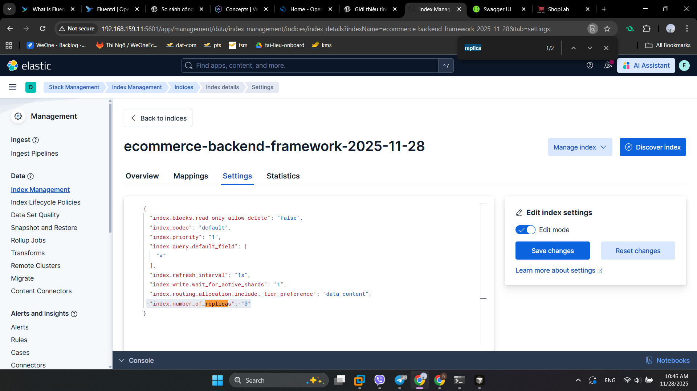
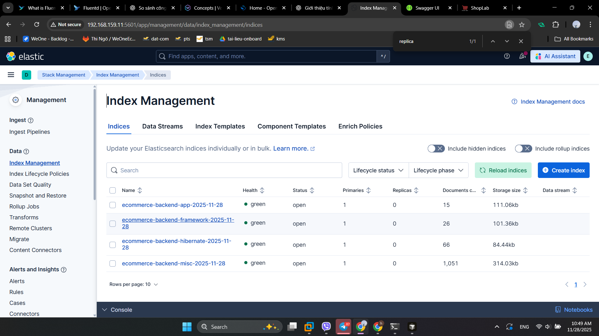
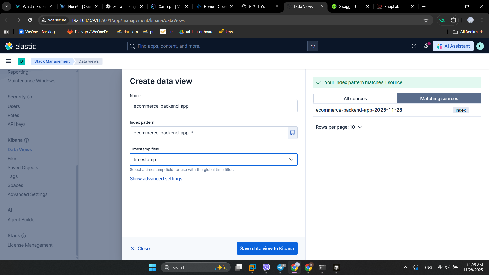
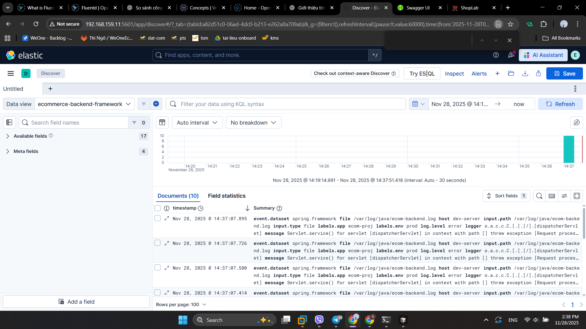
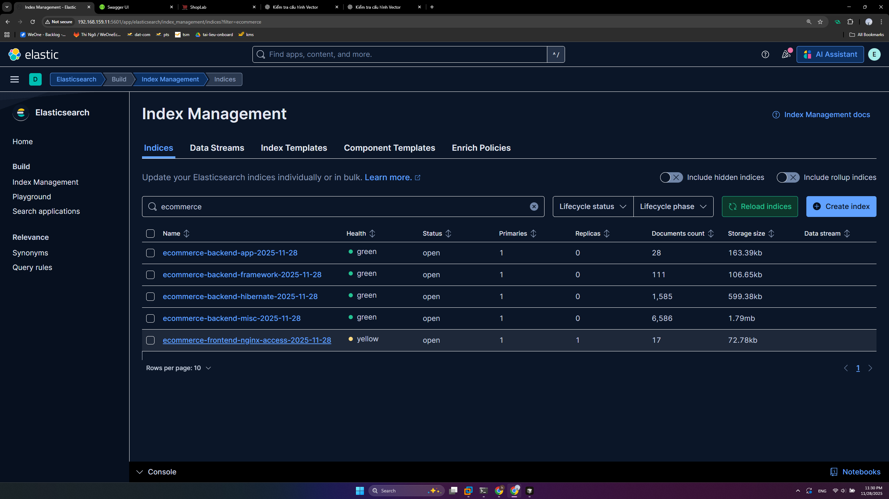

# Vector

Vector là agent để thu thập, chuyển đổi, đồng bộ log. Do đó cần lấy lgo ở đâu thì cài Vector ở đáy
Thực hiện trên dev-server

## 1.Cài đặt vector

```sh
bash -c "$(curl -L https://setup.vector.dev)"
sudo apt-get install -y vector
sudo systemctl enable --now vector
```

File cấu hình vector.yaml gốc trong trường hợp bạn cấu hình sai

```sh
vi /etc/vector/vector.yaml
```

```yml
# ____  __

# / / / /

# V / / /

# _/  /

#

# V E C T O R

# Configuration

#

# ------------------------------------------------------------------------------

# Website: <https://vector.dev>

# Docs: <https://vector.dev/docs>

# Chat: <https://chat.vector.dev>

# ------------------------------------------------------------------------------

# Change this to use a non-default directory for Vector data storage

# data_dir: "/var/lib/vector"

# Random Syslog-formatted logs

sources:
  dummy_logs:
    type: "demo_logs"
    format: "syslog"
    interval: 1

# Parse Syslog logs

# See the Vector Remap Language reference for more info: <https://vrl.dev>

transforms:
  parse_logs:
    type: "remap"
    inputs: ["dummy_logs"]
    source: |
      . = parse_syslog!(string!(.message))

# Print parsed logs to stdout

sinks:
  print:
    type: "console"
    inputs: ["parse_logs"]
    encoding:
      codec: "json"
      json:
        pretty: true

# Vector's GraphQL API (disabled by default)

# Uncomment to try it out with the `vector top` command or

# in your browser at <http://localhost:8686>

# api

# enabled: true

# address: "127.0.0.1:8686"
```

[Tài liệu chính thức](https://vector.dev/docs/reference/configuration/)

Với Vector thì có 3 thành phần chính:

- Source: Nguồn data
- transforms: Chuyển đổi dữ liệu format, masking v.v.
- Sink: Đồng đọ dữ liệu đến đích ở đây là ES

Vector hỗ trợ rất nhiều nguồn log [chi tiết](https://vector.dev/docs/reference/configuration/sources/). Trong seri này sẽ dùng 2 loại source:

- [File](https://vector.dev/docs/reference/configuration/sources/file/): Ecommerce-Backend
- [Docker](https://vector.dev/docs/reference/configuration/sources/docker_logs/): Ecommerce-Frontend

## 2. Cấu hình Vector

### 2.1. Cài đặt Vector

- Vì ES dùng https nên cần copy cert sang vector để xác thực

```sh
root@dev-server:~# cd /etc/vector/
root@dev-server:/etc/vector# mkdir certs

root@log-server:~# scp /etc/elasticsearch/certs/http_ca.crt  root@192.168.159.12:/etc/vector/certs

root@dev-server:/etc/vector# chown -R vector:vector /etc/vector/
```

- Backup lại file cấu hình vector.yaml

```sh
root@dev-server:/etc/vector# mv vector.yaml vector.yaml.org
root@dev-server:/etc/vector# vi vector.yaml

```

### 2.2. Cấu hình log cho Backend

- Tạo file cấu hình [vector.yaml](./vector.yaml). Có thể dùng cấu hình đơn giản hơn với chỉ 1 Index duy nhất ở file [vector-1-index.yaml](./vector-1-index.yaml)

>Note: Chú ý sửa IP của log-server trong phần sinks

- [Giải thích cấu hình vector.yaml](./Giải%20thích%20cấu%20hình%20vector.yaml.md)

- Kill process ddang chayj backend

```sh
root@dev-server:/etc/vector# rm /var/log/java/ecom-be.log
root@dev-server:/etc/vector#
root@dev-server:/etc/vector# ps -ef | grep java
root      136379       1  1 07:37 ?        00:01:38 java -jar ecom-proj-0.0.1-SNAPSHOT.jar
root      137876  137689  0 09:16 pts/0    00:00:00 grep --color=auto java
root@dev-server:/etc/vector# fill -9 136379
```

- Xoas log cux

```sh
root@dev-server:/var/log/java# echo > /var/log/java/ecom-backend.log
```

- Validate file cấu hình vector.yaml

```sh
root@dev-server:/var/log/java# vector validate /etc/vector/vector.yaml
```

- restart vector

```sh
root@dev-server:~# systemctl restart vector
```

- Chạy lại ứng dụng backend

```sh
root@dev-server:~# nohup java -jar /project/SpringBoot-Reactjs-Ecommerce/Ecommerce-Backend/target/ecom-proj-0.0.1-SNAPSHOT.jar > /var/log/java/ecom-backend.log &
```

- Lên Kibana => Elastic Search => Index Management xóa Index `devopseduvn-log` đi.bằng cách chọn Index => Manage Index => Delete Index
- danh sách Index hiện tại health đáng là `yellow` vì replica đang là 1 án vào từng Index => sang tab Settings => Bật edit mode => Sửa  "index.number_of_replicas": "0"



- Đã có đủ 4 Index tương ứng cấu hình Vector ở health `green`



- Vào Kibana => Dât View => Create Data View tương ứng với các Index trên. ví dụ: ecommerce-backend-app
  - Name: ecommerce-backend-app
  - partern: ecommerce-backend-app-*
  - Timesatmp feild: timestamp

- Taho tác trên <http://192.168.159.12:5173/> và tạo sp trên <http://192.168.159.12:8080/swagger-ui/index.html#/product-controller/addProduct> để tạo log
- Kibana => Analytics =>


### 2.3. Cấu hình log cho Frontend

- Nếu có nhiều dự án mà chỉ cấu hình chung vào file `vector.yaml` sẽ rất khó quản lý nên cần tách riêng ra cho từng dự án.

```sh
root@dev-server:~# cd /etc/vector/
root@dev-server:/etc/vector# mkdir conf.d
root@dev-server:/etc/vector# mv vector.yaml conf.d/
root@dev-server:/etc/vector# cd conf.d/
root@dev-server:/etc/vector/conf.d# mv vector.yaml ecommerce-backend.yaml
root@dev-server:/etc/vector/conf.d# touch ecommerce-frontend.yaml
```

- Xem thông tin file cấu hình của vector service sẽ thấy ở `/lib/systemd/system/vector.service`

```sh
root@dev-server:/etc/vector/conf.d# systemctl cat vector.service
# /lib/systemd/system/vector.service
[Unit]
Description=Vector
Documentation=https://vector.dev
After=network-online.target
Requires=network-online.target

[Service]
User=vector
Group=vector
ExecStartPre=/usr/bin/vector validate
ExecStart=/usr/bin/vector
ExecReload=/usr/bin/vector validate --no-environment
ExecReload=/bin/kill -HUP $MAINPID
Restart=always
AmbientCapabilities=CAP_NET_BIND_SERVICE
EnvironmentFile=-/etc/default/vector
# Since systemd 229, should be in [Unit] but in order to support systemd <229,
# it is also supported to have it here.
StartLimitInterval=10
StartLimitBurst=5
[Install]
WantedBy=multi-user.target
```

- Thêm `--config-dir /etc/vector/conf.d` vào `ExecStartPre=/usr/bin/vector validate` và  `ExecStart=/usr/bin/vector`

- Cập nhật cấu hình

```sh
root@dev-server:/etc/vector/conf.d# systemctl daemon-reload
# Kiểm tra
root@dev-server:/etc/vector/conf.d# systemctl cat vector.service
# /lib/systemd/system/vector.service
[Unit]
Description=Vector
Documentation=https://vector.dev
After=network-online.target
Requires=network-online.target

[Service]
User=vector
Group=vector
ExecStartPre=/usr/bin/vector validate --config-dir /etc/vector/conf.d
ExecStart=/usr/bin/vector --config-dir /etc/vector/conf.d
ExecReload=/usr/bin/vector validate --no-environment
ExecReload=/bin/kill -HUP $MAINPID
Restart=always
AmbientCapabilities=CAP_NET_BIND_SERVICE
EnvironmentFile=-/etc/default/vector
# Since systemd 229, should be in [Unit] but in order to support systemd <229,
# it is also supported to have it here.
StartLimitInterval=10
StartLimitBurst=5
[Install]
WantedBy=multi-user.target
```

- Cấu hình `ecommerce-frontend.yaml`

```sh
chown -R vector:vector /etc/vector/
root@dev-server:/etc/vector/conf.d# vi ecommerce-frontend.yaml
```

- File maaus [ecommerce-fronted.yaml](./ecommerce-frontend.yaml) và [gải thích cấu hình](./Giải%20thích%20cấu%20hình%20vector%20ecommerce-frontend.md)

>Note: Chú ý đến tên các phần trong file yaml phải là duy nhất trong toàn bộ cấu hình vector không sẽ gặp lỗi. Ví dụ `fe_docker` mà project khác cũng đặt `fe_docer` là toang.

- Restart hệ thống

```sh
# Cần cấp quyền cho user vector để có thể truy cập docker socket
root@dev-server:/etc/vector/conf.d# systemctl restart vector
root@dev-server:/etc/vector/conf.d# systemctl daemon-reload
root@dev-server:/etc/vector/conf.d# systemctl restart vector.service
root@dev-server:/etc/vector/conf.d# docker restart ecommerce-fe
```


