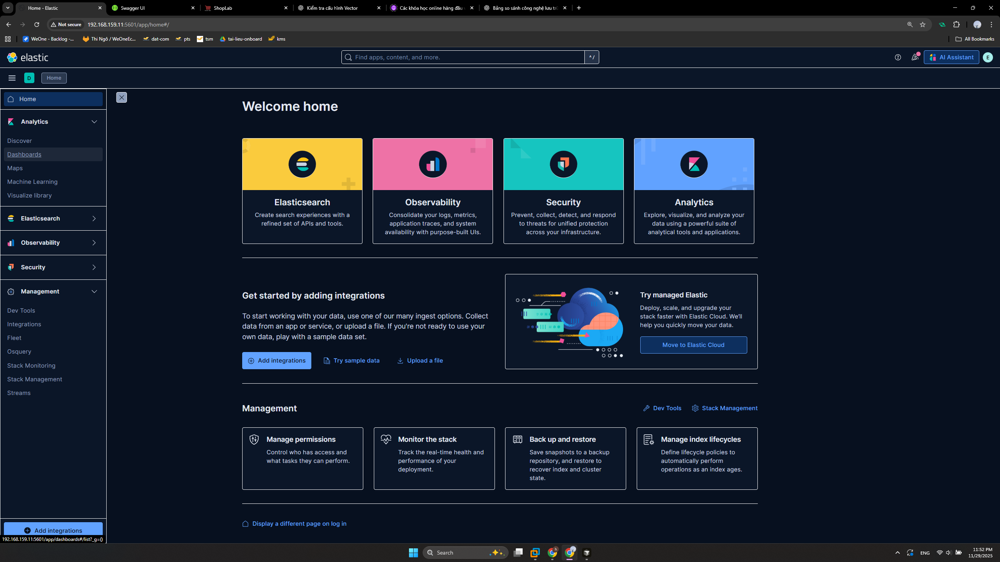
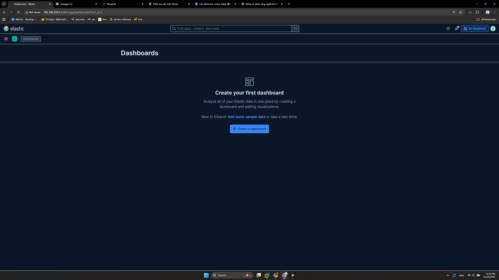
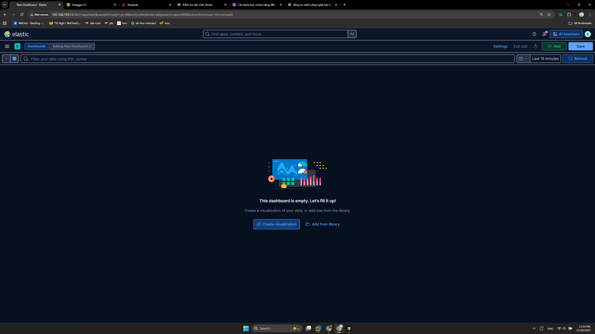
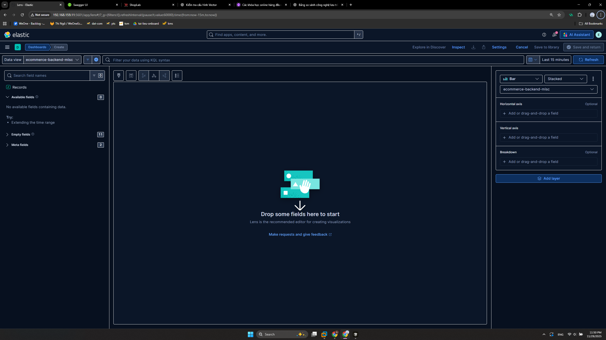
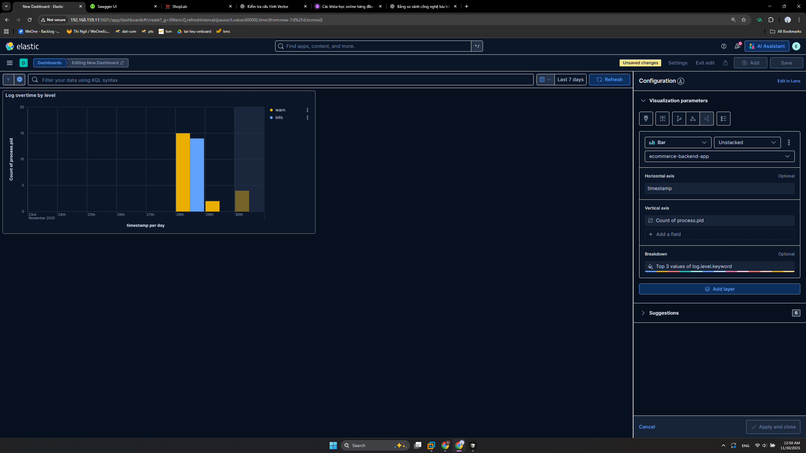

# Dashbooard Kibana

Truy cập [Kibana](http://192.168.159.11:5601/) => Menu Analytics => Dashboard => Create Dashboard => Create visualization

 - Cấu hình Visaulization khá đơn giản như loại biểu đò (bar, line, pie), Data view (là các Data view được tạo ở bài trước), feild làm trục hoành (Horizontal Axis), feild làm trục tung (Vertical Axis).
- Ví dụ biểu đồ cột thống kê log theo ngày trong 7 ngày gần nhất

