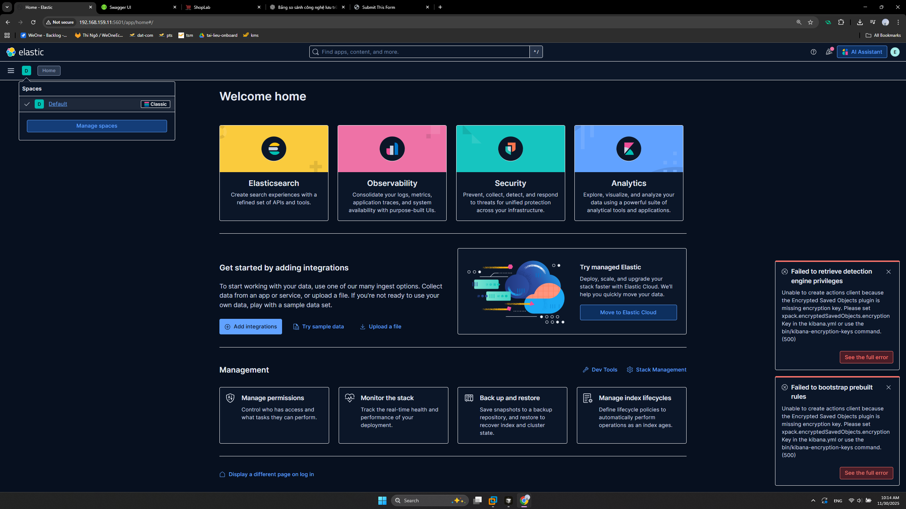
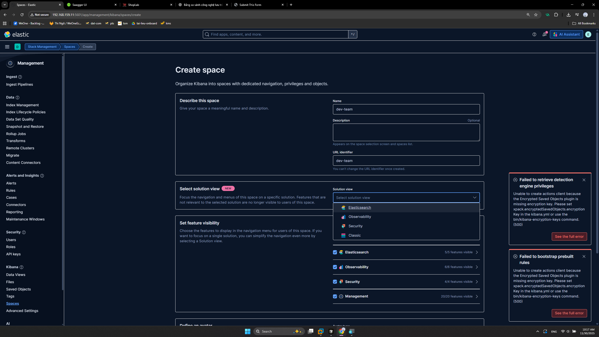
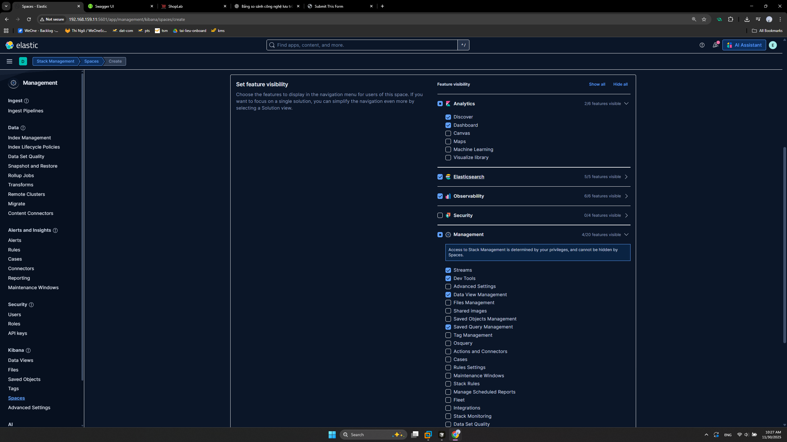
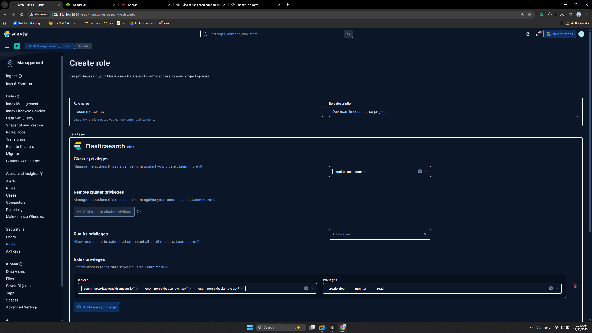
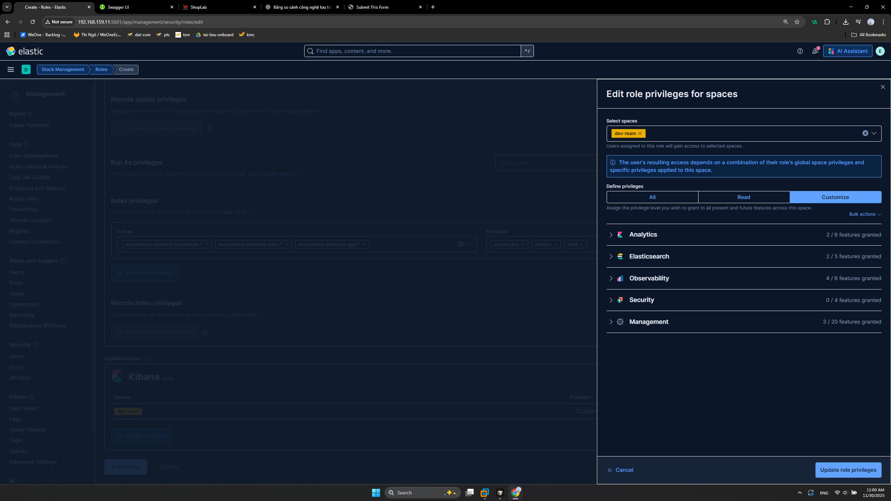
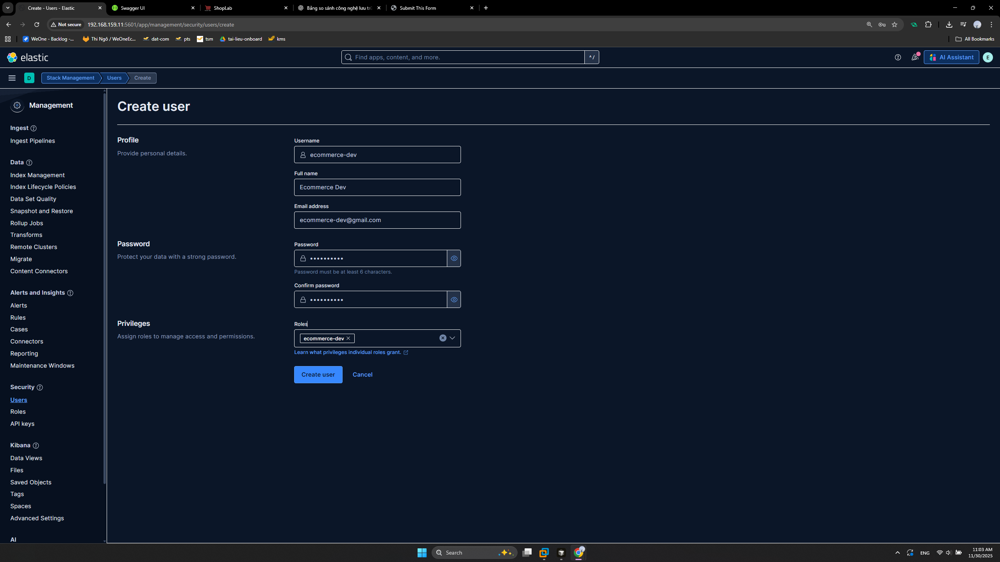

# Phân quyền trong Kibana

## 1. Tạo Space

Tạo Space `dev-team`

Phần `Solution View` là giới hạn chức năng hiển thị trên giao diện Menu của Space.
Chọn `Classic` để có thể tùy chỉnh `Set feature visibility`

Tương tự chúng ta có thể tạo space cho các team khác như BA, Tester, Networking, SA v.v.

## 2. Tạo Role và User

Cuyển về Space `default` để có các Menu cấu hình.
Vào `Stack Management` => `Roles`, Kibana đã tạo sẵn một số Role mặc định

Để rõ ràng hơn, chúng ta cần 1 Role để gán cho dev team của dự án ecommerce.

Gán Role vào Space `dev-team` và thiết lập quyền cho từng chức năng

Tạo user `ecommerce-dev`

