# Tạo máy ảo Ubunto bằng VMware Workstation Pro

1. Vào file > New Virtual Mechine
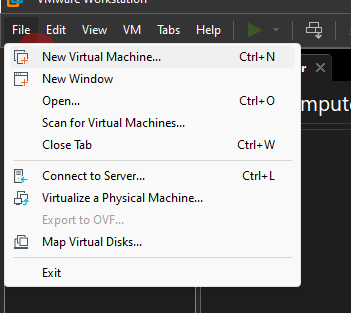
2. Next

3. Chọn file iso
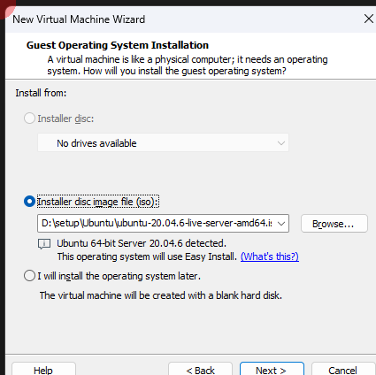
4. Điền tk/mk

5. Đặt tên máy ảo và nơi lưu trữ

6. Đặt giới hạn dung lượng

7. Cấu hình phần cứng

- Customize Hardware
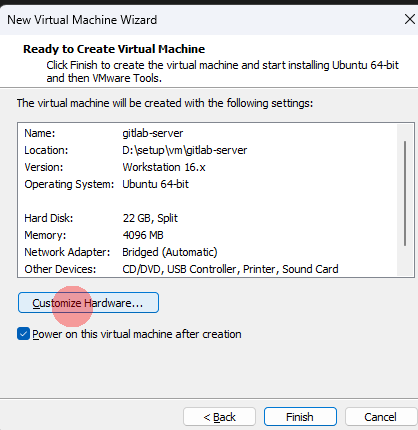
- Giới hạn RAM

- Cấu hình Processor

- Network đổi về Brige (mặc định là NAT)

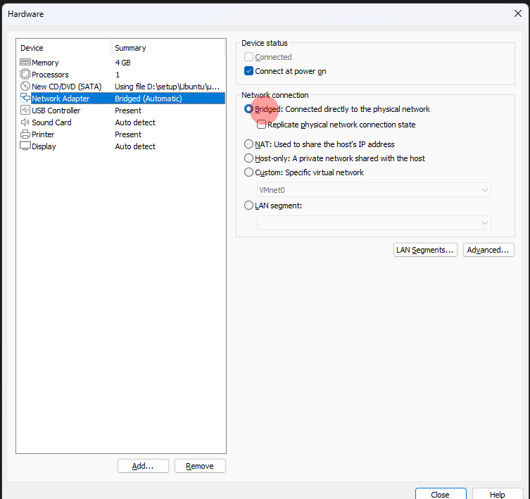

- Chú ý sẽ có 2 kiểu netwwork 2 kiểu này sẽ thay đổi cấu hình gateway4:
  - Brige: Là ip cùng mạng LAN, gateway4: 192.168.1.1
  - NAT: Nội bộ máy local, gateway4 là ip vào Edit>Virtual Network Editer tìm dòng NAT NAT Setting>Gateway Ip

8. Close > Finish
9. Bật VM vừa tạo

10. Cấu hình VM

- Chọn ngôn ngữ English > Enter
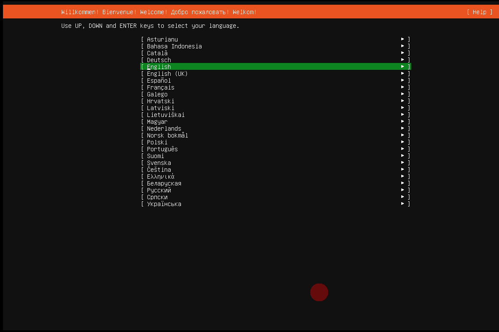
- Không cần update > Enter


- Keyboard


- Network: enS3 là tên card mạng, ip ở dưới là ip động sẽ thay đổi khi restart VM nên sau đó cần cấu hình lại
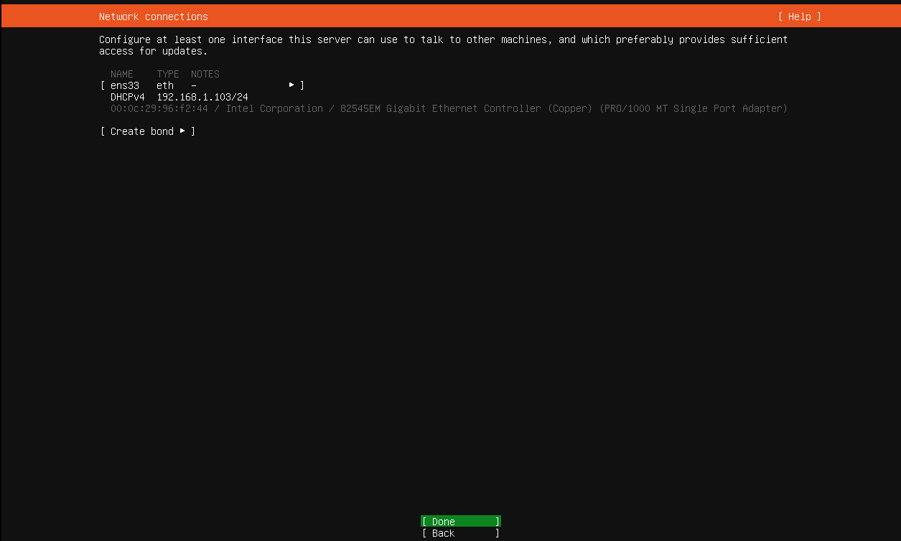

- Proxy để mặc định
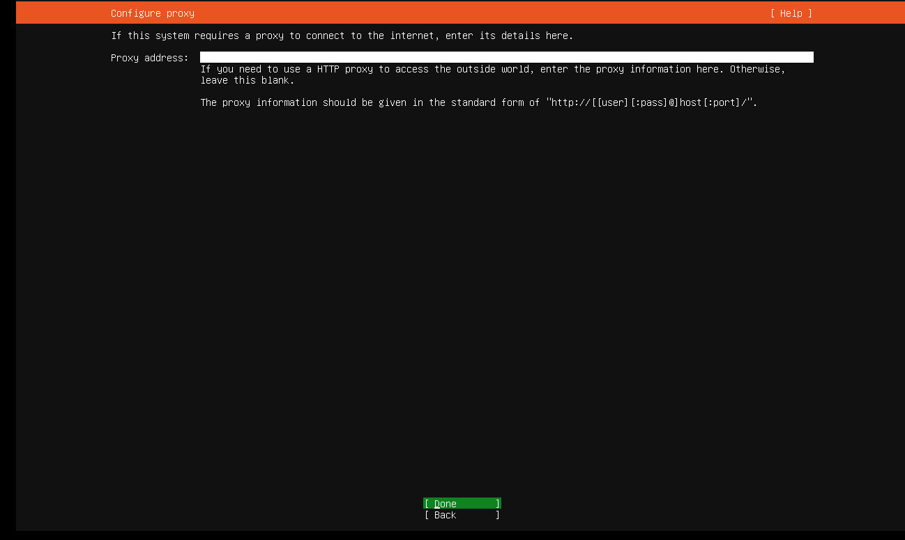

- Miror để mặc định
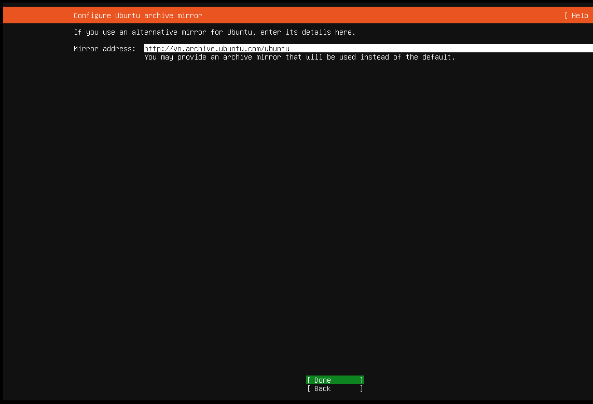

- Storage để mặc định

- Disk để dung lượng dòng Ubuntu-LV bằng dòng trên

- Điền thông tin
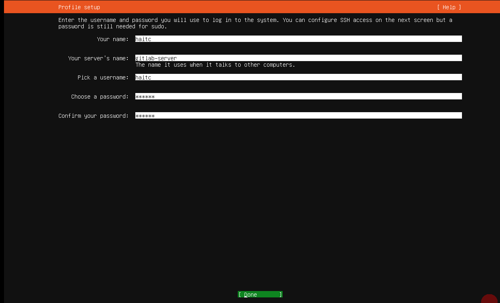
- Cài đặt OpenSSH nhớ tích vào không là phải cài tay như sau:

``` sh
sudo apt update
sudo apt install openssh-server
sudo systemctl enable ssh
sudo systemctl start ssh
sudo systemctl status ssh
```


- Cần cài thêm gì thì tick vào
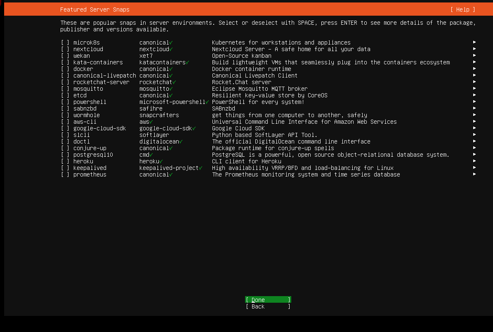
- Chờ cho VM chạy xong


11. Cấu hình ip

- Chỉnh sửa file config netplan

``` sh
sudo nano /etc/netplan/00-installer-config.yaml
```

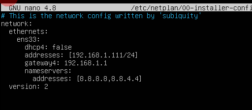

- Ctrl+x y để thoát và lưu

``` sh
# Apply cònig
netplan apply
# kiểm tra xem ở phần es330 ăn ip chưa
ip a
# restart server
reboot
```
