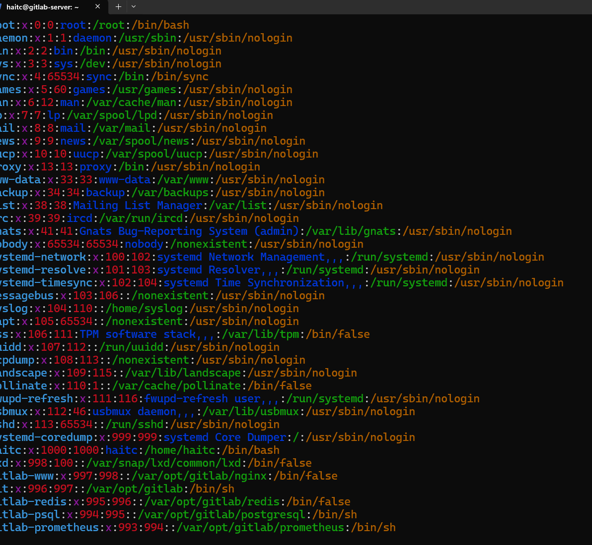

1. Cài đặt gitlab runner

- [Install Git Lab runner on Ubuntu](https://www.linuxtechi.com/how-to-install-gitlab-runner-on-ubuntu/)

``` sh
sudo -i
apt update
curl -L "https://packages.gitlab.com/install/repositories/runner/gitlab-runner/script.deb.sh" | sudo bash
apt install gitlab-runner
gitlab-runner -version
```

- Kiểm tra user gitlab-runner

``` sh
vi /etc/passwd
```



2. Cấu hình CI/CD trên gitlab

- tạo group
- Vào trang chủ gitlab => đăng nhập => projects => create new project => create blank project
- tạo 2 nhánh develop và release. Release chỉ maintainer mới được push
- Thêm 2 user dev1 có reole developer và lead1 role maintainer
- Vào dự án => Settings => CICD => Runner rồi ấn Extend
- Lên server đã cài gitlab-runner

``` sh
gitlab-runner register
```

- Url là domain của gitlab ở đây là: <http://gitlab.haitc.local/>
- Token


- Description và tag để tên server
- excutor để shell


- Mở file config

``` sh
vi /etc/gitlab-runner/config.toml
```

- Sửa concurrent = 4 (số dự án mà con runner chạy được)


- Khởi động runner

``` sg
nohub gitlab-runner run --working-directory /home/gitlab-runner --config /etc/gitlab-runner/config.toml --service gitlab-runner --user gitlab-runner 2>&1 &
```

- Kiểm tra process

``` sh
gitlab-runner 2>&1
```


- Quay lại trang gitlab và đã thấy 1 runner mới tên là gitlab-server

- Edit


3. Viết kịch bản

- tạo file .gitlab-ci.yml trong thư mục gốc của dự án

``` yml
stages:
  - build
  - deploy
  - checklog

build:
  stage: build
  script:
    - whoami
    - pwd
    - ls
  tags:
    - gitlab-server

```

- Build => Pipeline


- Chi tiết job


>NOTE: Khi chỉnh sửa bất cứ file nào thì pipeline sẽ được chạy. Sẽ xóa toàn bộ code cũ đi và downloa code mới.

- Cho usser gitlab-runner chạy với quyền sudo với các câu lẹnh cp, chown, su java1 mà không cần nhập password

``` sh
sudo víudo
```
- Thêm vào phần # User privilege specification
```
gitlab-runner ALL=(ALL) NOPASSWD: /bin/cp*
gitlab-runner ALL=(ALL) NOPASSWD: /bin/chown*
gitlab-runner ALL=(ALL) NOPASSWD: /bin/su java1
```
