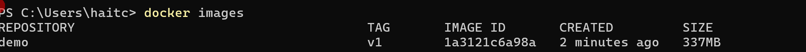
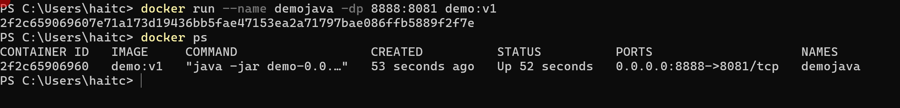

1. Các khái niệm cơ bản
1.1 Commands

- FROM: Khai báo image
- WORKDIR: Chỉ định thư mục làm việc, nếu folder chưa có sẽ tạo mới
- COPY . . : . đầu tiên là vị trí hiện tại của file Dockerfile trên máy hiện tại, . thứ 2 là vị trí thư mục WORKDIR trong container.
- RUN: Chạy các câu lệnh Linux.
- ENV: Định nghĩa các biến môi trường.
- EXPOSE: Chỉ định ứng dụng trong container chạy ở port nào.
- CMD: Dùng để xác định lệnh và giá trị mặc định
- ENTRYPOINT: Giữ lệnh cố định được chạy ở cuối.
1.2 Quy tắc
- Dùng user tương ứng không dùng root
- Chọn image phù hợp
  - Nhỏ nhẹ: Dùng alpine thay ubuntu
  - Uy tín: Chọn base image từ các nguồn official, verified, sponsored
  - Sử dụng công cụ kiểm tra image
- Sử dụng multi-stage để giảm dung lượng container: Build, Deploy...

2. Dockerfile dự án
2.1 Java
2.1.1 Basic

- tạo file Dcokerfile trong thư mục gốc chứa source code

``` Dockerfile
## Build Stage ##
FROM maven:3.9.9-eclipse-temurin-21-alpine as build
WORKDIR /app
COPY . .
RUN mvn install -DskipTests=true
## Run Stage ##
FROM amazoncorretto:21-alpine3.18-full
WORKDIR /run
COPY --from=build /app/target/demo-0.0.1-SNAPSHOT.jar /run/demo-0.0.1-SNAPSHOT.jar
EXPOSE 8081
ENTRYPOINT [ "java", "-jar", "demo-0.0.1-SNAPSHOT.jar" ]
```

- Giải thích:
  - Ở Build cần jdk và maven để build dự án java, dungfimage của alpine cho nhẹ
  - Samg bước run thì không cần maven chỉ cần jdk là đủ, nên sử dụng imae của amazon.
  - Vì code cấu hình chạy port 8081 nên cần EXPOSE đúng port 8081
- Build docker image từ file Dockerfile

``` sh
docker build -t demo:v1 .
```



- Run container

``` sh
docker run --name demojava -dp 8081:8081 demo:v1
```



2.1.2 Sử dụng Alpine thuần thay vì amazoncorretto

- Copy Dockerfile ra file Dockerfile-v2

``` Dockerfile
## Build Stage ##
FROM maven:3.9.9-eclipse-temurin-21-alpine as build
WORKDIR /app
COPY . .
RUN mvn install -DskipTests=true
## Run Stage ##
FROM alpine:20240807
RUN apk add openjdk21
WORKDIR /run
COPY --from=build /app/target/demo-0.0.1-SNAPSHOT.jar /run/demo-0.0.1-SNAPSHOT.jar
EXPOSE 8081
ENTRYPOINT [ "java", "-jar", "demo-0.0.1-SNAPSHOT.jar" ]
```

- Build image

``` sh
docker build -t demo:v2 -f Dockerfile-v2 .
```

- Run

``` sh
docker run --name demojava2 -dp 8082:8081 demo:v2
```

2.1.3 Sử dụng user demo (tương ứng với tên project) thay vì root

``` Dockerfile
## Build Stage ##
FROM maven:3.9.9-eclipse-temurin-21-alpine as build
WORKDIR /app
COPY . .
RUN mvn install -DskipTests=true
## Run Stage ##
FROM alpine:20240807

RUN adduser -D demo
RUN apk add openjdk21

WORKDIR /run
COPY --from=build /app/target/demo-0.0.1-SNAPSHOT.jar /run/demo-0.0.1-SNAPSHOT.jar

RUN chown -R demo:demo /run
USER demo

EXPOSE 8081
ENTRYPOINT [ "java", "-jar", "demo-0.0.1-SNAPSHOT.jar" ]
```

- Build image

``` sh
docker build -t demo:v3 -f Dockerfile-v3 .
```

- Run

``` sh
docker run --name demojava3 -dp 8083:8081 demo:v3
```

- Kiểm tra user run project

``` sh
docker exec -it demojava3 sh
whoami
```
