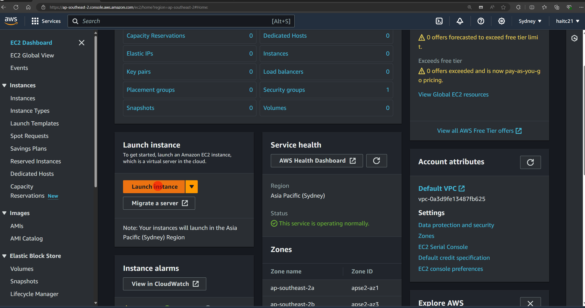
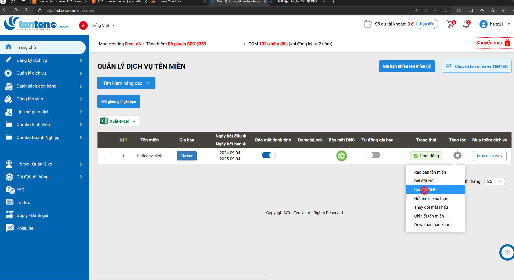
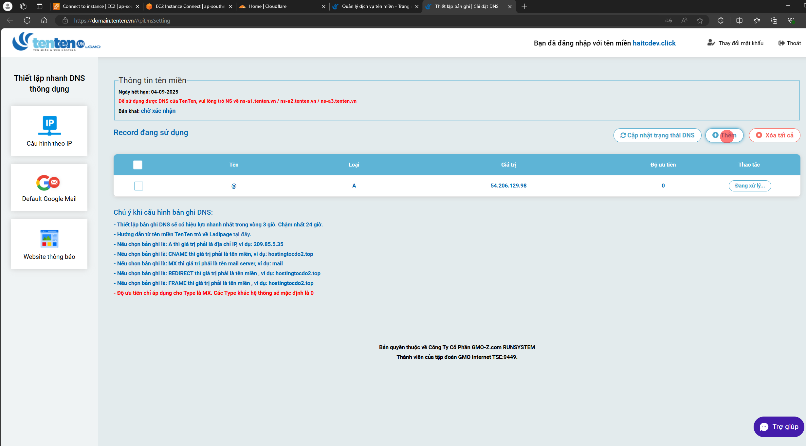
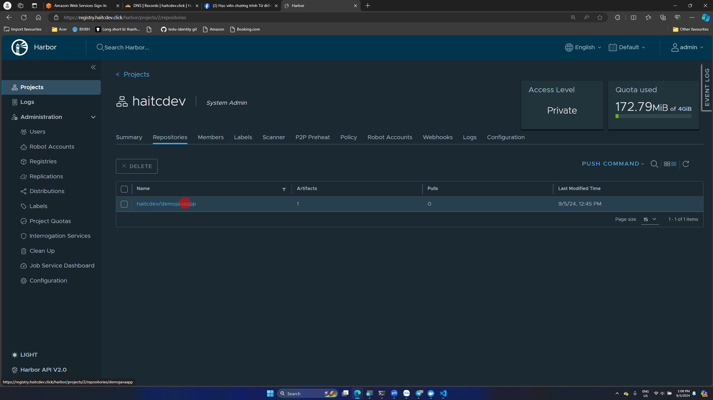

# Docker Registry

## 1. Hub Docker

- [Link](https://hub.docker.com/)
- Đặc điểm:
  - Miễn phí
  - Nhanh chóng
  - Chỉ miễn phí 1 private image
- Login: mặc định không điền gì thì sẽ tự hiểu là <https://hub.docker.com/>

``` sh
docker login
```

- Cấu trúc tên image: <domain>/<tên project>/<tên repo>:<tag>
- Mặc định thì domain là <https://hub.docker.com/>
- Đổi tên image trong máy

``` sh
docker tag todolist:v1 elroydevops/todolist:v1
```

- Đẩy lên hub docker

``` sh
docker push elroydevops/todolist:v1
```

## 2. Private Registry

### 2.1. Registry
>
>NOTE: Tuy cách này miễn phí nhưng không nên sử dụng cách này trong công ty vì nó thiếu chuyên nghiệp

- Cài đặt Docker
- Cài đặt openssl

``` sh
apt get update
apt-get install openssl
```

- tạo thư mục làm việc

``` sh
mkdir -p /tools/registry/ && cd /tools/registry
mkdir data certs
```

- Tạo cert tự ký

``` sh
openssl req -newkey rsa:4096 -nodes -sha256 -keyout certs/domain.key -subj "/CN=192.168.1.100" -addext "subjectAltName = DNS:192.168.1.101,IP:192.168.1.101" -x509 -days 365 -out certs/domain.crt
```

>NOTE: Chú ý đổi IP, đang cấu hình chứng chỉ có hiệu lực 1 năm (-days 365)

- Cài đặt registry

``` sh
vi docker-compose.yml
```

``` yml
version: '3'
services:
  registry:
    image: registry:2
    restart: always
    container_name: registry-server
    ports:
      - "5000:5000"
    volumes:
      - ./datas:/var/lib/registry
      - ./certs:/certs
    environment:
      REGISTRY_HTTP_TLS_CERTIFICATE: /certs/domain.crt
      REGISTRY_HTTP_TLS_KEY: /certs/domain.key
```

- Bởi vì không có chứng chỉ SSL mà chỉ là cert tự ký nên để sử dụng được cần thêm file cert lên các máy khác. Ví dụ ở server lab-server 192.168.1.100

``` sh
# tạo thư mục
sudo mkdir -p /etc/docker/certs.d/192.168.1.101:5000/
```

- Copy file domain.cert sang lab-server và đổi tên thành ca.crt

``` sh
# ở registry server
scp certs/domain.crt haitc@192.168.1.100:/home/haitc
```

- Sang lab-server

``` sh
sudo cp /home/haitc/domain.crt /etc/docker/certs.d/192.168.1.101\:5000/ca.crt
sudo systemctl restart docker
```

### 2.2 Habor

- Yêu cầu:
  - Máy chủ có IP phublic: Máy chủ của công ty, thuê VPS, EC2....
  - Domain hoặc subdomain
  - Chứng chỉ SSL để cấu hình HTTPS

#### 2.2.1 Máy chủ

- Ở đây sử dụng EC2 là 1 dịch vụ free trên AWS
- Tạo tài khoản AWS (cần thẻ VISA hoặc Credit Card), chọn Basic Freee Tỉe
- Tìm kiếm EC2

- name: registry-server
- OS: Ubuntu
- Instance type: t2.micro
- Tạo key pair và lưu về máy
- Trong phần Security nhớ tích chọn Allow HTTPS, Allow HTTp

- Bên menu trái chọn Instance => Chọn registry-server => Ấn Connect


### 2.2.2 Domain

[Tham khảo video của f8](https://www.youtube.com/watch?v=7RjjF8Ee7Ws&list=PL_-VfJajZj0XGfh528VqhlgXUfzw1Y0N7&index=20)

- Mua Domain ở dây mua ở trang tenten.vn các nơi khác làm tương tự
- Vào trang quản lý tên miền cấu hình DNS là Public IPv4 của máy chủ trong phần 2.2.1

- thêm bản ghi như hình


- Sử dụng Cloudlare
  - [Video](https://www.youtube.com/watch?v=DqhSe3HcDTU&list=PL_-VfJajZj0XGfh528VqhlgXUfzw1Y0N7&index=25)

### 2.2.3 Cài đặt

!. Cài đặt Docker
2. Cài đặt Harbor

- Cerbot là 1 tổ chức xác thực SSL

>NOTE: Chú ý sửa biến DOMAIN và EMAIL

``` sh
apt update -y
apt install certbot -y
mkdir -p /tools/harbor && cd /tools/harbor
curl -s https://api.github.com/repos/goharbor/harbor/releases/latest | grep browser_download_url | cut -d '"' -f 4 | grep '.tgz$' | wget -i -
tar xvzf harbor-offline-installer*.tgz
cd harbor/
cp harbor.yml.tmpl harbor.yml
export DOMAIN="registry.haitcdev.click"
export EMAIL="hai.tc21@gmail.com"
sudo certbot certonly --standalone -d $DOMAIN --preferred-challenges http --agree-tos -m $EMAIL --keep-until-expiring
```

- Sau khi chạy lệnh cerbot sẽ được 2 file
  - Certificate is saved at: /etc/letsencrypt/live/registry.haitcdev.click/fullchain.pem
  - Key is saved at:         /etc/letsencrypt/live/registry.haitcdev.click/privkey.pem
- Swar file harrbor.yml
  - hosstname: domain của bạn
  - cerrtificate: chính là đường dẫn đến 2 file vừa tạo ra
- Chạy lần lượt các lệnh sau

```sh
./prepare
./install.sh
```

### 2.2.4 Push image

- Đặng nhập bằng browser ở domain <https://registry.haitcdev.click>
- Tài khoảm mặc định: admin/Harbor12345
- Tạo project: haitcdev
- Đăng nhập registry trên client

``` sh
 docker login registry.haitcdev.click
```

- tạo tag với cấu trúc <domain>/<project>/<tên image>:<tag>

``` sh
docker tag demo:v1 registry.haitcdev.click/haitcdev/demojavaapp:v1
```


