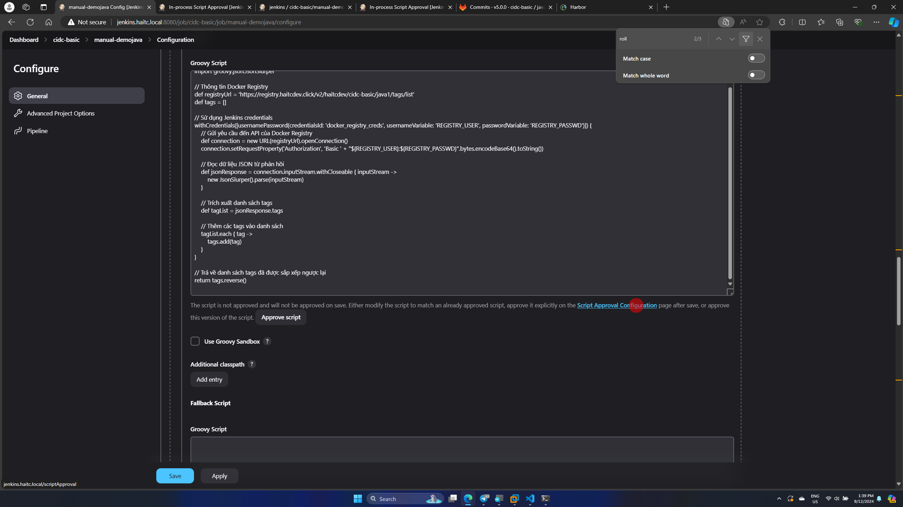
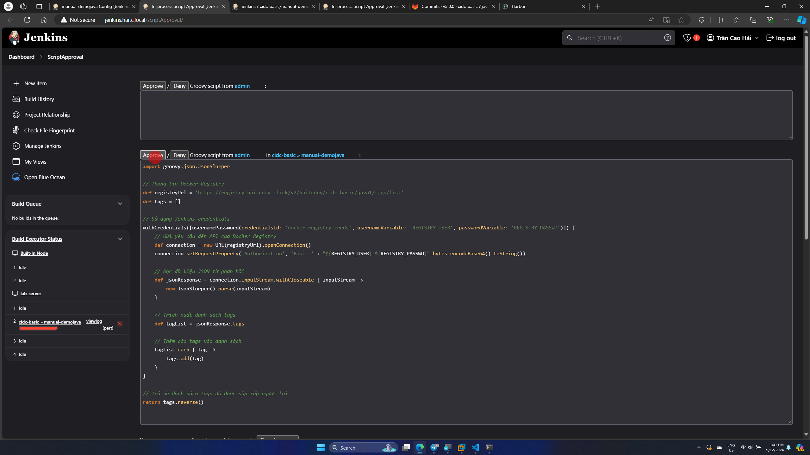
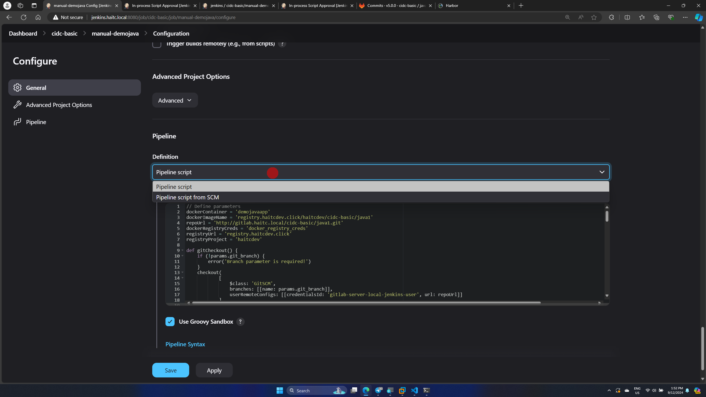
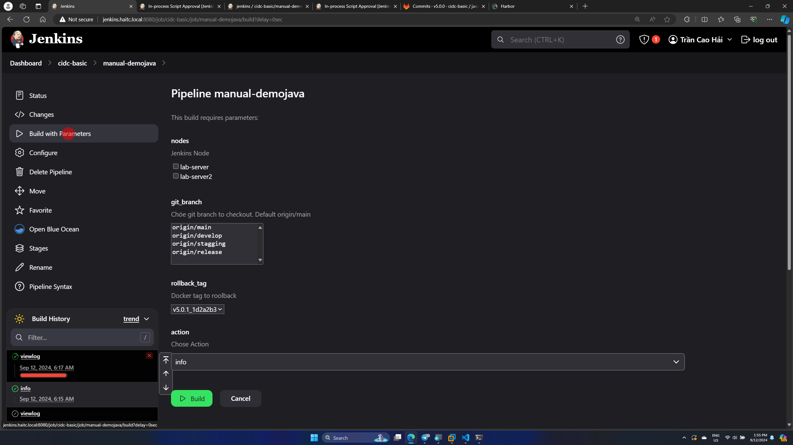

# Continuous Delivery

## 1 Cài đặt plugin

Cài đặt plugin 2 plugin sau để có thêm kiểu parameter

- Active Choice
- Get Parameter

## 2 Tạo Pipeline

- Tick chọn **This project is parameterized**

### 2.1 Thêm các Parameter

Add các paramester sau

- nodes: để xác đinh Jenkins Agent chạy pipeline, có thể chạy trên nhiều node cùng lúc
  - Kiểu Active Choice
  - tick chọn **Groovy script**
  - tick **Use Groovy Sandbox^^ nếu không tick thì jenkins sẽ yêu cầu allow các script
  - Choice type: Checkbox

``` groovy
return ['lab-server', 'lab-server2']
```

- git_branch: Xác định git branch để checkout (pull code mới về)
  - Kiểu: Git Parameter
  - Parameter Typ: Branch
  - Default value: origin/main

- rollback_tag: Dùng để xác định docker tag khi roll back phiên bản
  - Kiểu: Active Choice
  - script
  - Ấn vào **Jenkins Approval Configueration** để sang trang approve các script. Ấn save xong quay sang trang approve F5 lại rồi appove




``` groovy
import groovy.json.JsonSlurper

// Thông tin Docker Registry
def registryUrl = 'https://registry.haitcdev.click/v2/haitcdev/cidc-basic/java1/tags/list'
def username = 'admin'
def password = 'Harbor12345'

// Khai báo danh sách tags
def tags = []

// Gửi yêu cầu đến API của Docker Registry
def connection = new URL(registryUrl).openConnection()
connection.setRequestProperty('Authorization', 'Basic ' + "${username}:${password}".bytes.encodeBase64().toString())

// Đọc dữ liệu JSON từ phản hồi
def jsonResponse = connection.inputStream.withCloseable { inputStream ->
    new JsonSlurper().parse(inputStream)
}

// Trích xuất danh sách tags
def tagList = jsonResponse.tags

// Thêm các tags vào danh sách
tagList.each { tag ->
    tags.add(tag)
}

// Trả về danh sách tags
return tags.reverse()
```

- action: Chọn actio khi chạy pipeline ở đây có info - xem thông tin, viewlog, start - start docker container, stop - stop docker container, update - pull code + build image + run container, rollbac - tollback về phiên bản được chọn ở rollback_tag
  - Kiểu: Choice parameter
  - Choices

```
info
viewlog
start
stop
update
rollback
```

### 2.2 Pipline

- Ở phần này sẽ chọn kiểu pipeline script sử dụng code groovy để chạy pipeline



``` groovy
// Define parameters
dockerContainer = 'demojavaapp'
dockerImageName = 'registry.haitcdev.click/haitcdev/cidc-basic/java1'
repoUrl = 'http://gitlab.haitc.local/cidc-basic/java1.git'
dockerRegistryCreds = 'docker_registry_creds'
registryUrl = 'registry.haitcdev.click'
registryProject = 'haitcdev'

def gitCheckout() {
    if (!params.git_branch) {
        error('Branch parameter is required!')
    }
    checkout(
            [
                $class: 'GitSCM',
                branches: [[name: params.git_branch]],
                userRemoteConfigs: [[credentialsId: 'gitlab-server-local-jenkins-user', url: repoUrl]]
            ]
        )
    gitTag = sh(returnStdout: true, script: 'git tag --sort version:refname | tail -1').trim()
    gitCommit = sh(returnStdout: true, script: 'git rev-parse HEAD').trim().substring(0, 7)
    dockerTag = "${gitTag}_${gitCommit}"
    sh(script: 'git status', label: 'Git status')
}
def printInfo() {
    sh(
        script: '''
        echo "Hostname: $(hostname)"
        whoami
        pwd
        df -h
        free -m
        docker images
        docker ps
        ''',
        label: 'Show info Jenkins Agent'
    )
}

def dockerLogin() {
    withCredentials([usernamePassword(
        credentialsId: dockerRegistryCreds,
        usernameVariable: 'REGISTRY_USER',
        passwordVariable: 'REGISTRY_PASSWD')]) {
        sh(
            script: "echo \"$REGISTRY_PASSWD\" | docker login $registryUrl -u $REGISTRY_USER --password-stdin",
            label: 'Login to Docker'
        )
        }
}

def buildAndPushDockerImage() {
    dockerLogin()
    sh(script: "docker build -t ${dockerImageName}:${dockerTag} ./src/demo", label: 'Build docker image')
    sh(script: "docker push ${dockerImageName}:${dockerTag}", label: 'Push image')
}

def pullImageAndRunContainer(imageName, tag) {
    dockerLogin()
    sh(script: "docker pull ${imageName}:${tag}", label: 'Pull docker image')
    sh(script: "docker run --name ${dockerContainer} -d -p 8083:8081 ${imageName}:${tag}", label: 'Run docker container')
}

def viewLog() {
    sh(script: "docker logs -f ${dockerContainer}", label: 'View logs')
}

def cleanUpContainer() {
    sh(script: "docker rm -f ${dockerContainer} || true", label: 'Remove old container')
}

def cleanUpImages(tag) {
    sh(script: "docker images --format \"{{.Repository}}:{{.Tag}}\" | grep \"^${dockerImageName}:\" | grep -v \":${tag}\$\" | xargs -r docker rmi -f", label: 'Remove old images')
}

def startProcess() {
    sh(script: "docker start ${dockerContainer}", label: 'Start docker container')
}

def stopProcess() {
    sh(script: "docker stop ${dockerContainer} || true", label: 'Stop docker container')
}

def updateProcess() {
    stage('build') {
        buildAndPushDockerImage()
    }
    stage('deploy') {
        cleanUpContainer()
        pullImageAndRunContainer(dockerImageName, dockerTag)
        cleanUpImages(dockerTag)
    }
}

def rollbackProcess() {
    if (params.rollback_tag == '') {
        error('Rollback tag is required!')
    }
    cleanUpContainer()
    pullImageAndRunContainer(dockerImageName, params.rollback_tag)
    cleanUpImages(params.rollback_tag)
}

// Main pipeline script
node(params.nodes) {
    currentBuild.displayName = params.action
    gitCheckout()
    action = params.action
    switch (action) {
        case 'info':
            printInfo()
            break
        case 'viewlog':
            viewLog()
            break
        case 'start':
            startProcess()
            break
        case 'stop':
            stopProcess()
            break
        case 'update':
            updateProcess()
            break
        case 'rollback':
            rollbackProcess()
            break
        default:
            error('Action parameter is required!')
    }
}

```

- Save

## 3. Chạy pipeline

- Ấn vào **Build with Parameters**

- Bây giờ có thể cài đặt ấc param đê chạy pipeline theo ý muốn
