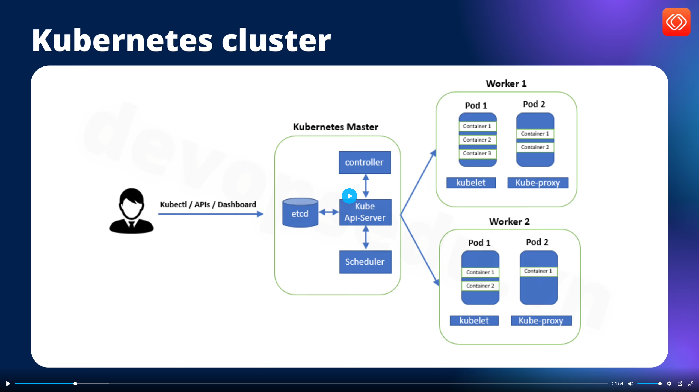
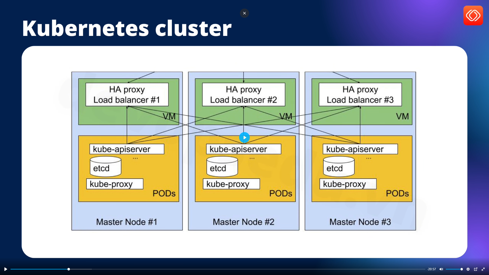

# Cài đặt kubernetes trên on-premise

## 1. Mô hình triển khai

### 1.1. . Mô hình production gồm 1 master và 2 worker

- Trong kiểu này thì master (control plane) sẽ không cài các node,pod


### 1.2. Mô hình dev, stagging cả 3 đều là master + worker



## 2. Triển khai k8s 1 master 2 wworker

 Ở đây có 3 server

- 192.168.159.101 sv1 : master
- 192.168.159.102 sv2 : worker 1
- 192.168.159.103 sv3 : worker 2

### 2.1 Cài đặt bằng cách sử dụng lệnh kube-admin

**Bước 1:** Cấu hình hệ thống (chạy trên cả 3 server)

- Cập nhật hệ thống

``` sh
sudo apt update -y && sudo apt upgrade -y
```

- Thêm user devops và thêm vào group sudo

``` sh
adduser devops
usermod -aG sudo devops
su devops
```

- k8x yêu cầu tắt swap

``` sh
sudo swapoff -a
sudo sed -i '/swap.img/s/^/#/' /etc/fstab
```

**Bước 2:** Cài đặt containerd tương tự như docker (chạy cả 3 server)

- Cấu hình module kerne

``` sh
sudo vi /etc/modules-load.d/containerd.conf
```

Nội dung containerd.conf

``` containerd.conf
overlay
br_netfilter
```

- Tải module kernel

``` sh
sudo modprobe overlay
sudo modprobe br_netfilter
```

- Cấu hình hệ thống mạng

``` sh
echo "net.bridge.bridge-nf-call-ip6tables = 1" | sudo tee -a /etc/sysctl.d/kubernetes.conf
echo "net.bridge.bridge-nf-call-iptables = 1" | sudo tee -a /etc/sysctl.d/kubernetes.conf
echo "net.ipv4.ip_forward = 1" | sudo tee -a /etc/sysctl.d/kubernetes.conf
```

- Áp dụng cấu hình sysctl

``` sh
sudo sysctl --system
```

- Cài đặt các gói cần thiết và thêm kho Docker

``` sh
sudo apt install -y curl gnupg2 software-properties-common apt-transport-https ca-certificates
sudo curl -fsSL <https://download.docker.com/linux/ubuntu/gpg> | sudo gpg --dearmour -o /etc/apt/trusted.gpg.d/docker.gpg
sudo add-apt-repository "deb [arch=amd64] <https://download.docker.com/linux/ubuntu> $(lsb_release -cs) stable"
```

- Cấu hình containerd

``` sh
containerd config default | sudo tee /etc/containerd/config.toml >/dev/null 2>&1
sudo sed -i 's/SystemdCgroup = false/SystemdCgroup = true/g' /etc/containerd/config.toml
```

- Khởi động containerd

``` sh
sudo systemctl restart containerd
sudo systemctl enable containerd
```

- Kiểm tra

``` sh
containerd --version
```

**Bước 3:** Cài đặt kubelet, kubeadm, kubectl (chạy cả 3 server)
Để có thể hoạt động được thì cần kubelet, kubeadm, kubectl

- Thêm kho lưu trữ Kubernetes

``` sh
echo "deb [signed-by=/etc/apt/keyrings/kubernetes-apt-keyring.gpg] https://pkgs.k8s.io/core:/stable:/v1.30/deb/ /" | sudo tee /etc/apt/sources.list.d/kubernetes.list
curl -fsSL https://pkgs.k8s.io/core:/stable:/v1.30/deb/Release.key | sudo gpg --dearmor -o /etc/apt/keyrings/kubernetes-apt-keyring.gpg
```

- Cài đặt các gói Kubernetes

``` sh
sudo apt update -y
sudo apt install -y kubelet kubeadm kubectl
sudo apt-mark hold kubelet kubeadm kubectl
```

>Note: **apt-mark hold** để tránh khi apt update sẽ tự động thay đổi phiên bản
