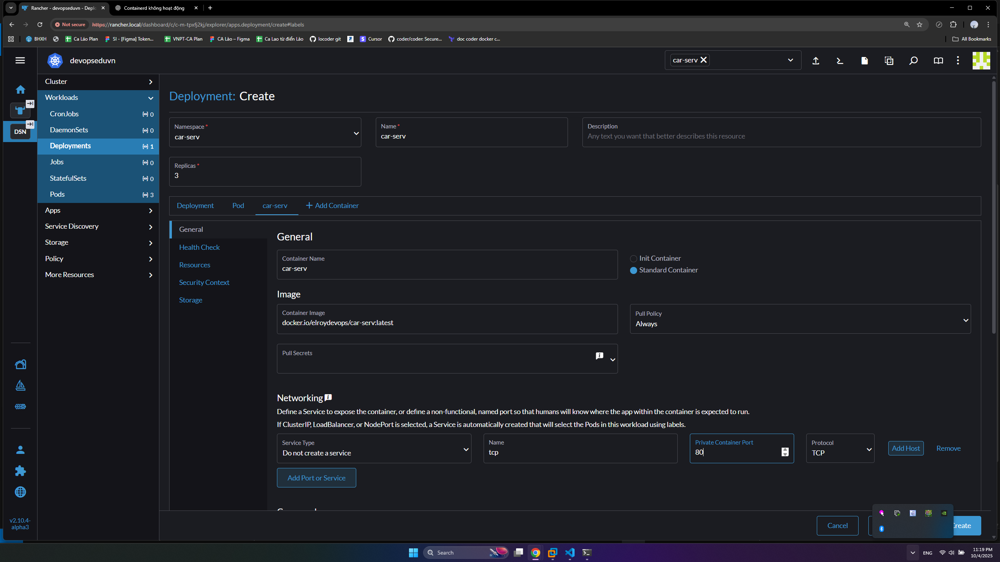
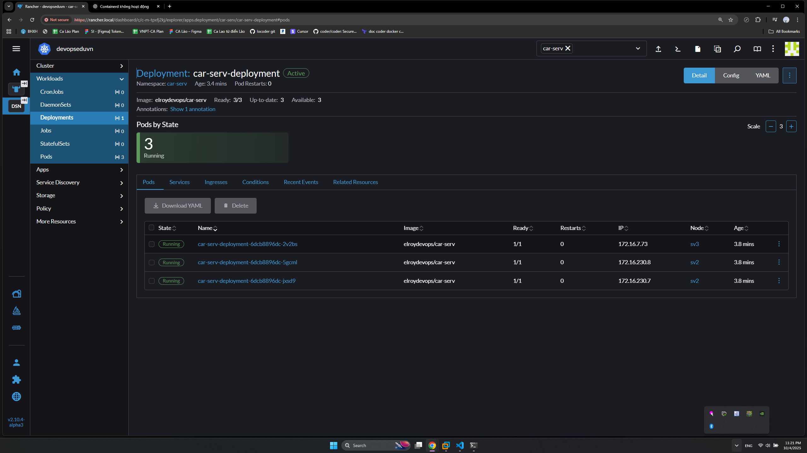
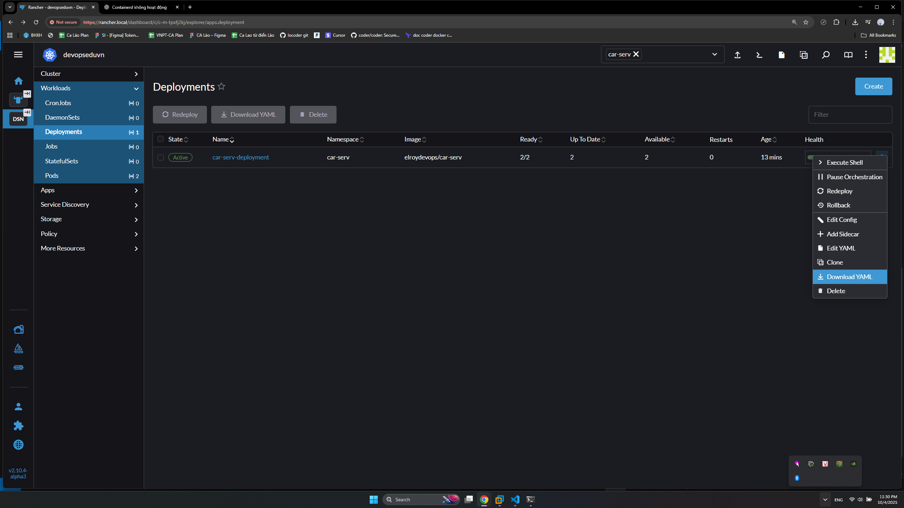
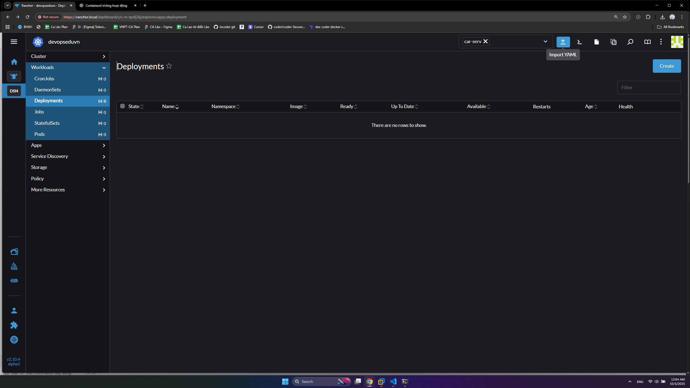
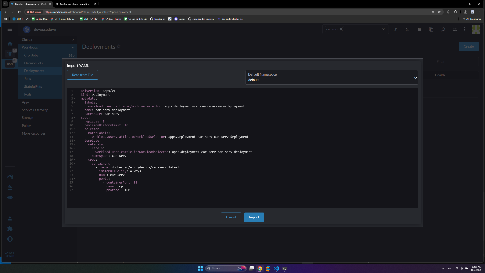
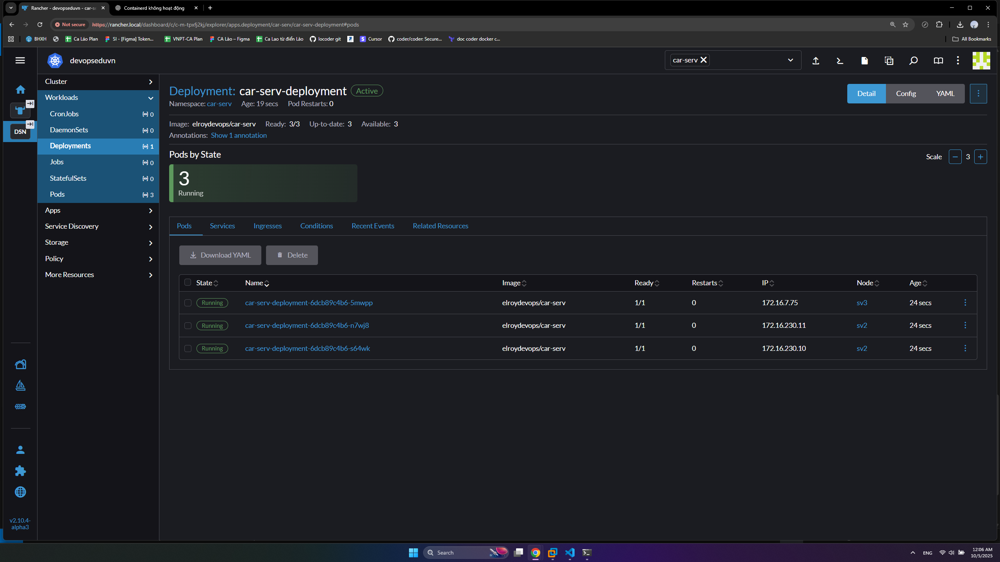
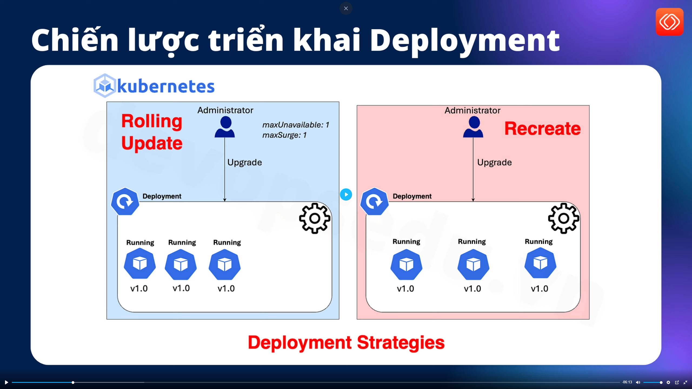

# k8s Deployment

## 1. Giới thiệu

- Là 1 trong các thành phần quản lý **Worklod** trong k8s
- Là thành phần được sử dụng nhiều nhất trong triển khai ứng dụng trên k8s, hỗ trợ quản lý pod, replica, auto stacle, limit resource...
- Quản lý phiên bản ứng dụng: Khi nâng phiên bản image, Deployment cũng lưu lại lịch sử.
- Tự động khắc phục lỗi. Ví dụ cấu hình Deployment có 3 pod nếu 1 Pod bị lỗi thì k8s sẽ tự động tạo Pod mới

## 2. Tạo Deployment

- Có thể tự viết file yml như các bài trước tuy nhiên để nhanh và đúng chuẩn thì nên sử dụng công cụ UI để tạo trực tiếp hoặc gen ra file yml
- vào [Rancher](https://rancher.local)
- Chọn cụm **devopseduvn** tạo ở bài [cài đặt rancher](../5.%20Rancher/README.md)
- Chọn namespace () **car-serv** tạo ở bài 
- Bên thanh Sidebar chọn Workloads => Deployments => Create
- Cấu hình:
  - Namespace: car-serv
  - ame: car-serv-deployment
  - Replica: 3
  - Container name: car-serv
  - Image: docker.io/elroydevops/car-serv:latest
  - Add Pod: tcp, 80, TCP



- Nhấn Create và chờ. Kết quả:



- Tạo được 3 pod trên 2 worker là sv2 và sv3. Địa chỉ Ip này chỉ là Internal IP để các Pod kết nối nội bộ.
- Nhấn vào dấu ... ở dòng car-serv-deployment chọn **Download YAML**



- Mờ file [car-serv-deployment.yaml](./car-serv-deployment.yaml) chỉnh sửa:
  - Trong metadata xóa:
    - metadata:
      - creationTimestamp
      - generation
      - managedFields
      - resourceVersion
      - uid
    - Sửa lablels: `workload.user.cattle.io/workloadselector` -> `app`, và giá trị thành `car-serv-deployment`
  - Trong spec xóa:
    - progressDeadlineSeconds
    - strategy
    - template:
      - metadata:
        - creationTimestamp
        - Thêm labels.app: car-serv-deployment
    - spec:
      - containers:
        - resources
        - securityContext
        - securityContext
        - terminationMessagePath
        - terminationMessagePolicy
      - dnsPolicy
      - restartPolicy
      - schedulerName
      - securityContext
      - terminationGracePeriodSeconds
  - Xóa hết phần status
- Kết quả thu được file deployment.yml cơ bản nhất đã loại bỏ hết các giá trị mặc định và tự động sinh

```yml
apiVersion: apps/v1
kind: Deployment
metadata:
  labels:
    app: car-serv-deployment
  name: car-serv-deployment
  namespace: car-serv
spec:
  replicas: 3
  revisionHistoryLimit: 10
  selector:
    matchLabels:
      workload.user.cattle.io/workloadselector: apps.deployment-car-serv-car-serv-deployment
  template:
    metadata:
      labels:
        app: car-serv-deployment
        workload.user.cattle.io/workloadselector: apps.deployment-car-serv-car-serv-deployment
      namespace: car-serv
    spec:
      containers:
        - image: docker.io/elroydevops/car-serv:latest
          imagePullPolicy: Always
          name: car-serv
          ports:
            - containerPort: 80
              name: tcp
              protocol: TCP
```

- Bây giờ có thể xóa deployment vừa rồi và import fiel yml trên vào vẫn sẽ ra kết quả như ban đầu







## 3. Các lệnh cơ bản trong Deployment

Chạy các lệnh sau trên sv1

- Lấy danh sách Deployments

```sh
kubectl get deployments -n car-serv
kubectl get deploy -n car-serv
```

- Danh sachs ReplicaSet

```sh
kubectl get replicasets -n car-serv
kubectl get rs -n car-serv
```

- Edit config

```sh
kubectl edit deployment/car-serv-deployment -n car-serv
```

- Rollout status

```sh
kubectl rollout status deployment/car-serv-deployment -n car-serv
```

- Scale: Tăng/giảm số replica

```sh
kubectl scale deployment/car-serv-deployment --replicas=4 -n car-serv
```

>Note: Đây chỉ là các lệnh thường dùng, hầu hết sử dụng UI cho nhanh.Truy cập  để xem chi tiết.

## 4. Chiến lược triển khai Deployment



- **Rolling Update (default)**: Cập nhật dần dần các Pod. Được sử dụng trong hầu hết các trường hợp vì nó đảm bảo ứng dụng sẽ luôn hoạt động được.
- **Recreate**: Tạo mới hoàn toàn các Pod.

### 4.1. Recreate

- Xóa `car-serv-deployment` đã tạo ở phần 2 và chỉnh sửa file yml như sau:
  - Sửa `spec.replica`: 4
  - Thêm `spec.strategy.type`: ReCreate
  - Sửa `spec.template.spec.containers.image`: docker.io/nginx

```yml
apiVersion: apps/v1
kind: Deployment
metadata:
  labels:
    app: car-serv-deployment
  name: car-serv-deployment
  namespace: car-serv
spec:
  replicas: 4
  strategy:
    type: ReCreate
  revisionHistoryLimit: 10
  selector:
    matchLabels:
      workload.user.cattle.io/workloadselector: apps.deployment-car-serv-car-serv-deployment
  template:
    metadata:
      labels:
        app: car-serv-deployment
        workload.user.cattle.io/workloadselector: apps.deployment-car-serv-car-serv-deployment
      namespace: car-serv
    spec:
      containers:
        - image: docker.io/nginx
          imagePullPolicy: Always
          name: car-serv
          ports:
            - containerPort: 80
              name: tcp
              protocol: TCP
```

- Vaò `Edit Deployment` đổi lại image về`docker.io/elroydevops/car-serv`
- Các pod cũ sẽ bị xóa đi và tạo các Pod mới với image mới

>Note: Recreate ít được sử dụng vì nó có thể gây downtime lâu nếu image nặng hoặc mạng yếu
>
### 4.2. Rolling update

- Sửa file yml
  - Sửa `spec.strategy`:
    - type: RollingUpdate
    - rollingUpdate:
      - maxSurge: 25%
      - maxUnavailable: 25%

```yml
apiVersion: apps/v1
kind: Deployment
metadata:
  labels:
    app: car-serv-deployment
  name: car-serv-deployment
  namespace: car-serv
spec:
  replicas: 4
  strategy:
    type: RollingUpdate
    rollingUpdate:
      maxSurge: 25%
      maxUnavailable: 25%
  revisionHistoryLimit: 10
  selector:
    matchLabels:
      workload.user.cattle.io/workloadselector: apps.deployment-car-serv-car-serv-deployment
  template:
    metadata:
      labels:
        app: car-serv-deployment
        workload.user.cattle.io/workloadselector: apps.deployment-car-serv-car-serv-deployment
      namespace: car-serv
    spec:
      containers:
        - image: docker.io/elroydevops/car-serv
          imagePullPolicy: Always
          name: car-serv
          ports:
            - containerPort: 80
              name: tcp
              protocol: TCP
```

- **maxSurge**: Số Pod mới tối đa có thể được tạo vượt quá số lượng replicas mong muốn trong quá trình cập nhật.
  - Có thể là số nguyên (ví dụ 1) hoặc tỷ lệ phần trăm (ví dụ 25%).
  - Cho phép tăng tạm thời tổng số Pod để đảm bảo không bị gián đoạn dịch vụ.
  - Trong ví dụ trên: Trong khi cập nhật, có thể có tối đa 5 Pod (4 cũ + 1 mới).
K8s sẽ tạo Pod mới trước, chờ chúng “Ready”, rồi dần xóa Pod cũ.
- **maxUnavailable**: Số Pod tối đa được phép không khả dụng (Unavailable) trong quá trình cập nhật.
  - Cũng có thể là số nguyên hoặc tỷ lệ phần trăm.
  - Dùng để kiểm soát mức downtime tạm thời trong quá trình rolling update.
  - Trong ví dụ trên: K8s cho phép tối đa 1 Pod không sẵn sàng trong lúc cập nhật (nghĩa là có thể xóa 1 Pod cũ trước khi Pod mới sẵn sàng).
